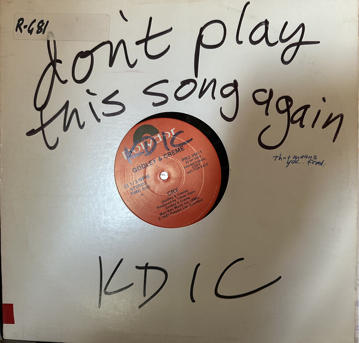

Back when I was a college student [1], I had a serious vinyl addiction. Every few days, I'd wander a few blocks south of campus to visit Second Hand Tunes and look through the cheapo bin for interesting records. When I went back home to Boston, I'd take the T to Kenmore Square and visit Nuggets or other stores, or head off to Harvard Square for the stores there. In Chicago, I'd also take the El to Wax Trax. I accumulated a surprisingly large collection. Or perhaps not so surprising, for those who know me.

Poor Michelle got stuck dealing with the boxes and boxes [2] when we moved to Maine, because I was already working at Dartmouth. By that time, I was also accumulating CDs.

When we moved to Grinnell, we moved the LPs, too. At least the ones that had moved from Chicago to Maine. The ones that somehow ended up in Boston ended up getting sold in one of the few times I let go of things I collected. I regret it. But there was one positive: Jeff "Mono Mann" Conolly [3] was the one who picked up the boxes, and I got to hear him make comments on the records.

Since arriving in Grinnell, I've had fewer opportunities to feed the addiction. There have been some, but they've mostly been chances to get CDs, such as when Drake Library got a donation of a large box of great folk CDs.

Recently, I got to revisit my addiction. You see, KDIC, Grinnell College's radio station, decided to clean out its vinyl collection. It's probably best that the announcement came out when I was in Iowa City, so I only got back for the last part of the first day of the sale. All records were two for a buck. Not a good thing for a vinyl addict.

Once upon a time, I had a list of all the albums I owned. I built my own custom database in HyperCard. It would even output to nicely formatted RTF. But Apple discontinued HyperCard, and I never had the energy to re-enter thousands upon thousands of albums of data. So I spent some of the sale asking myself whether I already owned certain albums. I generally decided that I did.

In any case, my approach was that of a typical addict: Go through each box and pull out the albums that look interesting. I suppose I considered going back through my pile and sorting through it. Unfortunately, I ran out of time. I'm planning a deep dive and accompanying musing after the semester ends. For now, I thought I'd write a bit about what types of things I grabbed.

There were a surprising number of albums from Boston bands. Of course, I own most of the music by early 1980's Boston bands, so I was able to convince myself that, say, I didn't need another album by Scruffy the Cat. However, I did pick up one or two albums by the Flies and an extra copy of a Throbbing Lobster comp. 

I found some interesting radio-station-only albums, such as an interview album with Robyn Hitchcock. I was surprised that so many RH albums remained in the bins. It appears the young folks don't know music from my days. There was a decent amount of jangle pop, too. But I own the Tommy Keene albums I saw, the Let's Active albums, even the deleted Zeitgeist album.

So what did I grab? Too much! Much too much. Some albums I grabbed just because of the comments from the DJs. You'll see one at the top of this musing. Their copy of _Seconds of Pleasure_ by Rockpile had lots of great comments. I followed my habit of trying things from labels I like, such as the Dutch East India Trading Company or Big Time. I found a few old Folkways albums. At some point, I decided to grab colored vinyl as I saw it. I know I also bought albums I probably have, such as  Joe Ely's first album [4] and _Lord of the Highway_. Part of me said, "You only own those on CD", and there's something comforting about owning the vinyl.

What else? The problem with trying to grab interesting albums from boxes is that you don't necessarily remember everything. As I said, I need to do a deep dive. I recall buying the McGear album and a Denny Laine album. I know I got some pub rock, such as the two Ducks Deluxe albums. I'm pretty sure I threw a Jello Biafra album on the pile. Some albums that appeared to be self-released. A friend handed me two Material Issue EPs.

I didn't see many soul or blues albums. I considered some mainstream country, but mostly decided against it. I grabbed a few John Hartford albums. I found an early-80's indie bands from Philly comp, but it didn't have the Wishniaks [5].

As you might expect, there wasn't anything by the big names. No Stones, Beatles, Eagles, whatever. But that's okay! The fun is in finding things that might be new, or things that are hard to find.

I skipped over so many albums that I love. Things by Kate and Anna McGarrigle. Folk by Arlo Guthrie, Pete Seeger, and Ronnie Gilbert. Singles by the Go-Gos. I forget what else.

They said they were going to put out more albums on the second day. And I know that I didn't look through everything on the first day. I also know that some boxes deserved a second look, perhaps even a third. Surprisingly, I found that I'd satiated my addiction. I may have bought too many albums, but I didn't need to go back and look for even more. Perhaps I've grown a bit [6].

In any case, I'm looking forward to hooking up the turntable and listening to the vinyl. I'm also looking forward to categorizing what I bought. I promise to report back. Eventually.

---

[1] Forty or so years ago. Wow!

[2] And boxes.

[3] Crap. When I looked him up, I discovered that [he has cancer](https://gofund.me/41a731600).

[4] RIP

[5] Yes, I realize that most readers will have no idea who the Wishniaks were. Also, no idea about Joe Ely, Ducks Deluxe, John Hartford, Godley and Creme, Jello Biafra, and most of what I found. That's one of the issues of being a vinyl addict; you can end up having much too broad tastes and wasting brain cells on this kind of knowledge.

The Wishniaks are special to me because my best man, Andy Chalfen, was the lead guitarist and songwriter.

[6] As I write this, I find myself regretting not going back. Oh well. I have enough. I probably have too much.
