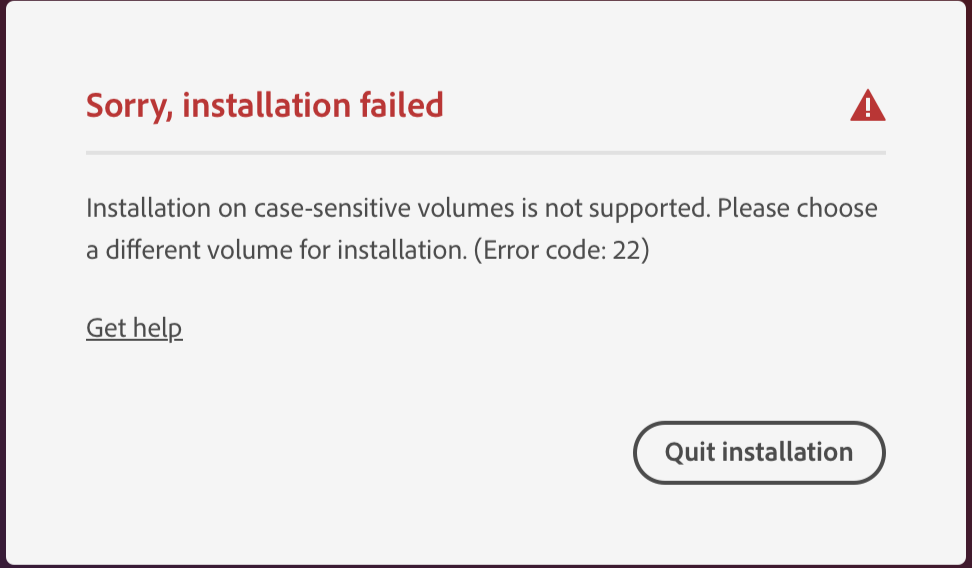

Today I tried to install Adobe Acrobat on my laptop (a somewhat old MacBook pro). It should be easy, right? I have a license through the College. It's fairly standard software.

I employed the obvious method: I went to the Adobe site, signed in, and downloaded the Acrobat installer. Then I started it. Here's what I saw:

What?

Who designs software that fails on a case-sensitive volume? Adobe used to be a typography company. Don't they understand that letters can come in multiple forms?

I didn't pay enough attention to the dialog, so I dug out an external drive, reformatted it to be case insensitive, and started the installer again. Then I realized that there's no option to select another drive. The only acceptable drive is your startup drive.

I checked the help page. Adobe suggests that you erase your drive and re-initialize it to be case insensitive. That's right, _They want you to reformat your startup drive to install their software!_

I suppose I won't be running Adobe products any time in the near future.

---

**_Postscript_**: The last time I said something was difficult, my Dean suggested an easier way to approach it, and another reader suggested a different approach. I wonder if any of my readers have an idea on how I can still install Acrobat.

---

**_Postscript_**: I suppose I have one approach. I could set up a virtual machine on my laptop and someone convince that virtual machine that it has a case-insensitive drive. That seems like a lot of work.

---

**_Postscript_**: Here's an even more fun approach: I could ask ITS for help. However, I don't think that's a good use of their time.
