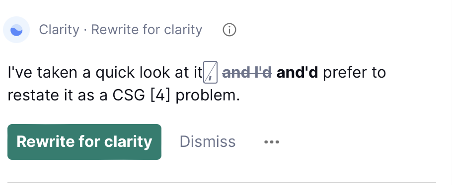
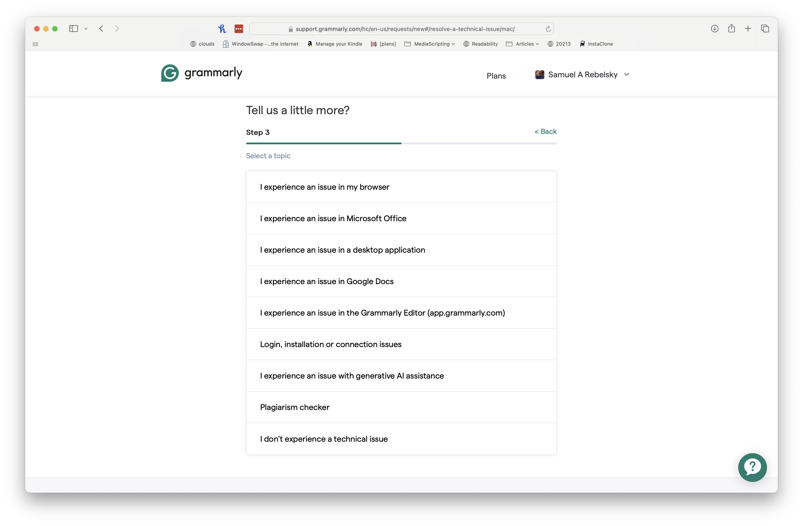

The other day, I was musing on some topic [1] and was editing a draft using [Grammarly](https://grammarly.com). It gave me some of the worst advice I've seen.

Here's my sentence.

> I've taken a quick look at it, and I'd prefer to restate it as a CSG problem.

What comments might you make about this not-very-exciting sentence? Here are some that spring to mind.

* The "it" reference may not be obvious; perhaps restate the corresponding referrent. E.g., "I've taken a look at _that assignment_."
* "taken a look" is a long way to say "looked". Once you've made that change, you might also get rid of the contracted "have".
* Some readers may be put off by the contractions of "I have" and "I would". (My musings are relatively informal; contractions are part of the deal.)
* If you haven't recently explained CSG (Computing for Social Good), you might want to do so. (In the original, I added an endnote to explain.)

Putting it all together, you might come up with something like the following.

> I looked briefly [2] at the assignment, and I would prefer to restate it as a Computing for Social Good (CSG) problem.

Still not very exciting, but perhaps a bit nicer. Ralph would probably tell me to look at other sentence patterns because I tend to stick to a few basic ones.

What does Grammarly say? Something very different.

What the fluff? [3]

What is "and'd"? It's not a term I'd seen before. Perhaps "I and'd these two values together" in a spoken programming context [4]. But not in any other context. My quick Web searches [5] for "and'd" brings me to pages about Dungeons and Dragons [6].

I did the natural thing (other than ignoring the advice), and went to the Grammarly help pages. After selecting "Technical Issue" and "macOS", I ended up with this fascinatingpage.

Yes, that's right, "I experience an issue in my browser". Wouldn't you expect a grammar tool to have more grammatical choices? Perhaps "I experienced an issue in my browser" or, as Grammarly suggests, "I am experiencing an issue with my browser."

More precisely, _I am experiencing problems with Grammarly!_

---

[1] Probably CSC-207.

[2] briefly looked?

[3] Thanks, Danika!

[4] "And" is an operation that can be applied to two integers and represents the bitwise Boolean "and" of the operands, with 1 representing "true" and 0 representing "false".

[5] Google, Bing, DuckDuckGo.

[6] Perhaps AD&D [7]. Perhaps Antiquated D&D.

[7] "Advanced Dungeons and Dragons", the version of Dungeons and Dragons that was in vogue when I was in high school.
