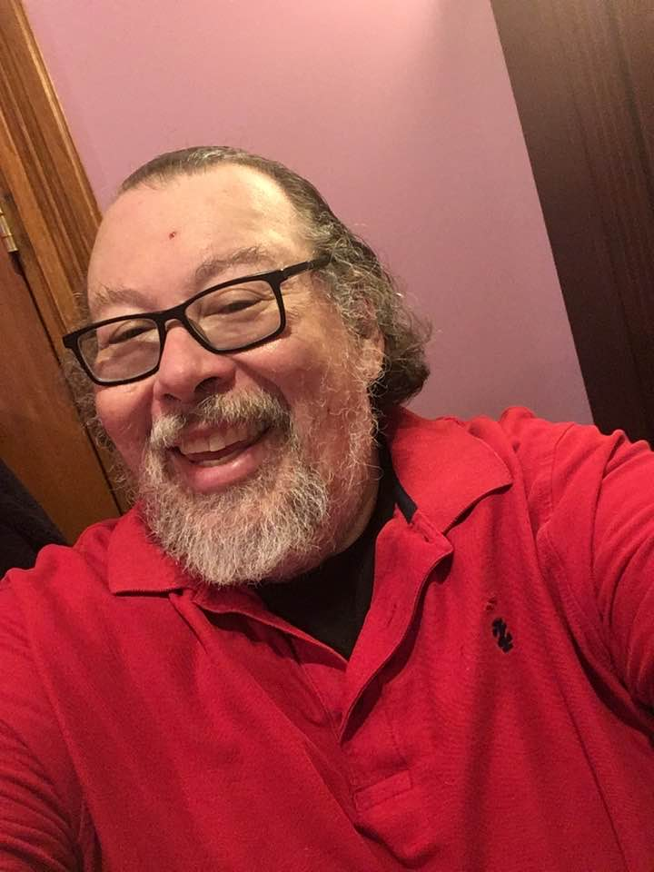
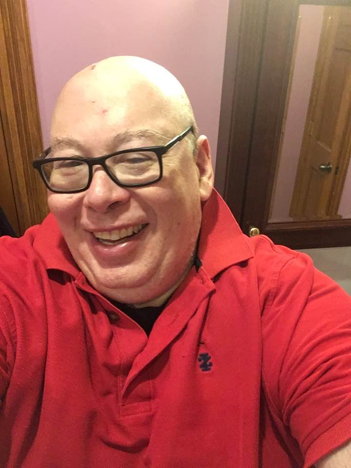
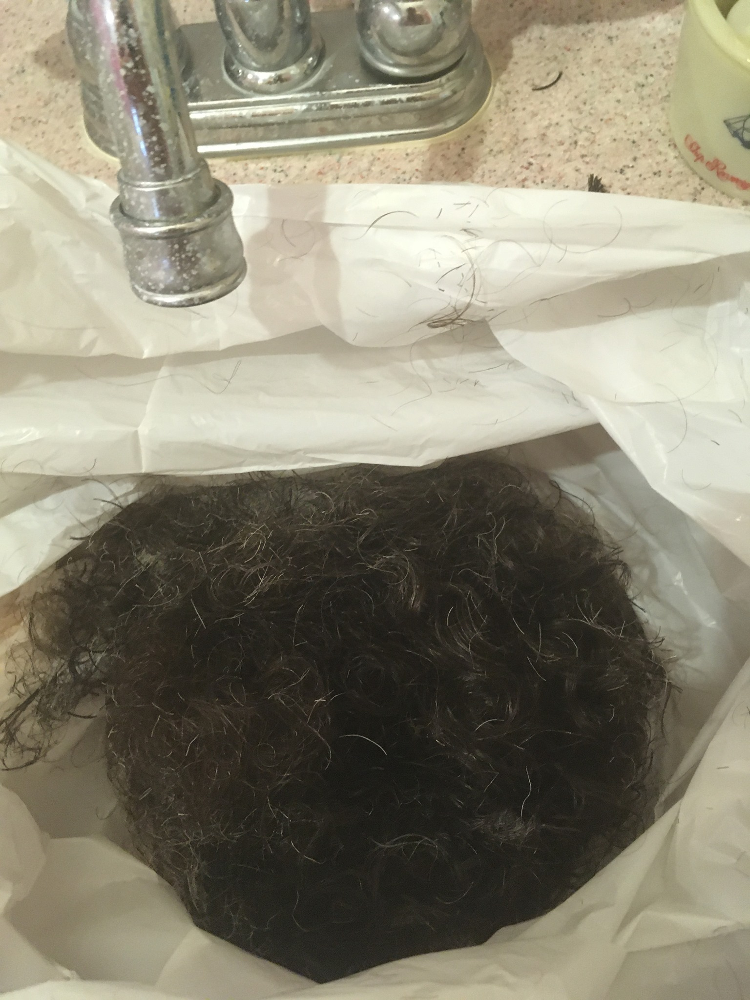

_Is it live, or is it Memorex&reg;?_

_Is it real, or is it Clairol&reg;?_

Those are questions from the past.  Some of you may still remember them.

These days, there's a new question.

_It is real, or is it Photoshopped&reg;?_

Here's one example.

"**Why?**" you may ask.  Well, once in a while, I think about shaving
my head just to see what it would look like.  I always decide not
to.  The closest I ever came was when I tried to give myself a short
haircut with my razor and did such a crappy job that the barber
needed to cut my hair down to 1/8". 

But today I felt like a change.  It's April Fools' Day, and I think the
Tigger suit is quarantined in my lab [1].  I wanted to do so something.
And it's not like I'm interacting with a lot of people these days.  That
is, it doesn't really matter what I look like [2].

After Michelle came home and saw the result, I posted the before and after
photos to Facebook and asked people to weigh in on the Photoshopping&reg; [3].
I particularly enjoyed the "If it's Photoshopped&reg;, the razor stubble
is a great touch."  And, given my offsprings' talents on the computer,
it was reasonable to guess that Photoshop&reg; was at work.  But it's
real.  Here's the hair to prove it [4].

It's not that I was bored.  As someone suggested, I have enough
board games to prevent boredom.  Rather, I did feel like I
need to jumpstart some changes.  So the hair is my first change
[5].  Let's hope that it leads to a few more.  Daily walks.  Daily
musing.  Straightening my home office.  Making book boxes.  Cleaning
the house.  More reading.  More writing.  Things like that.  We
shall see.

---

**_Postscript_**: It was harder to shave my head than I thought.
It's partially that I don't seem to have any single-blade razors
and the double-blade razors clogged too easy.  And that's after I
used scissors and an electric razor!  Now I have a scraped-up head.
I'm hoping it heals in a few days.

---

**_Postscript_**: Which look do I prefer?  I don't particularly like
my face shaven, even though I tend to look younger without a beard.
I like having long hair, but I don't mind the no-hair look.  For the
next few weeks, I think I'll try to keep my head shaven but allow
the facial hair to regrow.

---

**_Postscript_**: You know how I thought to myself that I wouldn't
be seeing people much for the next month?  I forgot about the class
I'm taking this semester that has synchronous videochat.  I hope that
my classmates aren't freaked out.  I wonder if they will take my new
hairstyle as a tribute to the teacher.

---

[1] It's more that I'm prevented from visiting my lab than that the
suit is quarantined.

[2] Or so I thought.

[3] More precisely, I wrote "Is it real or is it Photoshopped&reg;?", but
primarily as a joke.  I thought people would realize that it was real.

[4] Yes, I realize that this could be a bag of hair from a previous time
I cut my own hair.  You'll just have to take my word that it's not.

[5] Or zeroth change, for those who count like computer scientists.

