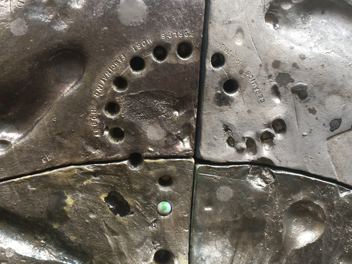
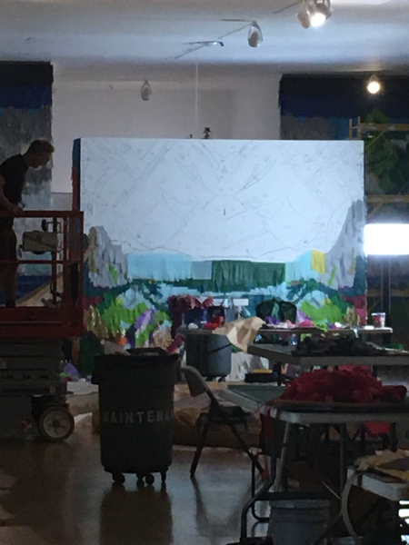
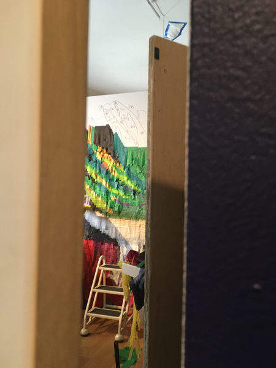

Yesterday, I took my research students to the Des Moines Art Center.  I
try to take my research students to the Art Center every year.  We often
do work related to image making, and I think it's helpful to look at the
variety of images and approaches represented at the Art Center.  I also
think experience with culture (cultures?) is appropriate.  And it's an
excuse to go out to lunch together to build community [1].

While at the Art Center, I saw two colleagues from the Humanities whose 
last names differ by only the first letter.  There was the normal "It's nice 
that we have science faculty who value the arts."  And then they asked the
question that folks usually ask,

> What's your favorite piece?

I've been visiting the Art Center for long enough that it's hard to pick
just one.  And so I gave multiple answers.

> There are lots of pieces of love here, not all of which are on display
  right now.  One of my favorites involves carefully traced and cut lines
  in paper.  It's fragile, so I don't think it can be displayed for very
  long.  I haven't seen it in a few years [3].

> I also really like the [Donald Judd steel boxes](https://emuseum.desmoinesartcenter.org/objects/37087/untitled;jsessionid=8DB33A0E178C609C7C3D12222103C07A)
  that are normally in the big sculpture room [4].

> And of course, I love the [Maya Lin glass globes](https://emuseum.desmoinesartcenter.org/objects/40843/rock-field?ctx=22398151-a57c-41c2-b47f-9896f7129771&idx=1) and [the terrifying plaster-cast bodies that remind me of the holocaust](https://emuseum.desmoinesartcenter.org/objects/37257/the-flock-ii?ctx=44f14595-244b-4607-8459-f540d61cac80&idx=0) [5].

Can you tell that I'm in a materials person?  That isn't to say
that I don't love, say Hoppers'
[_Automat_](https://emuseum.desmoinesartcenter.org/objects/41752/automat?ctx=75d9b951-d1a6-48e0-b46e-58cd21e18702&idx=4)
or Francis Bacon's [_Study After Velázquez's Portrait of Pope
Innocent X_] [6], but there's something I really like about materials.
Also patterns or algorithms, such as in the Judd boxes or many of
LeWitt's wall drawings.

In any case, I moved on to current things.

> There were two still lives by Grant Wood [7] that I don't remember
  seeing before and I found compelling.  I'm not always a fan of
  Wood's landscapes or portraits, but there was something special
  about these.

> I always enjoy [pieces by El Anatsui](https://emuseum.desmoinesartcenter.org/objects/47848/basin?ctx=a9235954-1346-40ae-981f-060e132f9b6c&idx=2) and the one that's up now is no exception [8].

> I like [the Elias Sime](https://emuseum.desmoinesartcenter.org/objects/50630/tightrope-noiseless-12?ctx=c91568ed-c64d-4949-8d64-404606d68cb3&idx=0), but I must admit that I prefer the ones with circuit boards.

I didn't mention that I still like his use of cinderblock-sized boards to
build his pieces.  I also didn't mention the joy I got from seeing the
Sime show at Hamilton.  I could have spent days there.  If I recall
correctly, I was able to fit in three hour-long visits.

> And I especially enjoyed a new piece in that gallery; [a ceramic piece
  about the artist struggling with his mortality](https://emuseum.desmoinesartcenter.org/objects/50887/impression-of-the-artist-as-an-incorporeal-witness-to-the-ce?ctx=de146c78-5b56-46de-9cdf-326d79a3ec3f&idx=6) [9].

I appreciated the part where there seem to be traces of him kneeling
in worship to the central figure.  And I liked the statement that,

> Ceramics is the world's most fascinating hobby.

But that's a sculpture that will take a few hours to investigate.  And I
know that's how I should be spending my time at the museum [10]; focusing
on the details of a few pieces rather than quick overviews of many pieces.
Nonetheless, I was able to choose a few pieces for ten-or-so minutes of 
observation.

Did I mention [the Goldsworthys](https://emuseum.desmoinesartcenter.org/objects/37533/three-cairns?ctx=e0455f4e-927d-43c5-be8f-4258e8aa808b&idx=1) to them?  That falls in the pieces I normally love to see, not least because of its connection to Grinnell.  I did tell my students about [the wonderful picture of the CERA cairn in the midst of a prairie burn](https://sculpturemagazine.art/disjunctions-in-nature-and-culture-andy-goldsworthy/).

My other favorite part of visiting the Art Center is seeing Grinnell
relationships on the artworks.  The pieces donated by or funded by,
say, Louise Noun.  Names like "Cowles" and "Younker", which may be
more of an issue of leading Des Moines figures who donated to both
the Art Center and Grinnell than Grinnell alums [11].  This visit
was the first time I noticed that Gregg Narber had donated something
in the central courtyard.

We also got a quick sneak peak at the preparations for the Justin
Favela show.  It looks like it will be amazing.  I'm sad to hear that
most of the work is planned to be ephemeral.

I look forward to returning!

---

[1] We had hoped to go to A Dong, but it was only doing take-out.  We
settled on Zombie Burger.  I think A Dong would have been healthier for
me [2].

[2] I got a mushroom sandwich, which is better than most things.  And I
avoided the shakes.

[3] I wish I could remember the artists's name.

[4] I couldn't remember Donald Judd's name.

[5] _The Flock II_ by Magdalena Abakanowicz.

[6] A student and I spent some time with that piece this time.

[7] [_Vegetables_](https://emuseum.desmoinesartcenter.org/objects/38200/vegetables?ctx=f0352e48-a0cd-4922-98bf-00dd94a9633c&idx=4) and [_Basket of Fruit_](https://emuseum.desmoinesartcenter.org/objects/38643/basket-of-fruit?ctx=f0352e48-a0cd-4922-98bf-00dd94a9633c&idx=5).

[8] See!  More materials.

[9] Robert Arneson's _Impression of the Artist as an Incorporeal
Witness to the Center of the Universe_.

[10] Thanks Chen!

[11] Noun was an alum.
