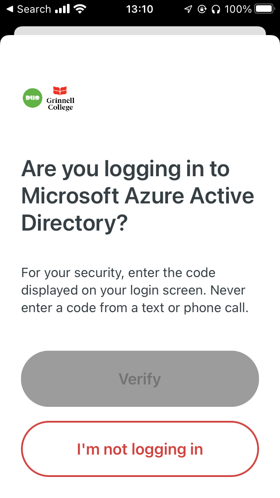

The other day, I went to connect to one of Grinnell's systems that is protected by two-factor authentication.  In case you are not yet embroiled in the world of 2FA (or multi-factor authentication), the basic idea is that in addition to providing a password, you also respond to a second kind of request, typically on your cell phone [1].  Grinnell uses an authentication system called Duo for this.

Here's what I saw on my cell phone.

In case you couldn't tell, the "Verify" button is greyed out because it doesn't work.

What would you do when presented with this screen?  Where would you enter the code?  Or would you just click "I'm not logging in" and give up?

No cheating!  Pretend that you haven't dealt with it already.

Do you have an answer?

No?

Maybe this will help.  It's the message we got ITS [2] about changes to DUO.

> DUO (our current multi-factor authentication tool) is being updated to protect accounts from a new form of cyberattack, and to take advantage of a new redesigned visual interface with security and usability enhancements [3]. This is an upgrade to DUO. New DUO prompts will be used on most Grinnell College applications including Microsoft 365. If you currently use DUO on your mobile device, it will continue to work after the upgrade.

Did that help?

I don't blame ITS.  DUO is a widely-used MFA [5] system; it makes sense that they chose it for Grinnell.  ITS is not responsible for user interfaces on the software it buys.

Still, isn't that a crappy UI?

---

**_Postscript_**: In case you didn't figure out an answer, it's "Scroll down for the data entry field and then enter the numbers that appeared on your computer."  Would it kill them to add a scroll bar?

---

[1] Further discussion of multi-factor authentication is an issue for a future musing.

[2] Information Technology Services.

[3] "Usability enhancements"?  Really?  This UI [4] is more usable?

[4] User interface.

[5] Multi-factor authentication.
