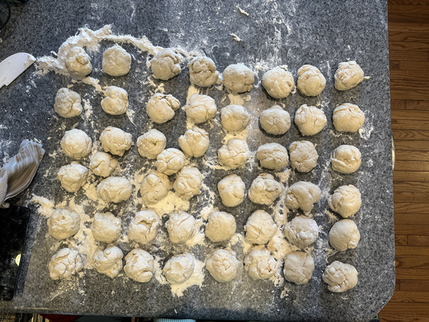

I've been making bagels for a long time. I can't remember when I started. Did I make them in high school? In college? Or did I start after Michelle and I got married. Michelle would know. I'm not sure anyone else would. Strike that; I seem to recall that my Resident Assistants from college, who read my musings, commented on me making bagels. And perhaps Adena knows [1]. Or David I. Maybe other college friends.

For a while, bagels were a key part of the Rebelsky Ground Hogs' Day [2,3] Celebrations. So were my dad's baked eggs, but those are a topic for another musing. Making bagels for brunch means getting up early for the rising, the boiling, and the baking. At times, I felt like the Dunkin' Donuts guy "Time to make the -donuts- bagels."

At some point, offspring activities made it difficult to hold our annual Ground Hogs' Day Celebration; for some reason, swim meets kept popping up on that weekend. Now they're done. Or at least they're done competing. Perhaps I'll revive the celebration next year. Can I do one myself? That's a separate musing. 

In the mid-twenty-teens, Middle decided that we should make bagels at Thanksgiving. Why Thanksgiving? I've never completely understood why, other than that it gave him an excuse to invite friends who were stuck in town over to the house early in the morning [4]. And so we've made bagels for Thanksgiving ever since. 

I've always used the recipe from _Love & Knishes_ [5].

> * 8 cups flour
> * 1 tablespoon salt
> * 1 tablespoon sugar
> * 2 cakes fresh yeast (_I can't find this anymore, so I always look up the alternative amount of dry yeast to use._)
> * 2 cups lukewarm potato water (water in which peeled potatoes have been cooked)
> * 1/4 cup salad oil
> * 4 eggs, slightly beaten
> * 2 tablespoons sugar
> * 2 quarts boiling water
> * poppy seed or sesame seed (optional)

> Sift together dry ingredients into a large mixing bowl. Soften yeast in one third of the potato water. Add to the flour. Add oil to the remaining potato water and stir into the flour mixture. Add eggs and stir briskly to form a ball of dough.

> Knead on a lightly floured board for ten minutes. This must be a firm dough; add more flour if necessary. Return to the bowl, smooth side up. Cover with a tea towel and let rise at room temperature until the dough rises to the top of the bowl. Knead again on a lightly floured board until smooth and elastic (as for rolls). Pinch off pieces of dough and roll between the palms to form ropes about 6 inches long and 3/4 inch wide. Pinch the ends together firmly to make a doughnut shape.

> Add sugar to boiling water. Drop bagels into the water one at a time. As they come to the surface, turn them over. Boil 1 minute longer on the second side. Please on a greased cooky sheet and bake at 450 degrees until the crust is golden brown and crisp (10 to 15 minutes). Bagels may be sprinkled with poppy seed or sesame seed before baking, if desired. Makes about 30.

We like to share (probably my inclination, but definitely one that Middle expanded), so the number of bagels we made grew. And grew. I believe one year, we made a gross. Perhaps even a baker's gross [6]. I recall using something like twenty-five pounds of flour. But our lives got busy. Busier. And the kids were only home for Thanksgiving. So we cut back. This past year, we only made enough for ourselves [7].

I also got older. At some point, I left much of the work to Middle. He loves to bake. I think he bakes something every week [8]. And, well, the recipe morphed. At some point, he started adding baking soda to the boiling water. Why? "It's basic dad; it makes a better crust" [9,10].

Or perhaps the recipe has just been completely replaced. I asked him about what he did this Thanksgiving, and here's what he sent.

> The night before ... Make the Mix

> * Probably about 2 cups of water
> * Enough flour to make a thick paste
> * Healthy tablespoon of gluten
> * Together with a dash of sugar and yeast
> * Let sit overnight

> In the morning

> Knead as much flour into the dough as you can. Let proof until doubled. Punch down, divide into equal sized balls. Shape bagels (these days I punch a hole in the ball and spin until a nice shape). In a pan, add some molasses and baking soda to boiling water, then boil the bagels for 1-2 minutes on each side. After that, pat the bagels dry and bake at 350 until done.

I now know what it's like to get a recipe from a Jewish Grandmother. How many bagels does this make? How much flour do I end up using? What's a "dash" of yeast? How does that scale?

Also: What happened to making ropes? Where are the eggs? [11] The oil? [12] _Where is the potato water!?_ It's bad enough that I had to give up on the yeast cakes, which were so much fun to work with. But no potato water? Blasphemy!

Nonetheless, I must admit that his bagels were yummy. Really yummy. Eldest called these bagels, along with lox, cream cheese, tomatoes, red onions, and such, "Happiness sandwiches". I know what he means.

This weekend, I decided to try to make some myself. We're headed to a Super Bowl party, and I wanted to bring something. Why bagels? Ask my muse. She [14] inspires me to do more than muse. I wanted to make enough to share. So I asked. "How much water would you use for ten pounds of flour?" Of course, he had no idea. However, we were able to approximate by referring to [a recipe from King Arthur flour](https://www.kingarthurbakinsg.com/recipes/martins-bagels-recipe) by Martin Philip. It bears some similarities to my son's, but also has some key differences, such as how long you rest the mix ("poolish", in Philip's terms),how the dough should feel ("cohesive, shaggy, tacky mess; resist the urge to add more flour" vs. Middle's "add as much flour as possible"), and the temperature (475 vs. Middle's 350).

I was still going to use potato water. Feed the yeast appropriately! Unfortunately, we didn't have any potatoes in the house. And, at the time when I was making the mix, I wasn't really in the mood to go out shopping. So, no potato water. I found some potato starch; hopefully, it achieves the same goals.

Middle and I decided that two quarts of water would be appropriate for ten pounds of flour. We underestimated. I added an extra cup in the morning and ended up using about nine pounds. I think two and a half would have been nearly perfect. Maybe a little too much. I'll figure that out next time.

Of course, as we were chatting, Middle also decided to update his instructions. Let's see. What did he say?

> Lately I've been pouring the baking soda into a dry pan, cooking off the water in it (sodium bicarbonate breaks down into sodium carbonate and water at boiling water temps, so you get a stronger base out).

You gotta love chemists! 

He also suggested that I proof the yeast before making the mix. Sugar, slightly warm water, yeast, fuzzy bubbles. QED!

I must admit that poking holes in balls of risen dough is more fun than making ropes. Making ropes was fun. Pinching them together was a joyful challenge. But the feeling of risen dough? Awesome.

At about the point that I was toasting the baking soda, I realized that I'd never added any salt. There wasn't any salt in his recipe? Salt is yummy. But it's also bad for me. Perhaps its absence is for the best. The taste will be the test.

I've learned that it's good to keep records. Here's my final ingredient list (approximate).

> * 9 cups of water.
> * 2 Tbs of yeast.
> * 2 Tbs of sugar.
> * 1/2 cup of potato starch.
> * 1/4 cup of gluten.
> * 9 pounds of flour.
> * 5 Tbs baking soda. (Start with 2 Tbs; add another tablespoon each time you add more water to the pan.)
> * 5 Tbs blackstrap molasses. (Start with 2 Tbs; add another tablespoon each time you add more water to the pan.)

Each ball of dough was about 112 grams. I ended up with 48 bagels, plus one small bit of dough left over.

---

**_Pictures_**: It's a recipe. I should include pictures, right? Let's see .... What do I have?

Here's the dough after I added all the flour and let it rise for a few hours.

The balls of dough I made along the way.

Here's what the bagels looked like after rising.

Here's what the bagels looked like after boiling.

And coming out of the oven.

Wasn't that thrilling? They're darker brown than I'd like, but they taste ok.

---

**_Postscript_**: If I want to make another gross, I suppose I'll need about thirty pounds of flour. And help. And much more time.

---

**_Postscript_**: After I made the bagels, Middle and I had a conversation. Well, a chat. All electronic. And he added some important notes. Let's see.

We both agreed that some salt is important.

When I told him that it was taking about thirty minutes to bake the bagels, he suggested that perhaps the temperature should be hotter than 350 degrees. For the second two dozen, I used 400 degrees and the convection setting.

Although I make it a practice to add more "ingredients" whenever I top off the boiling water, he doesn't. He notes that "If you taste the water, it should taste mildly sweet and painfully bitter/soapy". Does that mean it tastes like cilantro?

It sounds like I didn't use enough sugar. I thought sugar was there for the yeast. He tells me that people tend to like a sweeter dough.

He told me to make sure to roll the balls until perfectly smooth so that the bagel becomes smoother when punched out. That's advice I wish I'd followed. Mine look kind of rough. Or very rough.

It appears that when rising the bulk dough, it's a good idea to pour oil on the dough and roll it around in the bowl. Who knew? [16]

---

[1] Yup. She says I made bagels in college and taught her how, too.

[2] Middle tells me that it's "Ground Hog Day". I like the possessive. I'm sticking with it.

[3] No matter how you spell it, it sounds like it calls for a brunch. Right? An unkosher one, with sausages.

[4] I now have an answer. He had been lamenting a lack of family traditions and family recipes, and Michelle brought up bagels as a solution for both. It just happened that, since the conversataion began in summer, the next big event was Thanksgiving. 

Speaking of family food traditions, I felt like "Dad makes pancakes in the morning on special occasions" was a tradition. As was "Mom makes waffles". My dad's baked eggs are a family recipe, but I rarely made them for the kids. And when I bake apples, I channel my grandmother. We also started the book club as a tradition; that's a sad one to try to continue right now.

[5] Apparently, the book was published as _Love and Kishkes_ in the UK. Or maybe down under.

[6] Does such a thing exist?

[7] I suppose there are also other reasons for that. I'm amazed that we were able to make anything.

[8] Take note, ladies, he's a catch!

[9] A baker and a chemist! Such a catch! Handsome, too.

[10] Middle informs me that that's not a direct quote. Rather, it's "Higher pH lowers the temp required for browning reactions."

[11] Answer: Eggs make the dough tender and less chewy. Also make the bagels non-vegan. I'd forgotten that the old bagels were a bit more tender. I'll admit that I liked the tender aspect. I may have to play with that.

[12] Answer: Oil feels weird in dough and inhibits gluten formation.

[14] I realize that I previously referred to my muse as "they". Today, they identify as female. Gender is malleable [15].

[15] Do you pronounce that as "mail-uh-bull" or "mail-y-uh-bull"?

[16] I suppose he did.
