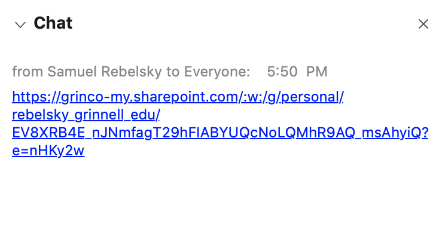

The other day, I was in one of the many Webex meetings that happen on campus,
even during Winter break.  At some point, someone shared a URL to a shared
Office 365 document.  Unfortunately, most of us who clicked the link found
that it didn't work.  This is a story about my further adventures with the
issue.

I'm pretty sure that links in Webex worked last term.  So what has changed?
The obvious change is that links now work differently.  It used to be that
links in the chat linked to, well, the linked page.  But at some point in
the past month or so, Cisco decided that links should go to a CYA page
that reads.

> External Site

> The host or presenter would like Webex Meetings to open a website on your computer. Cisco is not responsible for the content or availability of external sites. We recommend that you make sure this website content is from a trusted source. If you view this page or go to this site, you will be subject to the privacy policy and terms and conditions of the destination site.

> Destination site: ...

> **Continue**

Unfortunately, the far-from-competent programmers at Cisco managed to design
their code so that the URL gets downcased.  For example, here's a link in
a chat window.

What happens if you click that link?  You end up on a page like this.

As you can tell (or as you could tell if you looked closely enough), the URL on that page is not the same.  Well, it's mostly the same.  Except, well, all the letters have been downcased.  For example, the "`EV8XRB4`" that appeared immediately after `rebelsky.grinnell.edu/` is now "`ev8xrb4e`".

Yes, that's right, Cisco munges URLs even worse than Proofpoint [1].  Go Cisco!

How does one react to a problem like this?  One can curse Cisco.
One can curse ITS for suggesting that we use garbage software.  But
things don't change when you just curse people.  So I tend to report
them.  The friendly folks at the [ITS Help Desk](https://help.grinnell.edu)
[2] gave me the "report a problem" URL for Webex,
<https://mycase.cloudapps.cisco.com/attendeeCaseCreate>.

As you might guess, I had to create an account on Cisco.  Well, kind of.
Cisco thought I had an account.  But I still had to do some setup.  Such
fun!

While I was filling out the report form, I saw a helpful "Chat"
button, so I tried that.  It's easier to chat with someone than to
do endless back and forth via email, right?  Unfortunately, the
Chat ended up being someone just collecting the info that I could
have entered on the form.  Wow, that was a waste of my time.

I was also confused that the chat tech referred to the technology as
"WebEx" even though Cisco calls it "Webex" [2].

It didn't take long for a Cisco engineer to write back with six questions.

* Can you please confirm where in chat you facing this issue? In meeting or team space?
* If its webex meeting chat, Did user tried any other browser or reinstall app?
  <https://help.webex.com/en-us/WBX000026378/Meeting-Services-Removal-Tool>.
* Does all user or host affected?
* Is it working fine previously?
* Does the link work fine when clicked from chat after down casing as well?
* Is issue replicable?

Why do they always ask you to uninstall and reinstall the software?  I
suppose that should have been my first step.  Except, well, it doesn't
look like it has anything to do with the software, Webex updates
itself regularly, and, well, I wasn't the only one experiencing the
issue.

But I'm an obedient user.

So I uninstalled Webex.  On the Mac, that involves a few steps [3].

1. Drag the application to the trash.

2. Download the [Mac Cisco-Webex Uninstaller](https://www.cisco.com/c/dam/en/us/td/docs/collaboration/webex_centers/Collaboration-Help/TS-Help-Portal-Support-Utilities/Cisco_WebEx_Meeting_Application_Uninstaller-New.dmg)

3. Quit all of your Web browsers (or at least Chrome and Safari, which were
   the browsers I was running).

4. Do the normal things with a downloaded .dmg file.  (Mount the .dmg, double-click the application, authorize the application, run the application.)

5. Remove the .dmg.

6. Restart your Web browsers.

7. Cross your fingers.

It didn't uninstall everything.  For example,
`/Users/rebelsky/Library/Application\ Support/Cisco/WebEx\
Meetings/Updates/Cisco_Webex_Meetings.app.7z` remained on my computer.
But I deleted it.

And then there was the issue of reinstalling the software.  Do I
remember how I installed Webex?  Nah.  Someday, I'll learn to install
everything with Homebrew, but I'm not sure that works for Webex [4].
So I improvised.

1. Open a Web page to my personal room, 
<https://grinnellcollege.webex.com/meet/rebelsky>.

2. Authenticate.  I love authentication.  Type my 36-plus-character
password.  Type the word "Push".  Unlock my phone.  Agree to the Duo
prompt.  So much fun!  And I get to do it so many times each day.

3. Click on the link on the page that reads "Don't have the desktop
app.  Download it now."  Unfortunately, I can't easily share the link,
since they use JavaScript to generate it.

4. Open the comparatively small .pkg file.  That runs Cisco Webex Start,
which then seems to download Cisco Webex Meetings to two different places,
/Applications/Cisco\ Webex\ Meetings.app and
/Users/rebelsky/Library/Application\ Support/WebEx\ Folder/T33_64UMC_41.1.3.11/Meeting\ Center.app [5].

5. Marvel as things appear to install relatively smoothly.

As expected, reinstalling made *absolutely no difference*, other
than wasting fifteen or twenty minutes of my life.

Somewhere in this process, a chat window popped up where I'd first
reported the problem.  What did they say?

> Can you please inform if you are an admin with Premium/Enhanced coverage
or are you an End-user? If you are an admin with Premium/Enhanced coverage,
please provide us a contract to open a case. If you are an End-user, please
call Cloud Support Frontline for support directly.
<https://support.webex.com/MyAccountWeb/needsupport.do?userType=ht>

So I told them that I'm an end user and they told me they wouldn't help 
me.  Thanks Cisco!

Okay, back to the email.

> Can you please confirm where in chat you facing this issue? In meeting or team space?

> _ I have encountered this issue in a large meeting and in a one-on-one chat in my personal room.  I believe it is widespread._

> If its webex meeting chat, Did user tried any other browser or reinstall app?

> _I am using the Webex application, so the browser should be irrelevant.  I have removed and re-installed the Cisco Webex Meetings app.  The problem persists._

> Does all user or host affected?

> _Yes, all users are affected.  Everyone in the large meeting had the same experience._

> Is it working fine previously?

> _It appears that Cisco has added a new feature that informs the user that Cisco is not responsible for the link.  Links worked correctly prior to the addition of that feature._

Does the link work fine when clicked from chat after down casing as well?

> _Downcased versions of links don't work, since the URLs are case sensitive._

Is issue replicable?

> _Yes, the issue is replicable._

I love answering questions!  I got another reply within thirty minutes.

> Thanks for the swift response. Please confirm the issue is restricted to Personal meeting room or webex schedule meeting as well. Also can you please share the new feature refer that link will not work.

> Please replicate the issue & share the below details.'

> - Meeting number , date & time

> - Webex tracer logs

> https://urldefense.proofpoint.com/v2/url?u=https-3A__help.webex.com_en-2Dus_WBX000026383_WBX-2DTracer&d=DwIGaQ&c=HUrdOLg_tCr0UMeDjWLBOM9lLDRpsndbROGxEKQRFzk&r=6rcUljFJZnpk5uomPd3v3WCzboqh0RuwO-BZyxMfi0U&m=4nX-ZLUA5hj0sLGfp89411duY2enhQrCfwZNyUV4cMQ&s=Ke886o5B83cLulGWAECSGWwvrHLQJUEhmSZqHxchG1c&e= 

> - Recording of issue with password or meeting window snapshot with chat 

> - OS version & desktop app version.

Isn't it wonderful when URLdefense makes URLs unreadable?  No worries.
The URL above is <https://help.webex.com/en-us/WBX000026383/WBX-Tracer>.
Unfortunately, WBX-Tracer is a Windows product.  So I did the rest.  I
recorded a video of me making a link, clicking the link, and ending up
in the wrong place.  I recorded screen shots.  I figured out how to
find the meeting number for a Webex meeting.  I learned that the
recordings for a meeting don't appear until you quit the meeting.  Ah,
such fun.

And so I wrote back.

> Dear Name,

> Did you try replicating what I did?  It's pretty clear that Webex downcases URLs in all instances.

> I'm on macOS Catalina, Version 10.15.7.  The link for Webex tracer only works on Windows.

> My meeting took place on 25 January 2021 at about 5:50 pm Central Standard Time.  My meeting number is 120 436 9391.

> Here's a link to a recording in which I demonstrate what goes wrong.

> https://grinnellcollege.webex.com/grinnellcollege/ldr.php?RCID=gobbledygook [6]

> pw: noneofyourbeezwax

> I am attaching a screenshot of the chat panel, the page that appears when one clicks the link, and the page that appears when one clicks the "Continue" button.  You will note that the URL has been downcased.

But the earlier message from the chat suggests that I'll likely be more
successful if someone from ITS (i.e., our official contact) writes to
Cisco.  So I put in a ticket [7].

My fingers are crossed that Cisco will fix things eventually.  My guess
is that it won't be until the end of Spring Term One.

Once again, I'm left wondering (a) why people don't test their software
and (b) why they aren't willing to acknowledge when it needs fixing.

I deserve a bounty.

---

**_Postscript_**: If you feel like retyping the URL and have a Grinnell 
account, you'll likely be able to access a sample shared page.

---

[1] Proofpoint URLs may look worse, but it's possible to (mostly) undo the
damage.  My [handy-dandy script](https://rebelsky.cs.grinnell.edu/urldefense)
works most of the time.

[2] To further complicate things, the Webex logo uses "webex".

[3] <https://help.webex.com/en-us/WBX38280/How-Do-I-Uninstall-Webex-Software-on-a-Mac>

[4] I'm not sure that it would make ITS happy if I used Homebrew to install
everything.

[5] Remember that location?

[6] If you'd like the real link, let me know.  It's not all that interesting.

[7] Ticket INC0025016, if anyone from ITS is reading.
