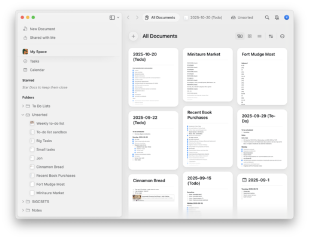

As long-time readers know, I struggle to keep track of, let alone manage, all the outstanding tasks I have. Memory isn't enough! (Particularly these days.) I've tried a variety of approaches, including paper notebooks, index cards, computerized text files, and software (including Todoist). Nothing quite worked the way I wanted.

Recently, I stumbled upon Craft---or [Craft.do](https://craft.do), to disambiguate the name---a somewhat free-form note-taking application. Unlike, say, Todoist, which focuses primarily on a particular model of managing to-do lists, Craft gives you tools to, well, craft things the way you'd like.

Here are some of the things I like about Craft.

My Craft documents are available on my phone (via an App), on my computers (also via Apps), and via the Web. One reason I struggled with paper notebooks and text files was that they often weren't available when I needed them. Perhaps my notebook wasn't with me. Perhaps the computer with the files wasn't available. I need iPhone access in the middle of the night when another task springs to mind and I'll probably forget it by morning [1]. I prefer computer access for entering longer lists of tasks and for arranging and rearranging them. Craft does both.

Craft lets me write my to-do lists (and, on occasion, other notes) using Markdown. I use Markdown for so much of my work that it's now second nature. That makes life easier.

As I said, Craft is open-ended. If I want to choose a different way to organize my to-do lists, I can easily switch. I compare that to, say, Todoist, which expects me to tag each activity with a priority, a deadline, and, optionally, some other things. Of course, Todoist is nice about rearranging my tasks based on priority and how soon they're due. But I'd rather do that "by hand", as it were. And Craft definitely makes it easy to rearrange items; dragging is simple. 

Choosing different ways to organize my lists seems important. For example, most weeks I try to keep track of what I'm planning to do each day, but also have a section for longer tasks that have to get done at some point. This week, which is break and therefore a bit less involved, I just created a few lists: One for quick phone calls and email messages [2], one for medium-sized tasks, and one for bigger things that I could start, but didn't need to. Some weeks, I like to separate home tasks from work tasks from "out and about" tasks. I can switch as my mind dictates.

Unfortunately, Craft is not open-source. I prefer open-source software when I can find it. However, I also use a Mac and an iPhone; I'm willing to accept proprietary stuff as part of my life.

When I applied to ITS for permission to use Craft, one of the questions the review committee [3] asked was why I couldn't just use Microsoft Notes. I'll have to admit that I'd never thought about using Microsoft Notes for this purpose. And so I tried. And I was reminded about why I don't generally think about using Microsoftware. The interface was inconsistent (confusingly so) between Mac and iPhone. It was also kludgey, at best [4]. And, compared to something elegant enough to be nominated for design awards (yes, that's Craft.do), it's particularly inelegant. In addition, I don't think Notes supports Markdown. Still, I'll have a chat with someone in ITS to see whether I'm missing something.

One of my favorite aspects of Craft.do is that there's a reasonable free plan and, more importantly, the advanced version (Craft Plus) is [free for students, faculty, and staff](https://www.craft.do/education). Would I pay the $60 per year that others pay? I'm not sure. I paid about $30/year for Todoist [5]. I'll have to use Craft for a bit longer to figure that out.

What else? As I noted, Craft is somewhat free-form note-taking software. I use it for to-do lists, but it supports many other types of note-taking. It even lets you embed notes within each other [6]. I've also started using it to replace my other "Quick notes" software, such as the iPhone notes application.

Is Craft the right software for you? I have no idea. But it's working well for me. I'd encourage you to play with it, particularly if you're someone who can get a free Craft Plus subscription.

---

[1] That's an issue because (a) the task probably needs to get done and (b) at some point, I'll start to fret about what the task was.

[2] I realize that I should generally try to make phone calls and email messages as they spring to mind. However, enough spring to mind that I often forget some unless I write them all down. And, believe it or not, some spring to mind in the middle of the night. "Damn, I need to check in with X about Y", or something like that.

[3] Did you know that ITS had a review committee for software requests? I didn't
.

[4] I've asked some folks at Microsoft why their user interfaces are often so bad. The most typical answer is "We don't budget for that."

[5] That reminds me; it's time to unsubscribe.

[6] No, I haven't yet tried recursive embedding. Someday, I will.
