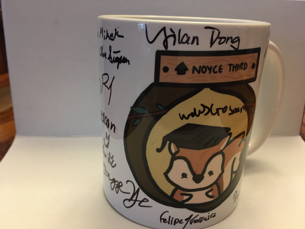
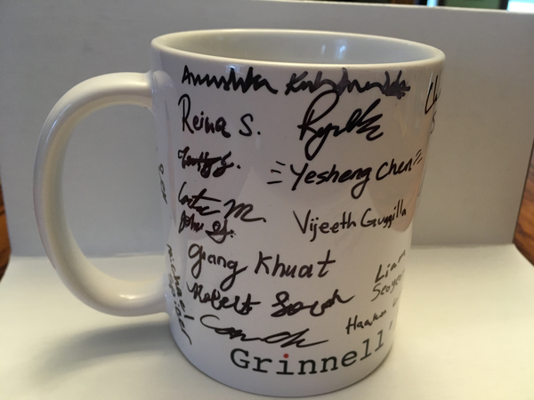

On Thursday, 27 May 2021, we had a graduation event for Grinnell's CS
seniors [1].  It was a bit different than normal.

In past years, the CS department has traditionally conducted three
separate events associated with the end of our CS majors' Grinnell
careers.  We have a celebration of CS seniors at Relish; we
conduct [the Pledge of the Computing
Professional](http://pledge-of-the-computing-professional.org/) for
interested students (not only CS majors but also those intending
careers in computing), most frequently immediately after Baccalaureate;
and we have a breakfast for our seniors and their families on the
morning of commencement.

This year, we crammed all of that into a short online ceremony.  We also
added announcements of honors [3].  And, because many seniors are on
campus, we added a post-Baccalaureate meet and greet in the Kington
Courtyard [6].

For many years, I used to announce department "awards", but those
were humorous, or at least what I take to be humorous.  The "Alan
Funt Award", for the student who always made me feel like I was on
Candid Camera.  The "Finding a home in MathLAN" award, for the
student who often worked so late in the night that they fell asleep
under their desk.  Things like that.  But we discontinued those when
we went over twenty-five or so majors in a graduating class.  Creating
awards is hard!

Fortunately, we have other traditions.  One is that I give a short
speech to our seniors, which I think we started when we started the
senior lunches.

I'm not great at speaking off the cuff [7,8].  I always forget something
that I intended.  So, once again, I am attempting to write my speech in
advance, or at least to sketch my speech.  I was hoping to just reuse
my [speech from last year](cs-seniors-2020), but I see my notes from
last year say "I'll need to refer back to the earlier notes; there's
much I removed".

Here goes.

---

Good morning, good day, good evening, or good whatever time of day
matches wherever you are.  For those of you who don't know me, I'm
Sam Rebelsky, Professor and Former Chair of Computer Science [9].
As is our department tradition, I have some remarks for our graduates.

Thank you all for joining us: May 2021 grads, December 2020 grads,
March 2021 grads, December 2021 grads, parents, grandparents,
siblings, other family members, friends, faculty, zoombombers,
everyone.

We hope to get you out of here with enough time to line up for
Grinnell's Baccalaureate.  Oh, what's that?  Baccalaureate isn't
until 2pm or so this afternoon [10,11]? I assume we should get you
out of here before then.  And we look forward to seeing some of you
back in the Kington Courtyard afterward Baccalaureate.

I would first like to thank the families of our graduates for sharing
them with us, or at least permitting them to attend Grinnell.  I
know that I speak for all of my colleagues when I say that it has
been a true privilege to teach them and to watch them grow.  

On to the graduates (or near graduates), who are the focus of my
comments.

Thank you for much for joining us in this celebration.  My real
thanks are for all that you have brought us in the time you've been
at Grinnell, both physically and remotely.  Individually and
collectively, you have done so much for Grinnell, for the department,
and for each other.  We appreciate the grading, the mentoring, the
tutoring you've done; the resources you've created; the phone and
Web apps you've developed (ITS doesn't appear to appreciate them
as much as we do).  We appreciate your other software, too: libraries,
scripts, programs large and small. We appreciate the papers and
articles, poems and books you've written; the outreach you've led
or contributed to; the social events you've developed or joined;
the feedback you've given.  We also appreciate your performances
on the athletic field, on the stage, in your creations.  And there's
so much more; if I tried to list all of your accomplishments, we'd
still be here tomorrow, and I still wouldn't be done.  So let me
just say, "thank you for being you".

Many of you are double majors (and perhaps triple majors) and that
you have brought concepts from those other majors to our department.
If I count correctly, your class includes double majors with ten
other disciplines.  In alphabetical order, they are Biological
Chemistry, Economics, French, German Studies, Mathematics, Physics,
Political Science, Psychology, Sociology, and Theater and Dance,
Not a bad set of subjects!  (And I'm sorry if I missed any.)

I hope that most of you chose CS because you found something you
loved about the field, and not for the reasons we've heard from,
say Kumail Nanjiani '01, who said something like "I majored in CS
for my parents.  I majored in Philosophy for myself."

Of course, we appreciate our single-majors just as much as our
double majors.  We've particularly valued the ways that the single
major has permitted you to do more in the department and to explore
a wide variety of other topics.

In any case, we are thankful for all of you.  

We are very sorry that your senior-year learning has been online,
that most of you have had to spend most of this year away from
Grinnell, and that we could not hold these events in person.  I'm
told that some of those who are on campus are coming together in
the Kington Courtyard after Baccalaureate.  I hope to see many of
you there.

As I said, we will miss you.  I hope that you will take the time,
once in a while, to write back and let us know how you're doing.
Perhaps we'll even eventually update that map of graduates!  And
we'll still be there for you if you have questions, want advice,
or, most importantly, want to share your accomplishments, professional
or personal

I hope that you are also thankful for the many things you have been
able to do and learn at Grinnell, and I hope that you'll find ways
to give back.  Don't worry; I'm not asking for money.  As you know,
Grinnell students can always use hosts of externships, internship
opportunities, mock interviewers, advice from people out in the
real world, and more.  Please volunteer your time as you are able.
And if you feel like donating to either the Department's restricted
fund or the Broadening participation fund, we wouldn't object.

We wish you the best in the many careers you choose.  I'll remind
you that there are many things you can do with a CS degree.  While
we have many graduates in the computing industry, we also have
graduates who are helicopter pilots, physicians and nurses, documentary
filmmakers, fund raisers, homemakers (Male and female), teachers,
corporate trainers, and even Super Heroes in the Marvel Cinematic
Universe [12].  Please do not feel constrained by your major.

I must also remind you once again that computing technology has
great power, power to change the world.  As technologists, you have
responsibility to think about the technologies you build or contribute
to.  I hope that our conversations at CS table, in our classes, and
in the hallway have gotten you to think more about the risks of
computing and your own relationship to those risks.

Once again, thank you for being part of the Grinnell community and
of our department community.  We look forward to seeing you march,
even if only on the screen, and to hearing about your post-Grinnell
adventures.

Take care and be well.

---

_Three of my colleagues are also leaving Grinnell this year, albeit in
different ways.  I promised to give short comments about them.  I'm not
sure I gave myself enough time to prepare those comments.  Here goes [14]._

We also have a few farewells to say today.

First of all, Assistant Professor Shervin Hajiamini is leaving us
for Vanderbilt after two years as a visitor.  We are thankful to
Professor Hajiamini for his active involvement in the department,
which included not just taking over leadership of CSC-207, our course
in object-oriented design, data structures, and algorithms, but also
leading some important student research projects.  We have enjoyed
watching Shervin grow as a teacher at Grinnell and wish him the
best of luck.

Professor Henry Walker is moving from Senior Faculty Status to
Emeritus Status.  That means, among other things, that he is stepping
away from teaching in our department.  I'm not sure Henry will ever
completely step away from teaching; I believe I've heard that he's
planning to teach a course at Sonoma State this fall.  And he's
continuing to serve as an advisor for Grinnell students.  But, as
those of you who've walked by his office know, he has now cleaned
out that office.  (Looking ahead to having to do that myself terrifies
me.)  In any case, he will no longer be here physically.

It's hard to see Henry go.  He's been here since 1974. (You do the math.)
He founded the CS major.  I'm pretty sure he founded the study of CS at
Grinnell.  He was just showing me the lab manual from the original CS classes
at Grinnell.  Those of you my age will share my amazement that they managed
to do the mimeographs in three colors.  (If anyone wants one of the somewhat
newer bound lab manuals from the FORTRAN or BASIC classes, let me know.  I'm 
pretty sure he left a few in my lab.)

We've been fortunate to have him here for so many years, and, even
though he's not able to be at this ceremony, we thank him for
all that he has done.

Last, but not least, Scholar John David Stone is retiring.  Losing
John is as hard as losing Henry.  He's been with us nearly as long.
Among other things, John built the wonderful technological
infrastructure known as MathLAN.  For years, MathLAN has been a
bastion of open experimentation and freedom to play for computing.
John has brought an incredibly powerful ethical and philosophical
grounding to our department, including serious considerations of
privacy and security.  I've also appreciated the ability to go to
John with a wide variety of questions on concepts; in my perspective,
he's been the "Genius Bar" of our department.  I don't know what
our department will be like without John's insightful approaches.
But it will not be the same.

I doubt that John is part of this conversation; Webex's privacy guarantees
don't meet his high standards.  But I do want to have us publicly thank
him for everything.

Finally, I should note once again that many of the students here are
graduating and leaving us.  Thank you once, again, for all that you've
brought to us.

---

It went about as well as I expected.  I hate giving Webex talks [15];
I can't see anyone besides myself (or at least I couldn't today).
But I hope the students heard the words and understood just how
much we appreciate them.

Last year, lots of people stayed around after the main event.  This year
people left quickly.  What's the difference?  I think this year, everyone
has Zoom fatigue, even if we don't use Zoom as our primary platform.

The saddest part of the post-meeting chat was learning that the
College had canceled in-person Baccalaureate [16].  Faculty aren't
invited to graduation [18] and were hoping to do a gauntlet for the
students at Baccalaureate [19].  But without in-person Baccalaureate
that wasn't possible.  I'm sorry that we weren't able to support the
students in person.

The Pledge of the Computing Professional was fun, an experiment in
what one of my colleagues termed "synchronization over Webex".  And
no, it isn't easy; the voices saying the pledge were not in sync.
On the positive side, it was nice to see how many of our students
participated.

I'm thankful to my colleagues who put the ceremony together.  I'm
also thankful to them for putting together the in-person gathering.
I didn't recognize many of our students with masks on (including
some who have been mentors for me multiple times), but once I figured
it out, it was great to see them.  I'm thankful to the SEPC for
getting senior mugs, for making sure they had room for signatures,
and for bringing along Sharpies.  I brought copies of Mr. Walker's
first published lab manuals, for FORTRAN and BASIC.  As I said to
the students, "It came out in 1980, before most of the CS faculty
were born."  I need to muse about the history of active learning
in CS at Grinnell, but that won't be now.  I also brought cookbooks:
A choice of [_Veggie
Planet_](https://www.amazon.com/Vegetarian-Planet-Big-Flavor-Out-This-World/dp/1558321152/),
[_The Moosewood
Cookbook_](https://www.amazon.com/Moosewood-Cookbook-40th-Anniversary/dp/1607747391/),
and [_The Heart of the
Plate_](https://www.amazon.com/Heart-Plate-Vegetarian-Recipes-Generation/dp/0547571593/).
Too few of the students were willing to take them.  But I understand
that they have too much stuff to worry about moving and not wanting
to take more.

---

_Here's the Otter.ai transcript of the first part.  I've inserted some blank lines between paragraphs; I'm pretty sure that Otter only used two._

Okay, good morning, good day, good evening, good whatever time of day wherever you are. For those of you who don't know me, I'm Sam Rebelsky, professor and former chair of computer science, as is our department tradition. I have some remarks for our graduates. Thank you to everybody for joining us, the May 2021 grads, the December 2020 grads the march 2021 grads maybe even some December 2021 grads, the parents, the grandparents, the siblings, the other family members, the friends, faculty, the Zoom bombers, Everyone, we're glad to have you here. 

We hope to get you out of here in time for lineup for granos baccalaureate. What's that PM, baccalaureate is until two o'clock this afternoon? Oh, yeah, we should get you out of there by then, and we look forward to seeing some of you back in the Kingston courtyard after baccalaureate. 

I would first like to thank the families of our graduates for sharing them with us, or at least permitting them to attend for now. I know that I speak for all of my colleagues when I say that it's been a true privilege, to teach them, and to watch them grow. 

His remarks are really for the graduates. Let's go on to them. Thank you. Thank you so much for joining us in the celebration, but my real thanks for our for all you brought us in the time you've been at Brunel [20], those things are bad, both physically and more recently remotely, individually and collectively, you have done so much for Grinnell for the department for each other. And for us, we appreciate the greater the mentoring and the tutoring you've done the resources you've created the phone and web apps you've developed. Well it doesn't appear to appreciate those as much as we do. We appreciate the other software to your library scripts programs, large and small. We appreciate the papers and articles poems and books you've written the outreach you've led or contributed to the social events you've developed or joined the feedback you've given. You also appreciate your performances on the athletic fields on the stage and in your creations. There's so much more. If I tried to lift all of the accomplishments of our seniors, we'd still be here tomorrow. And I still wouldn't be done. 

So let me just say thank you. Thank you, thank you for being here. 

Many of you are double majors, and you've brought concepts from those other majors to our department. If I count correctly your class includes double majors with at least 10 other disciplines in alphabetical order, the ones I found are biological chemistry, economics, French, German Studies, mathematics, physics, political science, psychology, sociology, and theater and dance. Not a bad set of subjects, and I'm sorry if I missed any, it's likely I did. I hope that most of you chose yes because you found something you love about our field. 

I think most of you did. I do remember that Kumail Nanjiani class of one stood on the graduation stage a few years ago and said, I majored in CS, from my parents. I majored in philosophy for myself. I hope you majored in CS for yourselves. 

We also appreciate our single majors just as much as our double majors, and we've particularly valued the ways that the single major has permitted you to do more in the department, and to explore a wider variety of topics. In any case, we are thankful for all of you. 

Although it is not our fault. We are very sorry that your senior year learning has been online that most of you have had to spend most or all of this year away from Grinnell, and that we could not be holding this event in person. 

As I noted before, I'm told that some of those who are on campus are coming together in the kingdom courtyard after baccalaureate. I hope to see many of you there. As I said, We will miss you. 

I hope you will take the time, once in a while to write back and let us know how you're doing. Perhaps we'll even update that map of graduates in the hallway. And we'll still be here for you. If you want to ask questions, get advice, or perhaps most importantly, share your accomplishments, whether they're professional or personal. Personally I love seeing baby pictures. And I know that's far in the future.

I hope that you are also thankful for the many things that you have been able to do and learn it for now. And I hope you will find ways to give back. No this is not a request for money. As you know, when all students can always use hosts for externships internship opportunities people willing to do mock interviews or give advice from people, other than the kind of advice you get from your faculty, please volunteer your time as you are able. Of course if you feel like donating to either the department restricted fund or the broadening participation fund, we wouldn't object. 

We wish you the best in the many careers you choose our mind you there are a variety of things you can do with a CS degree. While we have many graduates in the computing industry. We also have graduates who are helicopter pilots physicians and nurses documentary filmmakers fundraisers homemakers, both male and female teachers, corporate trainers, and even a superhero in the Marvel Cinematic Universe. Please do not feel constrained by your major. 

You've heard this from all of us before, but I'm going to remind you once again that computing technology has great power, power to change the world, as technologists, you have a strong responsibility to think about the technologies you build or contribute to. I hope that our conversations at CES table in our classes, and in the hallways, and most recently online have gotten you to think more about the risks of computing, and your own relationships to those risks. 

Once again, thank you for being part of the Grinnell computing community and part of our department community. Look forward to seeing you march, even if only on screen, and to hearing about your post Brunel adventures. Take care and be well. And I'm going to applaud you.

---

_And here's the Otter transcript for the second part.  I think I changed more here._

It's me again, Sam. Um, so three of the faculty are leaving Grinnell this year, although in different ways. I promised to give short comments about them. So let's go.

First of all, can you go to the next slide, Assistant Professor Sherman hajian meanie is leaving us to go to Vanderbilt, after spending two years at Grinnell as a visitor. We are thankful to Professor Javier meany for his active involvement in the department, we concluded, not just taking over leadership for 207. Our courts and object oriented design instructors and algorithms, was also leading some important student research projects. We've enjoyed watching driven grow as a teacher at Brunel, and we wish him the best of luck. 

Next slide. Professor Henry Walker is moving from senior faculty status to emeritus status. This means, among other things, that he is stepping away from teaching in our department. Of course, I'm not sure Henry will ever completely step away from teaching. I believe I've heard that he's planning to teach a course at Sonoma State this fall. And he's continuing to serve as an advisor for Grinnell students. But as those of you who've walked by his office, no, no, he has cleaned out his office. Looking ahead to having to do that myself, utterly terrifies me. In any case, Henry will no longer be here physically. It's hard to see Henry doe. It's been here since 1974 You can do the math. He founded the Grinnell CS major. I'm pretty sure he founded the study of NACS at Grinnell. He was just showing me the lab manual from the original CS classes at Brunel. Those of you who are my age will share my amazement that they managed to do the Mimeo graphs in three different colors. He also has a bunch of bound lab manuals that are a bit newer, if you want one of them. I think he threw them in my lab, and I would be happy to give you one just let me know. In any case, we've been fortunate to have him here for so many years, and even though he is driving back to California and therefore not able to be at the ceremony, we thank him for all that he has done.

And last but not least, scholar John David Stone is retiring at the end of this year. Losing John is just as hard as losing Henry, although in different ways. He's definitely been here nearly as long, among other things, John built a wonderful full technological infrastructure known as math land [21]. For many years, math land has been the bastion of open experimentation and freedom for great aliens [22] to play with computing. John is also brought an incredibly powerful, ethical and philosophical grounding to our department, including serious considerations of privacy and security. Personally, I've appreciated the ability to go to John with a wide variety of questions on different concepts. In my perspective, he's the real genius bar of our department. I don't know that will be the same without his insightful approaches. I doubt that John is part of this conversation. WebEx is privacy guarantees do not meet his standards. But I do want to have us publicly thank Him for everything he's done.

_That's closer to what I planned than I thought._

---

[1] "Seniors" is a complex concept, particularly with the student
schedule changes associated with the pandemic.  Some of them graduated
earlier this year.  A few may not graduate until the end of the Fall
Semester [2].

[2] It seems so strange to write "Semester" rather than "Term".

[3] I suppose we added the announcement last year.  At least I recall that
we did.  And it was necessary because some of the CS honors didn't appear 
in the graduation program [4,5].

[4] As far as I can tell, it's because the list of candidates was a double-sided
page, and someone only looked at the front side.

[5] I still think the College has a moral obligation to reprint the program
for those who were not listed correctly, but what do I know?

[6] Or maybe in Kansas City; I never get those KC terms right.

[7] I also planned to wear a short-sleeve shirt.

[8] I ended up wearing a long-sleeve shirt.

[9] Yup, that's how I title myself these days.  It's even in my email
signature.  I don't think anyone notices.

[10] As I predicted, one of my colleagues got ready to correct me right
then.

[11] And it was scheduled for 3pm, not 2pm.

[12] Kumail Nanjiani is playing Kingo, which I think is an acronym
for "Kumail's Incredible Notoriety is a Grinnell Outcome".  Something
like that.

[14] Cleverly, I read the paragraph that I intended for you.

[15] Admittedly, I don't particularly like giving talks of any kind.

[16] Baccalaureate is an end-of-year pre-graduation ceremony.  A
few students get awards.  Students designate a few staff and faculty
members as honorary members of the class.  Distinguished faculty,
like John Garrison and Monessa Cummins, give lectures.  Distinguished
students, like Obuchi Adikema, also give short talks.  Students
make jokes about confusing John Garrison and John Rommerreim.  Things
like that.  This year, they also gave instructions for what to do at
graduation, such as "After making sure you are socially distanced from
President Harris, you may drop your mask for pictures." [17]

[17] Given that it's Grinnell, I'm surprised they didn't add "But don't
drop trou".

[18] More accurately, the faculty as a whole are not invited to graduation.
Many students who had extra wristbands invited faculty members.

[19] One of my offspring asked what the safety difference is between
Baccalaureate and Graduation.  I noted two things: Baccalaureate was
only for students, which meant a much smaller crowd, and most students
and faculty are now immunized.

[20] No, I don't know why Otter.ai interprets my "Grinnell" as "Brunel".

[21] MathLAN.  Although "math land" sounds like a great place.

[22] Grinnellians.  Perhaps Green Aliens.  I've heard suggestions that
we should call ourselves Munchkins.
