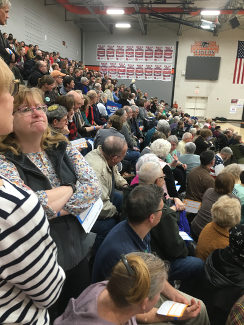
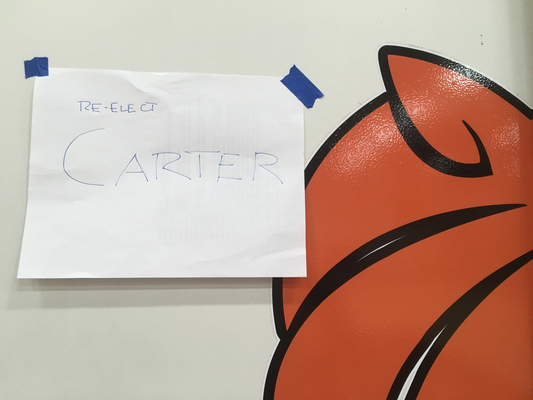
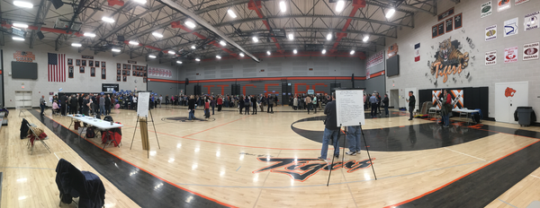

**_Disclaimer_**: _I began this musing before I heard about the
technology issues.  It's sad; the articles I saw about the satellite
sites showed a very positive spin on the process; I think they 
could have generated more support for them.  On the other hand,
the process worked, just more slowly than some might have wished.
The paper ballots permitted a clear way to document votes._

The Iowa Democratic Caucuses.  Everyone knows about them.  People
clearly have mixed feelings.  Why should a white, mostly rural,
state get such power?  Is the caucus process fair, given that it
requires a time commitment that many people lack?  On the other
hand, as Youngest says, "There’s something to be said about how
nice it is to hear what real people have to say, and not just the
reporters and polls."  You see conversations and community at the
caucuses.  You get to talk to people.  You can become a delegate,
even if you aren't currently part of the party's power structure.
And many voting processes are also unfair; people get told they
can't vote, spend hours in line, have their ballots rejected, fight
with Chad, fall prey to systems with no paper backups.  

My biggest worry is that one of the claimed strengths of the caucuses
may, in fact, be a significant problem.  As proponents seem to
suggest, Iowa is small enough that citizens can meet and chat with
significant numbers of candidates, or so that candidates can meet
and chat with a significant number of voters, or something like
that.  It sounds good, in theory.  And people take those responsibilities
seriously.  So what's wrong?  I've seen claims that Americans elect
people, not policies.  If you make your decisions based on your
interactions with the candidates, do you end up focusing on the
personality?  I'm not sure.

I will admit that I appreciate that candidates come to Grinnell and
nearby times, which means that my family, friends, neighbors,
colleagues, and students get to meet many of them [1].  It's an
"interesting" experience, to say the least.  Is it fair that it
happens to us in Iowa?  I'm not sure.  But it may beat candidates
only going to a few pre-selected places across the country.  And it's
a way we could attract students to Grinnell: "Some time in your career,
you'll get to meet with a bunch of presidential candidates."  

But it's not up to me to decide.  We'll see whether we get to be first
in the nation four years from now [2].

---

A few of my readers have asked me to muse about the caucus process
from the perspective of someone who participated in one [3].  I
like the caucus; I get to see and talk to a wide variety of people.
When I'm undecided, I get to talk to them about different candidates
and hear more about why people have chosen to support a particular
candidate.  It may be corny [4] to say it, but it feels a community 
coming together [5].

For those not familiar with the process [7], it's fairly straightforward.
There are some introductory announcements.  We elect a chair and a
secretary for the meeting.  We hear from representatives of some
of the candidates.  We get counted.  This year, we got ballots,
too.  Then they let us form groups around the candidates we support.
If a group gets 15% or more of the people present, they are considered
viable.  If not, they are not viable.  In past years, once viability
was determined, people could then switch around.  This year, members
of viable groups needed to stick with their viable groups, or at
least their cards needed to stick with the same viable group.
Members of non-viable groups can either join a viable group or try
to convince members of non-viable groups to join their group in an
attempt to become viable.  Then they compute the number of delegates
for each candidate.  You can read more in [the official
rules](https://acc99235-748f-4706-80f5-4b87384c1fb7.filesusr.com/ugd/5af8f4_2618217ea4384df5822b5eb004672c84.pdf) or look at the picture of the agenda
at the end of this musing.

So, what happened in my precinct, which I think was 2nd Ward, 7th
Precinct, or something like that.  We had 328 voters there, along
with a variety of people who wanted to observe or have an effect.
For example, the Yang campaign had sent someone from out of the
precinct.  I like Yang's MATH hats.  I also like the guaranteed
income.  Perhaps I should have supported Yang.

I noted that the form had this wonderful, "Only in F(6)C situation"
section.  I asked about it, and no one knew for sure what it meant.
I find that problematic.  I also find it problematic that my brain
immediately went to "I wonder what triggers this section."

Middle convinced me to help him caucus for Jimmy Carter, "the most
ethical president we've had in a long time".  I kept hoping someone
else would join us as a strategy to get more supporters for their
candidate; once Carter became non-viable we would have followed
them back to their preferred candidate.  Someone suggested we would
have been better off at the College, where some of the news crews might
have covered the ad hoc campaign.  

But we weren't at the College.  And it was just the two of us.  So
we stood there to the side, along with most of the other single-digit
candidates: Bennett, Gabbard, and Pythagoras.  Or maybe Bennett,
Steyer, and Pythagoras.  I thought the folks nearby we supporting
Gabbard, but [the results](https://results.thecaucuses.org/) list
Steyer.  I tried to convince the Pythagoras supporter that he wasn't
eligible, but I had to admit that Carter, while eligible, was not
running, and might be too old to serve [8].

After the second round, someone told me that they appreciated the
Carter strategy because it allowed us to scope out the room before
deciding who we supported, particularly since "No preference" can
become viable.  It didn't look like it would in our room, but I
hear it happened over at the College.

The new process, which was supposed to be more efficient, seemed
much less efficient.  People thought they were no longer viable or
were told they were no longer viable, switched, then were told to
go back to their original areas until counting was completed.  That
made things slow but did not seem to affect the accuracy of the
results.

Another problem was, well, more problematic.  Many people didn't
realize that you could become viable in the second round if you
weren't viable in the first round.  I heard that the Mayor Pete folks
were a bit frustrated, at first, because they only had 49 of the 50
people they needed to become viable, even though many of the Biden
supporters had decided to switch over to them.   I also hear that in
the Stanford remote caucus, Amy became viable in the second round,
even though she had only one supporter in the first round.

That's about all I have to say.  If you'd like, you can look at a
few of the photos I took [9].

---

**An Agenda for the Caucus**

---

**People Waiting in the Stands, Being Counted, Holding Their Caucus Cards**

---

**Caucus Card, Front**

---

**Caucus Card, Back**

_Observe the puzzling text about the F(6)C situation.  Michelle also appreciated that I got card 55 at age 55._

---

**The sign for the Carter group**

---

**A panoramic picture of the room**

_You might be able to see some of the Carter group at the right._

---

[1] Why didn't I include myself?  I hate crowds, so I don't tend to
go to the meet-and-greet events.

[2] Is there a good name for a four-year period?

[3] Okay, more than one.

[4] It is Iowa, after all.

[5] Or at least the Democrats in a community [6].

[6] Or at least the registered voters who are willing to call themselves
Democrats during the caucus.

[7] Given how often the process has been described in the media, I'm not
sure that there's anyone who doesn't know.

[8] You probably feel the same about [fill in name of candidate].

[9] You can also read, or have read aloud, the alt text I've written.
