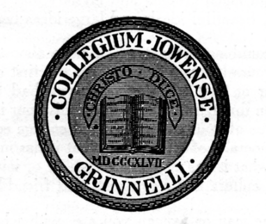

Grinnell has approximately four primary insignia/logos. 

There's the College seal, which seems to appear primarily on official documents and some podia around campus [1,2,3,4].  Or at least it used to.

There's our primary logo, a set of four laurel leaves.

There's a hybrid of the two that I did not realize we were using but found while searching for the primary logo.  

Perhaps it's not so much a hybrid as an update of the seal. I'm not sure. I was surprised how many copies of this one are out there.

And then there's the Honor G, the symbol used for our athletics program.

Does that image shock you? It surprises many people the first time. They ask,

> Why is Grinnell using a version of [the Iron Cross](https://www.adl.org/resources/hate-symbol/iron-cross) as a logo, given that it's a known hate symbol?

The simple answer is "We were using the cross first, and there's too much inertia to make a change." I'm not sure things are that simple., 

Like most, or at least most people of Jewish heritage, I found myself a bit shocked when I first saw the Honor G. But, like most people who note its hateful relationships, I found that repeated exposure led me to stop worrying about the issue. And, like many, I'm proud of Grinnell's wonderful athletes.

About a decade ago, the use of the Honor G on campus increased significantly. As I understand it, the College moved from limiting the use of the Honor G to the Athletic Department to permitting its use on items sold in the bookstore and elsewhere. I don't know if that made things better (in that it became common enough that it felt like noise) or worse (in that more copies of a hate symbol feel scarier). However, I'm relatively oblivious and didn't really think about it.

A few years ago, I participated in one of the many workshops Grinnell held on identity and inclusion issues [5]. At one point, the discussion turned to the Honor G. And the group concluded that it's a harmful enough symbol that Grinnell should stop using it. So, we asked the leaders to send a request to the president. They did.

The response, at least to the group as a whole? Silence.

If you know me, you know I have difficulty letting things go [6]. So, about a year later, I sent a note to President Harris and CDO Rivera reminding them about the request and noting that the shape is, perhaps, nearly as harmful as a swastika. If I recall correctly, the response was encouraging, but not ideal.  It was something like, "We are revisiting the name of our sports teams; we will consider the logo as part of that discussion." I understand that many people consider the name "Pioneers" to be a painful reminder of the US's colonialist history, and I think it's worth questioning whether that's an appropriate name. I even understand why one might want to have the discussions together. However, the issues are also separable. The logo says nothing about pioneering.

I let the question drop. Or at least I put it on the back burner. However, the rise in antisemitism in the US brought it to the forefront again [7]. It's a scary time to be Jewish in America and on many college campuses, including Grinnell's [8]. And so I reached out again.

This time, the response was much less encouraging. Something like "We are considering it as part of our broader marketing plans."

**A hateful and harmful symbol is not a marketing issue.** I don't know a more polite way to say that.

I realize that there are, perhaps, financial issues at play. Some alums are likely incredibly fond the Honor G and might withhold donations if we eliminated it. And the process of removing it from campus will likely be expensive, as well as complicated. For example, do we change all the championship banners that include the symbol?

But these issues can be resolved. If we've done our jobs correctly, our alums should listen to explanations about hate and harm. I expect that if our athletic symbol were a swastika, or a stylized caricature of a member of a marginalized group, or something equally hateful, we'd already have changed the symbol.

_Why is it so hard?_

Continuing to use this symbol when we know that it is a symbol of hate dishonors the College and dishonors the athletes who wear it. Hence, I consider it not an "Honor G" but rather a "Dishonor G". 

Unfortunately, this group considering "broader marketing plans" has no faculty representatives. I'm not even sure who is in the group. I don't have a representative with whom I can raise my concerns [9]. Hence, I'm musing instead. I know some Trustees sometimes read my musings. I hope they read this one and act on it.

Soon.

---

[1] Image found on Digital Grinnell at <https://digital.grinnell.edu/islandora/object/grinnell:34871>.

[2] Do any readers know why we used 1847 rather than 1846 and why we switched? I assume that 1847 is when we first taught classes and 1846 is when we incorporated. Why did we change which we use?

[3] Hmmm ... I thought that included the College motto.

[4] I had trouble finding a good one online.  I was surprised at what I found. In trying to recall it, I wrote the following.

> Like many seals, it's circular, with the College's motto ("_Veritas et humanitas_") around the outer rim, the founding date (1846) near the bottom, the old latin name "_Collegium Iowense Grinnelli_", and a book in the center, at least if I recal correctly. Some variants also have _Christo Duce_ around the book.a

Not a great description.  Memory is a strange beast.

[5] I fequently attend such sessions. At times, it's made me sad that I often saw the same set of faces at each meeting.

[6] Is that an understatement?

[7] Or let it bounce back?

[8] Recent events include someone drawing a Star of David on a dorm and some incredibly hateful and scary speech on Yik Yak. I don't think it's close to the problems we see at, say, Columbia, but it's still worrisome.

[9] That's not quite true. I've voiced my concerns with my Council reps. I'm pretty sure that they share my concerns. But it appears that faculty voices aren't relevant when we consider marketing.
