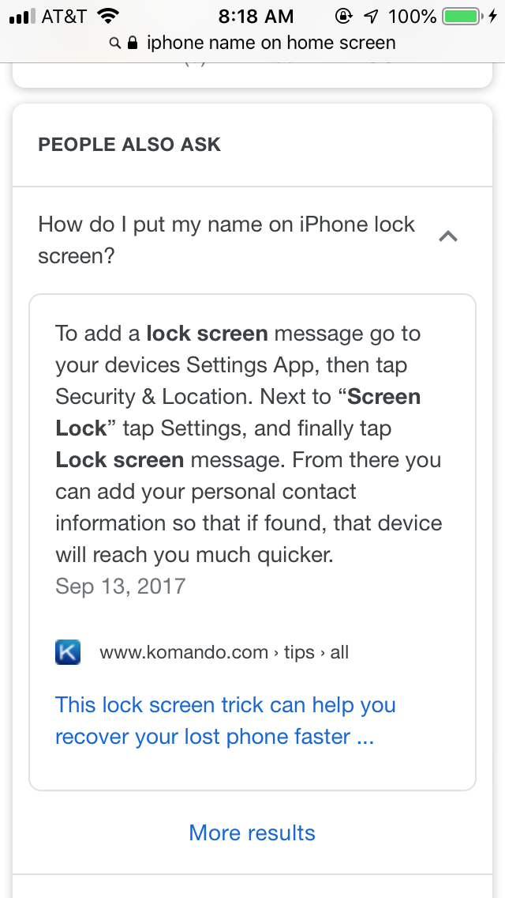

Dream suggestions
=================

*Topics/tags: [Miscellaneous](index-misc), technology, rambly*

Last night, I had a strange dream [1].  It mostly revolved around my
routine life on Noyce 3rd. I was working in my office [5], going to talks,
and wandering the hallways.

Some time toward the end of the dream, I found an iPhone in one of
our classrooms.  It’s usually a pain to try to determine who owns a
phone, but I always try. In this case, something on the phone suggested 
to me that it belonged to a member of the women’s tennis team [6], so I
wandered through our classrooms asking if anyone was on a tennis team
and could figure out whose phone it was [7].  Eventually, I found a
student who was likely to know whose phone it was, and I left it with them.

That wasn't the strange part.  That was the comparatively normal part.
My brain said, "life would be much easier if people put their name on
the lock screen."  I even recalled having done so on my iPhone. But
when I checked, it was gone.  That is, my name was no longer on the
lock screen.  I’d forgotten how I previously added the name, so I
did what seemed natural: I searched the InterWeb. Strangely enough, I
could only find a YouTube video on the subject. And it was one of those
rambly videos, accompanied by complicated instructions, and a narrative
that suggests that the speaker has discovered something particularly
revelatory.

I resolved to write down and post [8] clearer instructions. But,
as is too often the case, I had difficulty with them. That is, I had
trouble getting them right and replicating them once I thought I'd
gotten them right.  It got even worse when I tried to explain it to
a few students.  I ended up with weird pictures on my iPhone, but text
that wasn't very readable.  I can't recall all of the details, but the
process involved going back and forth between something in the Apple
menu [9,10] and the system settings [11], with options for where the
text appears and the color of the text.  But the choice also seemed
associated with cartoon-like picture so faces, and I'd managed to get
my iPhone in a state with a picture of a woman in dark pink, with my name
in dark pink lettering, and I couldn't tell whether or not the text was
visible [12]. I was certainly frustrated.

Then I woke up. 

I felt compelled to follow up on the dream.  After all, it does make some
sense to put your name on the lock screen.  In real life, Google provides
you with text answers, rather than links to YouTube videos.  Unfortunately,
the advice it provides is wrong.  Here's what I found.

How long did I spend looking for
"Security & Location" before I gave up and went to [the cited
page](http://www.komando.com/tips/417971/this-lock-screen-trick-can-help-you-recover-your-lost-phone-faster/all) for more instructions?
Too long. Far too long.  And it turns out that those were instructions
for Android phones, not iPhones.  Google's text extraction AI needs some
work.  What does that page say about iPhones?

> The number one way to put information on a lost iOS device is using "Find My iPhone"; a feature in iCloud.

> With Find My iPhone turned on, you can add a personal note to the lock screen of the iPhone. You can also track it and find exactly where it is. You can even take a step further and permanently lock or erase the device remotely if needed.

> All of this can be done by first enabling "Find my iPhone" by going into Settings, choosing Your Name> iCloud> and turning on Find My iPhone.

> Then, if you ever lose your device just simply sign into iCloud.com or open the Find My iPhone app on another iOS device. You can then put the phone into lost mode and display your message on the screen of that iOS device.

One problem with that solution is that it assumes that someone knows
that they've lost their iPhone.  In my experience, when I find phones on
Noyce 3rd, the student does not yet know that they've lost their iPhone.
And in some cases where the student does know that they've lost the
phone, they had never enabled Find My iPhone.  It would be much more
helpful to be able to put your name on the iPhone by default.

Unfortunately, as far as I can tell, there is not a natural way to put
your name on the lock screen of your iPhone. The best idea seems to be that
you should manually edit your wallpaper (i.e., lock screen photo). Perhaps
Apple assumes you’ll use Find My iPhone. But that requires that you’ve
set it up and know that you’ve lost your phone. I suppose if you can
take the time to add your name to the lock screen, you can instead take
the time to set up Find My iPhone [14]

So ... if you are reading this, particularly if you are a student,
please do the following. (1) If you have an iPhone, enable Find My iPhone
and consider editing your wallpaper to include your name. If you have an
Android phone, try following the instructions in the screenshot above. If
you have a Windows phone or a more traditional dumb phone, consider
taping your name on the phone.  

I guess that last strategy would work for any kind of phone.  If you're
worried about affecting the appearance, perhaps you could add the note
between your phone and its case.

---

Postscript: If you happen to work for Apple, please consider convincing
your employer adding a Lock Screen Text feature.

---

Postscript: When I last left my iPhone in a classroom, it was quickly
returned to me.  Why?  I'm probably the only person on campus who has
a St. Louis Rams phone case [15]

---

[1] No, it wasn't the strangest dream I’d ever dreamed before [2].

[2] It certainly wasn’t that we’d all agreed to put an end to war [3].
But that would have been nice. 

[3] Words taken from Ed McCurdy's "[Last Night I Had The Strangest
Dream](https://www.cshf.ca/song/last-night-i-had-the-strangest-dream/)".
I thought I was recalling [the Simon and Garfunkel
version](https://www.youtube.com/watch?v=2Pf_DntbQ8Y).  However, upon
listening to it again, the instrumentation is not what I recall.  I
wonder if my brain is combining multiple versions [4].

[4] My brain does strange things with this song.  Once in a while, it
recalls "guns and swords and unicorns were scattered on the ground" rather 
than "guns and swords and uniforms were scattered on the ground".

[5] More precisely, the room that used to be my office.  Perhaps I should
refer to it as "my once and future office".

[6] My subconscious almost certainly recalled that I had seen a member of
that team the other day.  Or perhaps it's that I went to sleep reading 
about the Federer-Nadal match.

[7] A better strategy might have been to ask the faculty members who teach 
in that classroom if they had a tennis player in their class. 

[8] Muse about?

[9] Yes, I know that iPhones lack an Apple menu.  But my sleeping brain
does not.

[10] Once upon a time, there was an Apple key on Apple keyboards.  That's
now turned into a cloverleaf/command key.  I wonder if the Apple menu
will eventually become a cloverleaf menu.

[11] Those do exist on the iPhone.

[12] Sorry, I have no clue what was going on with my subconscious there.

[14] The latter is more complicated since it involves the use of an 
iCloud account.

[15] I like having a case for a no-longer-extant team.  I also feel sympathy
that St. Louis has lost two NFL Teams [16].

[16] They did steal both teams from other cities, so perhaps I shouldn't
feel all that bad.

---

*Version 1.0 of 2019-07-11.*

