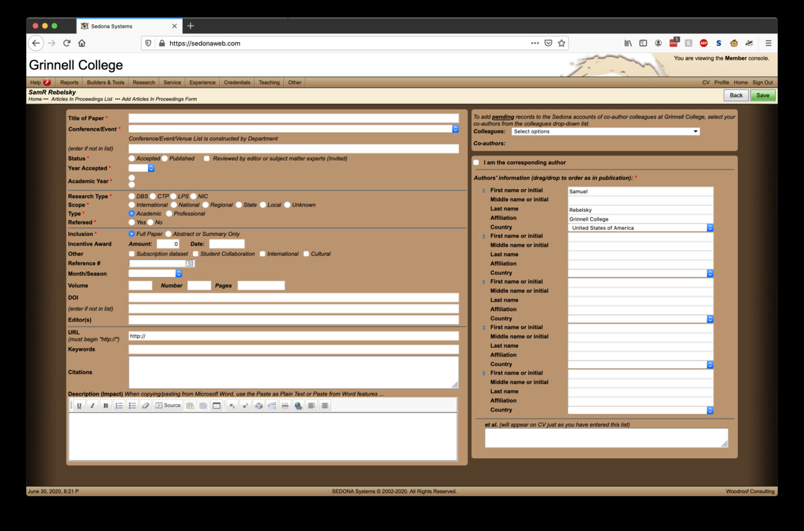

At the end of each academic year, Grinnell faculty are expected to
submit a Faculty Activities Report (or FAR).  Since our Fiscal Year
runs from July 1 to June 30, our FARs are due on July 1.  As you
might guess, the FAR provides us with the opportunity to report on
our activities for the year.  When I started, I think it was a Word
document [1].  At some point, Grinnell adopted the evil known as
Sedona and it was generated "automatically" from that.  Now it looks
like there's a combination of Sedona and a Qualtrics form.  Let's
consider the questions on [that
form](https://grinnell.co1.qualtrics.com/jfe/form/SV_8jZEe0smltgLmhD).

I find the opening page to the form both puzzling and problematic.  Here's
how it opens.

> **Annual Faculty Activity Report**

> Information may be reported here throughout the year.

> The Dean's Office will share this information as appropriate (Grants Office, faculty meeting agenda packet, etc.).

> Information entered here will be forwarded to your Academic Support Assistant(s) for entry into the Sedona database.

> Information you will be asked to provide on the following pages:

> * Teaching Activities (not courses taught as listed by Registrar)
> * Contributions to Student Research
> * Refereed scholarly publication citations
> * Non-refereed scholarly publication citations
> * Refereed scholarly presentations
> * Non-refereed scholarly presentations
> * Refereed creative work, performances, exhibitions
> * Non-refereed creative work, performances, exhibitions
> * Other scholarly activities
> * Grant Activity (external, whether funded or not)
> * Service to the College
> * Service to the Discipline
> * Contributions to Diversity
> * Needs

> You will have the option of uploading a current CV.

> You will be able to Save and Continue your FAR, but you will not be able to return to previous screens.

Why do I worry about this?  In part, it's because it doesn't clearly
document its relationship to Sedona.  It notes "Information entered
here will be forwarded to your Academic Support Assistant(s) for
entry into the Sedona database."  Does that mean the only purpose
is to provide info to our ASAs?  What timeline do they have for
getting things into Sedona?  Were we supposed to have submitted info
in time for them to submit it to Sedona by July 1?  The link in the
Faculty News Digest (FND) just said to fill in the link by July 1.
I think I'm okay.

Is this form used in any way other than forwarding info to our ASAs?
I guess so.  We've seen that it can be reported at faculty meetings and
elsewhere.  That assumes we use it "throughout the year".  But if we use
it throughout the year, how do we remember what we've entered in the
past?  It's so confuzzling.

Then there's the UI issue.  Why can't you return to previous screens?
Being able to return to previous screens is traditionally part of good
UI design for most surveys.  What's the benefit to an "enter and done"
model?

Well, if I can't go backwards, it strikes me that I should first record
what questions I'll be asked so that I can think about them.  Fingers
crossed that I can do so.

*The first page* asks some of the basic information.

> **Academic Year**

> **Your Name (First and Last)**

> **Email**

> **Department** (Please use 3-letter department code)

> **Department 2** (Please use 3-letter department code)

It does not appear to verify the email address [2].  I suppose we are
fortunate that people do not spam us with the form.  I suppose we
are even more fortunate that folks do not imitate Grinnell faculty.
Am I too paranoid about these issues?  Perhaps paranoia in software
is healthy these days.

I have some colleagues at other institutions who only use one name.
I wonder how the form is supposed to deal with folks like them.

*On to page two!*

> **Teaching Activities**

> Course information will be pulled from the Registrar's records. Please include other relevant teaching activities here.

> **Contributions to Student Research**

> MAPs, Independent Studies, Seminars, Creative Research / Performances, etc.

Hmmm.  I wonder what teaching activities I might include.  I wonder where
they get put on Sedona (or if they get put on Sedona).  Since student 
research is now an expected part of our work, at least if we want full-year
sabbaticals [3], I guess it makes sense to write it here.  Once again,
I wonder where it ends up on Sedona.  I don't see a "Contributions to
Student Research" section anywhere there.

*On to page three!*  Yay!  It's the scholarship page.  

> **Research and Scholarship**

> Please give complete information (date of publication, and volume, issue and page numbers, place, date, and type of presentation or conference).

> Please indicate if each work was refereed, blind/double-blind, or invited, where appropriate.

> **Refereed scholarly publications citations**

> **Non-refereed scholarly publications citations** 

> **Refereed scholarly presentations**

> **Non-refereed scholarly presentations**

> **Refereed creative work, performances, exhibitions**

> **Non-refereed creative work, performances, exhibitions**

> **Other scholarly activities**

> **I would like to include my work in Digital Grinnell**

I guess that's an easier way to work with things than on Sedona.

I still wonder why Sedona doesn't allow us to enter something is,
say BibTeX or Endnote format and parse the info out itself.  I feel
sorry for the ASAs who are asked to do so.

I appreciate that there's a question about [Digital
Grinnell](https://digital.grinnell.edu/).  We should be encouraged to
put our work there.  It would be nice if there were also a link.

*On to the next page.*  What page is that?  Four, I believe.  I
depends on how you count.  I didn't count the opening page;
alternately, I seem to have counted it as page zero.  The one that
asked me to enter my name and email address was page one.
Oooh!  Here's another UI suggestion.  Why not have it say "Page N of M"?
I do see from the top of the page that I am not about 65% done.  That's
strange, since I was only about 25% done on the prevous page.  I guess
they are counting the number of fields.

> **Grant Activity**

> Please describe the grant proposals (whether funded or not) which you have submitted to external agencies. Please provide the project title, source of funding, amount, and grant period.

Whoops.  That reminds me that I should have talked to our grants office
about my small ($5000) grant proposal [4].  I can't remember whether or not
we're required to do so for grants that small.

*On to page five!*

> **Service**

> * For Grinnell College: please list activities such as serving on committees, chairing a department or concentration, serving as a staff supervisor, directing a grant program, etc.
> * For national, regional, and state professional organizations, please describe any leadership or substantial service work.
> * Information entered will be used to generate a document that faculty can further annotate with details of service and other activities beyond those listed.

> **Service to the College**

> **Service to the Discipline**

> **Contributions to Diversity**

> **Other information: Honors, awards, other activities not listed above**

> **Needs**

> Briefly describe support for scholarship, curricular development, or pedagogical needs that are not likely to be met by the standard support processes.

This page seems to be a bit of a of topics.  I wonder why
they didn't put service on one page and everything else on the next
page.  And when will we get to annotate this?  That will be fun to
discover.  I'd ask, except I don't think the person who gets all of this
needs to be bothered more.  I also wonder if anyone ever reads the needs
statement.  I used to take it seriously, but the evidence was that no
one saw it.

*On to page six, the last page*.

> **Please upload current CV** (May also be emailed separately to Overworked ASA [overworked])

> **Submit FAR**

No, it doesn't really say "Overworked ASA".  I just know that they are.  I
hear they've been asked to take on even more responsibilities than normal
right now, and, as far as I could tell, they already had too many [5].

---

**_Postscript_**: Since I think Sedona is still involved in our
FARs, I thought I'd go take a look on Sedona.  You could probably
tell, since I already shared a screenshot.  I'm intrigued to see
that under the "Reports" menu, there are two reports entitled "FAR
(Faculty Activity Rep".  Both say "Generating Curriculum Vitae"
while they're doing the generation.  The first appears to generate
the 2019-2020 FAR, the second the 2017-2018 FAR. Or do I just get that
because I forget to enter anything for 2018-10?

Looking at my current FAR, it looks like I have a bit of work to do to
get my work up to date.  I was on sabbatical this past year, so there's
probably not any teaching [7,8].  But I did a lot of service.  I had a
panel accepted to a conference; of course, the conference got cancelled
after I arrived at the site.  That's a separate matter.

In any case, it feels like I'm going to have a lot of work to do 
tomorrow between updating my CV, updating Sedona, and filling in 
additional stuff on this form.  I suppose I'll also need to submit
my sabbatical report.  I should be fine as long as I get everything
in before midnight, right?

---

**_Postscript_**: It feels like I'd written a similar musing last
year [9] or the year before, at least I recall writing something
similar in terms of the discussion of the questions and the form.
However, I cannot find such a musing.  Oh well.  Repetition is good
for the soul.

---

[1] Most Mathematics and CS faculty ended up using LaTeX.

[2] It doesn't even verify that it is an email address.

[3] Next time!

[4] I submitted it in early June.  I think I hear in mid-July.

[5] We have a group of people on campus for whom it is acknowledge that
it will require at least 1.5 people, and probably two or more to replace
them.  This person is one of them.  I hope people realize how much they
do [6].

[6] No, I am not saying that to suck up.  After twenty-plus years, I'm
unlikely to significantly affect this person's view of me.

[7] I think the summer 2020 MAPs count toward the 2020-2021 FAR.

[8] Does grading AP exams count as teaching?

[9] It probably wasn't last year since it appears I did not update
my Sedona records last year.  As I said, tomorrow is going to be a
busy day.
