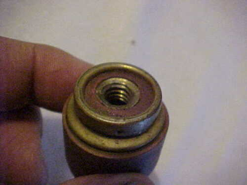

One thing that particularly impresses me about my children is their
willingness to attempt to fix things, even things they don't know
much about.  I also fix things [1], but I'm not as willing to push
myself as they are.  For example, while I'm willing to replace a
toilet valve, I don't tend to do significant car repairs.  In
contrast, Youngest appeared to think nothing of replacing the car
radio and was even willing to attempt replacing the handle on the
driver's door, even though it meant taking apart the door and pulling
out the window.  He also replaced his front bumper and related
pieces.

How did they my sons these skills?  In part, I think that they are
channeling their grandfather Lloyd, who seemed willing to try to
fix anything.  In part, I think they are building upon the skills
they learned doing technical theatre.  In part, they seem to just
be the types of kids who like to fiddle with things, or at least
Youngest and Middle do.  I do basic repairs, like gluing furniture
or nailing things, or even building simple furniture, but, as I 
said, I don't tend toward more complex repairs.

At times, they even inspire me.  For example, they helped me realize
that I could fix my minivan's [side-view mirror](side-view-mirror).
Since the last time I had it replaced, the insurance company paid
something like $600, it was clearly worth buying one for about $50
and doing it myself.

This past Turkey Break, when all three sons were home, Youngest
decided that he could fix our broken pocket door.  Now, this is an
*old* pocket door, from the late 1800's, when our house was built.
We weren't quite sure what was wrong with it, other than that it
was no longer vertical.  He read a bit about pocket doors, saw
warnings that said "Don't do *this*; it will remove the door from
the track", figured that he wanted to remove the door from the
track, and tried.  However, it turned out that he needed Eldest's
help.  They managed to remove the door and then remove the hardware
for hanging the door.  It appears that the problem was that one of
the two pieces had pulled its screws out from the wood, so they
made plans to reattach the screws.

It turns out that there are some benefits to age.  They bought wood
putty to fill in the old holes and planned to reattach the hanging
hardware in those puttied holes.  I know that wood putty provides
very little structural integrity.  So I used the strategy that I
learned from my father-in-law [2]: I glued toothpicks and chopsticks
in the holes, using wood glue.  Why?  Because that narrows the hole
and gives the screw something to grip, both the chopstick and the
wood that the screw gets pushed toward.  Once the glue had dried,
we reattached the hardware and then went to hang the door.

Once again, it took a combination of expertise to do get the door
correctly hung.  The kids knew the general strategy and had the
dexterity to get things in place.  But it wouldn't hang correctly.
I looked at the hardware and realized that they needed to attach
some pieces to each other before hanging.  It took a few hours all
told, but we now have a happily hanging pocket door.

This holiday season, we chose a somewhat simpler task.  One of the
hanging lamps in our house managed to blow its socket.  I've never
particularly liked that socket; it's an old Thomson-Houston socket
and needed an adapter to use a modern light bulb [3].  A few weeks ago,
when I went to put the bulb and adapter in, I got a shocking flash,
and it appears that we burned through the insulation on the adapter.
So I guess it's not strictly true that we blew the socket.  Nonetheless,
it seemed worthwhile to replace it.  Of course, they no longer make
anything remotely like the socket we had, so we had fun [5]
disassembling a modern socket assembly and fitting its interior
into the old assembly.  It took a lot of futzing around, particularly
as we tried to screw things together, but the result works!

Afterwards, I managed to find [a similar
assembly](https://www.ebay.com/itm/ANTIQUE-THOMSON-HOUSTON-PADDLE-SWITCH-SOCKET-1888-PATENT-SHADE-HOLDER/303415248658)
on eBay.  But we'd still need an adapter, and it costs $150.  I
prefer the $5.50 solution we came up with [6].  And, in any case, I'm
not sure that we could have removed the old assembly.

What are some other good stories?  For the past few years, we've
assumed that the heat lamp in the downstairs bathroom was broken.
Then, right before Turkey break, the fan stopped working.  So I
decided to replace the light switch with Youngest's help.  I thought
I'd turned off the power, but our house is wired strangely, and we
got a few sparks.  Eventually, I just turned off the master breaker
[7].  Once we got the new switch installed, we discovered that not
only did the exhaust fan work, the heat lamp did, too.

Fixing things always takes more time than I would expect.  And it often
induces unexpected challenges.  But it feels rewarding when we succeed.

Of course, things don't always work so well.  When one son managed
to partially dislodge his ceiling fan, [I managed to make it *much*
worse](ceiling-fan).  Amazingly, the professional electrician we
called in failed to balance it well, so we had to rely on our regular
[8] handyman to fix it.  And then there's the time I destroyed our
disposal while trying to install it.  The latter experience reminded
me of why I like to hire professionals.  And, while the handle in
the car sometimes works, it does not work consistently.

Oh well.  You don't learn what you and cannot do unless you try.
At least no one's gotten hurt and nothing has gotten (too) damaged.

---

Postscript: No, my sons do not normally do work for hire.  Thanks
for asking.

---

Postscript: Here's a picture of a whole adapter, taken from eBay.

  

The screw hole is how Thomson-Houston bulbs attach to the lamp.  The other
side fits a normal light bulb.  I managed to evaporate the red part on ours.

---

Postscript: I miss my father-in-law, who was willing to try all sorts
of projects and who often had the tools to do so.  I recall working with
him to install a shower and tile the bathroom when Michelle and I first
moved into this house.

---

Postscript: Here's my Facebook post about plumbing from 26 December
2011.

> Why Sam should not do plumbing, phase N. Our kitchen faucet has been loose, so I decided to tighten it on Saturday. Unfortunately, getting to the bolt to tighten the faucet meant that I had to remove the disposal. I hate getting the disposal back into place. You'd think it would be easy, but you have to line it up perfectly while under a sink and then twist something that's hard to twist.

> This time, I was so frustrated that I managed to break it.

> So, today we bought a new disposal. Put the new drain in the sink. Checked for leaks. No leaks. Wired the disposal. Fine. Tried to take the drain pipe from the old disposal, but the screws are rusted in place. Bought new pipe. Installed disposal (with some cursing). Discovered that the new pipe was 1/4 inch too short. Removed disposal. Bought another new pipe. Tried to install disposal again. Failed. Tried again. Failed. Had William try. Failed. Took a break. Finally got it in place. Got drain pipe in place. It fits! Yay! Try to tighten it. Turned wrong direction. Disposal falls off. Twenty minutes later, it's back in place, drain pipe is in place and connected neatly, and ... I discover that (a) I managed to disconnect the ground at some point and (b) the new drain is now leaking. So, back to square one. Took off the disposal. Re-wired it. Took off the sink drain. Ran to the hardware store for plumbers putty. Got the drain in place. Checked for leaks. No leaks. Got the disposal in place. Drain pipe connects. Power works. I don't think we have leaks, but I'm not confident.

> A few hours of my life are gone, and I'm frustrated. Next time I should just hire Jason.

> And I need to learn to write shorter posts.

Isn't that last sentence amusing [9]?  These days, I'd call that a *very short*
musing.

Oh, I forgot to mention:  A weak or so later, it started leaking.  When Jason
went to re-attach it, he said that I'd managed to strip something or other
and we needed another new disposal.  That helped convince me that there
are times that I should not attempt to fix things [10].

---

Postscript: In writing the first version of this musing, I had
completely forgotten that I'd already mused about [trying to fix
the ceiling fan](ceiling-fan) and [succeeding in fixing my side-view
mirror](side-view-mirror).  However, as I wrote this musing, I
realized that it made sense to have a new category for "[Those wacky
Rebelskys](index-rebelskys)" and, in rearranging links, I discovered
those two musings.

---

[1] More precisely, I attempt to fix things.  I don't always succeed.

[2] At least I think it was my father-in-law.

[3] Did you know that there used to be multiple kinds of bulb bases?  While
you may think of a traditional bulb/base combination as having an "outie"
bulb and an "innie" socket [4], the Thomson-Houston has an "innie" bulb and
an "outie" socket, but with about a half-inch diameter for the socket.

[4] Some people use gendered terms for these.

[5] No, not really.

[6] I so appreciate Paul's Hardware.  It was more convenient when it was 
less than a block away.  But three blocks is still pretty convenient.

[7] Maybe we'll map the circuit box this break.

[8] Or, given his custom, irregular.

[9] Rather than "a musing".

[10] Yes, I realize that contradicts the last sentence of the primary
musing.  I'm working on learning appropriate limits.

---

*Version 1.0 of 2019-12-30.*
