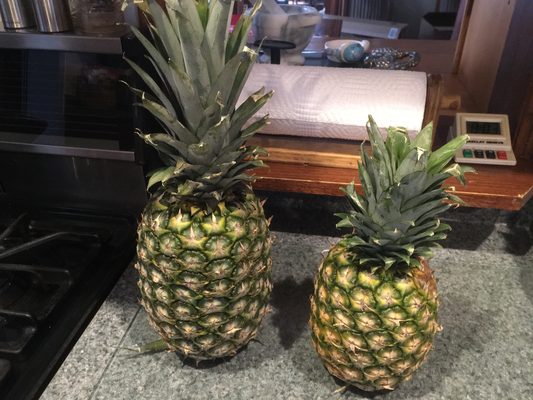

Fresh pineapple
===============

*Topics/tags: [Miscellaneous](index-misc)*

I love fresh pineapple.  I'm not sure that I can articulate all the
reasons why.  But I love the combination of sweet and tang, the
texture, the, well, freshness of it.  Canned and frozen pineapple
are also good, but not as good as fresh [1].  There are times that
I find fresh pineapple so appealing that I'll even chew on the core [2].

I also like dried pineapple.  It's a very different experience.
But the flavor is more concentrated and I appreciate the chewiness.
I don't like the things they add to dried pineapple, particularly
the unnecessary extra sugar.  In response, I sometimes make my own.

So when I saw that pineapple was on sale for ninety-nine cents at
HyVee, I bought a few.  Then I discovered that pineapple was also
on sale at Fareway, but for $1.99.  Which was the better deal?  You'd
think it would be obvious, wouldn't you?  But let's take a look at
the pineapples.

Can you tell which one came from HyVee and which came from Fareway?

That's right.  The big one came from Fareway and the small one came
from HyVee.  What's the difference in weights?  The Fareway pineapple
weighed five pounds while the HyVee pineapple weighted two pounds and
fourteen ounces.

But the real question is how much usable pineapple I could get out
of each.  I tend to use the pineapple cutter/corer that Michelle
bought me a few years ago and then cut whatever I can out of the
rind that's left over.  And, even though I do sometimes eat the
core, I won't count that in the weights.

I got two pounds and five ounces of fresh pineapple out of the large
pineapple and somewhere between one pound three ounces and one pound
five ounces out of each small pineapple.  **Math time!**  Thirty-seven
ounces for $1.99 is about 5.4 cents per ounce.  Twenty ounces for
$0.99 is about 5.0 cents per ounce.  I guess the smaller pineapples
are a slightly better deal.  And I suppose the HyVee pineapples are
slightly cheaper than I used in my calculation since College employees
get a 5% discount at HyVee.  I'm not sure which tasted better or
which were easier to cut, which would easily make up for any cost
difference.  In any case, both were good deals.  I bought too much
fresh pineapple, so I dried some in our convection oven.  I just
needed to stop myself from snacking too much along the way.

I suppose it's also worth finding out how much canned and frozen
pineapple cost and how much of a difference it makes to the taste
of the dried pineapple.  I'll leave those questions to another day
[3].

---

Postscript: I bought the pineapple [4] about two weeks ago.  It's
all gone.  Now I wish I'd bought more [5].

---

[1] I'm sure that those who get real fresh pineapple, as opposed to
that which has been shipped to the middle of Iowa, would say that the
pineapple I encounter is good, but not as good as real fresh pineapple.

[2] Mmmm.  Fiber.  Or perhaps "fibers".

[3] And another musing.

[4] And drafted this musing.

[5] Or that it went back on sale.

---

*Version 1.0 of 2019-12-24.*
