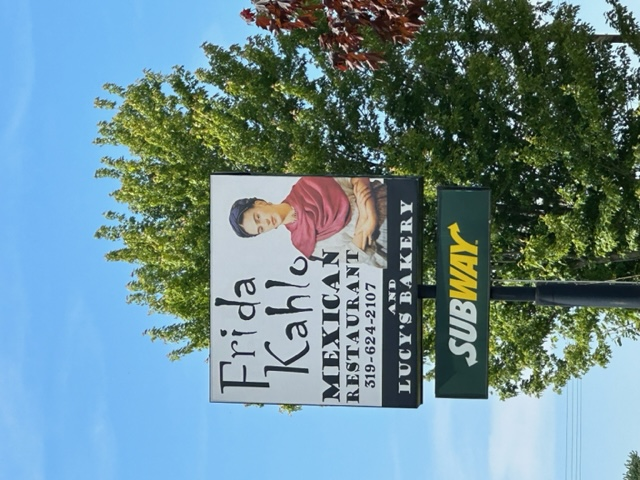

The other day, as I was driving through Solon, Iowa [1], I passed by the Frida Kahlo Mexican Restaurant [2].

It got me thinking: Is it legal to attach the name of a famous person to your restaurant without their permission?  Or do they, perhaps, have the permission of the Frida Kahlo estate?  

If they don't have permission, it seems wrong.  After all, putting the name there suggests that they are somehow involved.  Did she visit and say something like, "This is the best Mexican food I've had in Iowa; you should name the restaurant after me"?  Did she visit the University of Iowa and decide to found a restaurant nearby?  And the sign doesn't just have her name; it seems to have her likenes.

So I did what I often do.  I asked one of my children.  He suggested that under trademark law, the trademark is limited to a particular domain.  I'm not sure that applies in this case.  After all, putting someone's name on a restaurant seems to imply that they approve of it.  Of course, he also mentioned that there are separate policies related to name, image, and likeness, the infamous NIL rightsthat the NCAA is currently dealing with.

I'm pretty sure that the trademark rules aren't all that's in play.  For example, I don't think I could open a Tom Brady Bar and Grill [3].  A Simone Biles & Tom Brady Goat Farm also seems ripe for a lawsuit, even though I think it would be a great tribute.

On the other hand, no one stopped someone from opening the Dolly Madison baked goods company.  Without Dolly Madison, would we have Peanuts specials?  The John Hancock Life Insurance Company was founded nearly a century after Hancock died.  I wonder how he'd feel about his namesake company being owned by Canadians.  As another example, I'm pretty sure that Yogi Berra wasn't asked to approve Yogi Bear.  So maybe these "tributes" are permissible.

The mind boggles at the opportunities.  How about an Andy Warhol luncheonette that only serves tomato soup (Campbell's).  Or a Salvador Dali breakfast restaurant that serves eggs in a replica of The Persistence of Memory.  Warhol seems like a risk, though.  Arguably, anything is related to Warhol's work (or vice versa).

It seems appropriate to open a restaurant called "After Sherrie Levine".  It would, of course, serve only replicas of famous dishes from other restaurants.  I don't think she'd object.  At least I hope she wouldn't.

I suppose I could open a Bob Dylan diner on Highway 61. Of course, I'd close it immediately and then reopen it, so that it can be the "Bob Dylan Diner on Highay 61, Revisited".

Feel free to invent your own variants.  It's a fun exercise.

Maybe we can have a party at the Frida Kahlo Mexican Restaurant to discuss the opportunities.

---

**_Postscript_**: Dolly Madison may have avoided legal issues by dropping the "e" from Dolley Madison.  I wonder if we'd have to do that with the other names.  The Freda Kahlo restaurant.  The Andi Warhol luncheonette.  The Salva Dali breakfast nook.  Seems okay, right?

---

**_Postscript_**: I tried to look up the history of the Frida Kahlo Mexican Restaurant.  I didn't find much.  But I did find a variety of restaurants that seem to be named after her.  Perhaps tributes are okay.  Or perhaps the Kahlo estate isn't as aggressive as, say, the Warhol estate.

---

[1] Don't ask.

[2] And Bakery.

[3] Or Bar and Grille, for Grinnellians.
