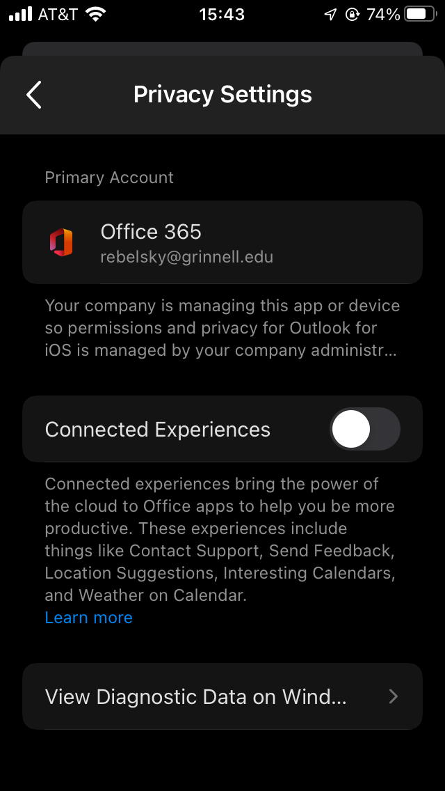
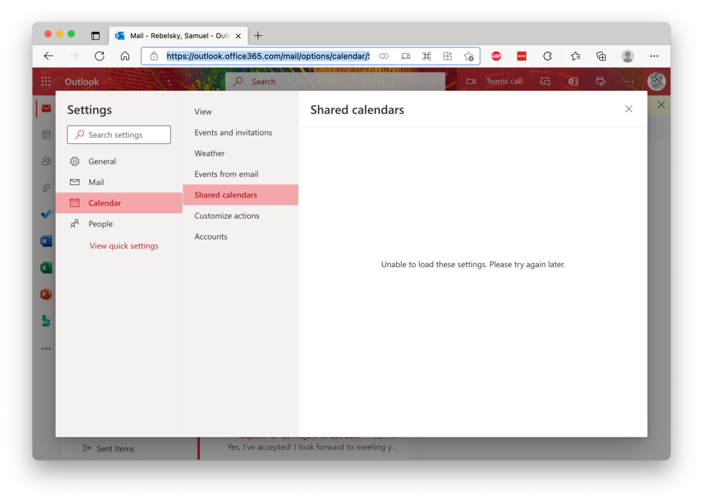

A little more than two months ago, in the middle of the semester,
ITS [1] and CRGC [2] decided that we needed to tighten our security
some more, particularly on mobile devices.  In particular, they
indicated that those of us using iDevices could no longer use the
native Mail and Calendar apps to access our College-provided calendar
and email.  Rather, we are now required to use Outlook and Microsoft
Application Management (MAM).  After all, there's a slim, but
non-zero, chance that someone might get a hold of our devices and
access FERPA-protected data, or something like that [3,4].

Until that change, I avoided Outlook.  It's no longer that I hate
Microsoft as a company; these days, it feels like they're doing some
good things, perhaps even some very good things.  For example, they
appear very supportive of the open-source movement.  And they feel
less monopolistic than they once did.  My alumni who are now there
say positive things.

However, in my experience, Microsoftware is generally not as intuitive
or as well designed as, say, Apple software.  Plus, if I have something
that works well, it's generally not necessary to switch unless I gain
some benefit.

Being able to read my email on my phone is a benefit.  And so I made
the switch to Outlook.

Before I complain too much about Outlook for iOS, I should first complain
about some related issues.  It is much less convenient to use multiple
email applications and multiple calendar applications.  However, if I
use Outlook for my other email accounts, I am potentially revealing other
information to Microsoft.  What information?  I can't tell.  In the past,
Outlook's infrastructure has been so questionable that [the EU Parliament
blocked its use](https://www.pcworld.com/article/431758/eu-parliament-blocks-new-outlook-apps-over-privacy-concerns.html).  I believe things are better
now.  However, I can't find an official privacy policy for Outlook for iOS [5].
I assume I agreed to one when I installed it, but I don't see it on the
Web or in the app.  And when I look in the privacy settings in the app,
all I see is,

> Your company is managing this app or device so permissions and privacy
for Outlook for iOS is [6] managed by your company administr...

Those ellipses?  They're part of the original.  I can't find a way to
see any more of the text.  The folks I asked couldn't either.  Great
design, isn't it?

I guess it's time to find out what the College says.  Hmmm ....  I
checked [the Web
page](https://grinco.sharepoint.com/sites/IT/SitePages/MobileApplicationManagementForiOS.aspx)
[7].  It says nothing.  I searched "permissions and privacy for
Outlook for iOS" on GrinCo.  Nothing appeared.  In the past, I would
have [put in a ticket](https://help.grinnell.edu/).  These days, I
try to avoid putting in tickets; the ITS staff are overworked.  But
it's winter break.  Maybe things are quieter.  I'll submit a ticket.
I've tried to make it clear that it's a low-priority request.
Until I find out more, I'm not giving Outlook access to my other
email.

What about calendars?  It should have all of my calendars in one
place.  In some cases, I can't schedule some things without knowing
what my family has scheduled [8].  I'm not going to share Michelle's
schedule with Outlook.  But ITS has a suggestion on how I can combine
calendars.  At least I think it does.  Ah, [found
it](https://grinco.sharepoint.com/sites/IT/SitePages/OutlookCalendar.aspx).
The beginning is amusing.

> After Mobile Application Management is applied to my Grinnell account, how do I view my Outlook calendar in the native Apple calendar app on my iPhone or iPad?

> Go to Outlook on the web by going to office365.grinnell.edu and log in. From there you will publish your calendar so anyone can view your calendar or subscribe to it.

Um.  Weren't we talking about privacy?  How is publishing my calendar so
that *anyone* can view it protecting data?  If ITS is encouraging us to
make our calendars public, why don't they just allow direct access through
the native Apple Calendar app? [9]  'Eh, that's something to worry about
another day.  I'll try what they recommend.

Whoops.

Where was I?  Oh, that's right.  I was complaining about the broader
issues surrounding the requirements that I use MAM and Outlook for
iOS.  There's one more big thing that irks me: Whenever Outlook
decides I need to re-verify, it puts up a helpful message.

> To access your organization's data with this app, enter your PIN.

Here's the thing.  **They are not my organization's data.**  I own the
copyright in any email I write.  Someone else owns the copyright in
the email I receive.  The organization does not or should not own
these data.

Bleh.

Okay, enough with contextual issues.  Let's move on to the Outlook
for iOS app.  I've managed to configure the app to behave as I'd
like in some situations.   My signature no longer says "[Get Outlook
for iOS](get-outlook)" [10].  I've turned off the default filtering of messages.
Swipe left now deletes messages. Of course, it's not quite as good as "slow
swipe left is 'show options' for message, fast swipe left is 'delete'.
However, most of the time when I swipe left, I want to delete the message.

But there's so much more that's missing.  I file a lot of my email.
With the native app, when I'm on the list of messages, I can swipe left 
and select "Move".  With the native app, when I'm on the message page,
I can just click the "Move/Refile" button, which is conveniently placed
at the bottom of the screen, near where my thumb is.  And the native
mail app learns patterns [11].  It knows, for example, that email from
certain people almost always goes in my "Department" folder.

What about Outlook for iOS?  I've configured swipe right to be Move.
It's not ideal.  But it doesn't feel quite as natural.  And when I'm
reading the message, I need to click at the top of the screen for more
options, and then select "Move to Folder".  It's probably a good
thing that Outlook doesn't learn my habits, but it does slow me down.

Speaking of the top of the screen: Microsoft doesn't seem to get a
key UI issue: The more commonly pressed buttons belong at the
*bottom* of a phone screen, not the top.  So why is the "Trash"
button at the top when I'm reading a message, and why are the
"Calendar" and Search buttons at the bottom?  Bad design is the
only thing that comes to mind.  Or maybe careless design.  Microsoft
knows that people will use their software no matter how it's designed.
And most Microsoft users don't complain.  Apple users, on the other
hand, seem more likely to complain about bad UIs.

Continuing with thoughtless UI decisions, let's consider what happens
when you delete a message.  On the native iOS mail app, you move on to the next
message.  On Outlook for iOS, you go back to the message list, making
it much slower to skim through your messages.

On the issue of skimming messages: Outlook for iOS lacks buttons
for the next message and previous message commands.  The native app
may have them in a less convenient place (the top of the screen),
but at least it has them.

What else?  I still don't understand why, when I'm reading a longer
message in Outlook for iOS, I need to click a separate "Read More"
button midway through the message.  Can't you just present the whole
message?  Why make extra work for your user?

Unfortunately, those UI issues are comparatively minor when one
considers "Undo" in Outlook for iOS.  For those unfamiliar with the
native iOS mail app, you can shake the phone to undo your last
action.  And, like most modern undo systems, it keeps a stack of
recent actions, so that you can undo again and again and again, and even
redo.  In contrast, Outlook puts up a small "Click here to undo"
for about five seconds.  If you miss it, you're out of luck.  If
you're someone like me, who has so many folders that they regularly
misfile when scrolling through them, you are now left searching to
figure out where you misfiled things.

There's more about Outlook for iOS that makes me less efficient and
that makes the email experience less positive.  But I've ranted
enough.

I just worry about the next piece of software that the College
will impose on us.

---

[1] Information Technology Services.

[2] Cyber Risk Governance Committee.  The members did not list their
names in the email announcing this policy, but they did list their
positions.

* Deputy Chief Information Officer (chair)
* Chair of the Faculty
* Chief of Staff and Vice President of Strategic Initiatives
* Data Privacy Officer
* Dean of the College
* Director of Information Security
* Registrar
* Vice president for Finance and Treasurer of the College
* Chief Information Officer ex-officio

I'm confused about the last one.  Isn't everyone on CRGC because
of the position they hold?  And why is _ex officio_ hyphenated?
[3] Here's the official statement.

> **Why are we doing this**: If a personally-owned mobile device with access to Grinnell College data is lost or stolen, protected College data could be compromised. The MAM program helps prevent this compromise and allows the College to meet necessary legal compliance standards while keeping the ability for employees to continue to use their personal mobile devices to access College data.

Yup, I think I got it about right.
 
[4] Note that one can also remotely erase most iDevices, so this is
probably an overstated issue.  In fact, the [Acceptable Use of Mobile
Devices Policy](https://grinco.sharepoint.com/sites/CITO/ITS%20Campus%20Policies/ITS-IS-805-P%20Acceptable%20Use%20of%20Mobile%20Devices.pdf) requires 
that we permit ITS to do a mobile wipe of our personal devices.

[5] I even spent some time searching on <https://privacy.microsoft.com>.

[6] Grammarly notes that 

> It appears that the singular verb *is* does not agree with the
  plural compound subject *permissions and privacy for Outlook
  for iOS*.  Consider changing the verb to the plural form.

[7] That's on GrinCo, so you won't be able to read it without a 
Grinnell account.

[8] That's less important now that the kids are scattered.  But
when they were home, I needed to pay attention their calendars as
well as mine.  And I still need to attend to Michelle's.

[9] No, I'm not putting in a ticket for that.  But I will call once the
help desk is open again.  Or maybe I'll call this week and see what the
remote help desk says about these things.  It could be amusing.

[10] Why does Microsoft consider it necessary to explicitly promote
their products in the default signature?  "Sent from my iPhone",
in contrast, works simultaneously as a promotion ("use iPhones"), a 
brag ("I can afford an iPhone"), and a warning ("typed on an iPhone
without autocorrect; expect mistakes").  Can't Microsoft be that clever
or that subtle?

