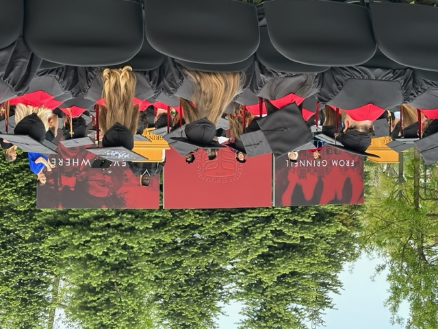

Today was Grinnell's annual graduation [1].  I should have been happy.  And I was, at times.  But I'm a curmudgeon, so I was also grumpy at far too many times [2].  I want to rant about some things.  But shouldn't I embrace the joy?  After all, most people at graduation were joyful (or seemed joyful [3]).  Still, some things bothered me.  Can I do both?  I can try.  I'll use italics for my curmudgeonly voice and a roman face for my more cheerful voice [4].

_There are so many ways you could cleverly employ these two voices.  However, that will require both careful writing and editing.  You're not going to bother doing that [5].  Are you? If I know myself, I'll just go with a stream of consciousness and then a few minutes of editing._

That's correct.  As in many of my musings, my main goal is to record some ideas and share them with others.  While this musing might be an opportunity for careful writing, today is not a day for careful writing.  Still, I hope my readers will enjoy it.

_Fine.  I'll start.  What was it with the new slogan on stage?  What was it?  **From Grinnell ... to Everywhere**._

_I suppose it's better than **Go Forth, Grinnellian**.  But why put a slogan on stage in the first place?  And wouldn't it be nice to discuss slogans with, say, the faculty?  That kind of consultation doesn't seem to happen much anymore, not since the **No Limits** fiasco.  I still think that should have been "Know limits"._

While I disliked the new motto, I enjoyed taking pictures.  I took photos of the empty seats in the morning and the quickly-cleared area in the afternoon.  People seemed to enjoy seeing them on Facebook [6].  I also took a nice photo of the bell and, in the process, learned that we have multiple bells.  The graduation bell is not the same as the Noyce bell.

_Whoo!  Taking pictures!  Such a highlight!  What's the mark for "sarcasm"?  If taking pictures was the best part of graduation, I shouldn't be all that happy.  How does the joy of taking pictures compare to the corporatespeak of President Harris's invented word, "actionship"?_

Yes, "actionship" feels like corporatespeak.  But when I said that to President Harris, she recoiled in horror.  Her goal was not to embrace corporatespeak.  Rather, she was trying to have fun with language.  She promised not to use it when discussing the strategic plan.

More importantly, the joy on her face as she handed each student their diploma was wonderful.  She seemed genuinely happy to congratulate each student and even to try funky handshakes with a few.  It's joy-inducing to see a president that engaged with the students.  And the students were happy. Of course, their families and friends were happy, too.

_I suppose the ceremony wasn't so bad, even though it was hot and I got a headache from sitting in the sun for so long.  Black hats absorb heat!  I'm glad I brought a water bottle, even though I don't recall seeing a message that we wouldn't be providing water.  (There likely was one.  I just didn't read the info closely enough.)_

Our speakers were also great.  They gave relatively short and usefully meaningful speeches.  The College even has a new land acknowledgement that seems much more appropriate than the old one.  

_Damn!  I can't complain about the land acknowledgement anymore.  But I'm sad that it's Reverend Shorb's last graduation._

I got to watch students I care deeply about walk across the stage.

_I seemed to know fewer than I usually do.  And a lot of CS majors seemed to be there "in absentia" [7]._

The graduating class (and the overall Grinnell population) has changed so much since I started.  It's much more racially, culturally, and internationally diverse.  We've moved in great directions.

_That diversity includes 64 CS majors.  We've gotten so large that I don't know them all.  Once upon a time, I taught every major in at least one class.  Now, there are some I've never met._

I was able to congratulate students and parents.  I also had the chance to talk to colleagues.  It was a lovely afternoon.

_But what about the CS breakfast?  That's a long-standing frustration, starting from the year they doubled the price, gave us less food, and the Dean wouldn't raise our budget for the increased price and increased number of majors, forcing us to pay from our restricted fund.  This year was also less than I'd hoped for.  While I don't blame anyone in particular, I think combining food for multiple departments is inappropriate if you're charging individual departments, having food outside the reception room is inconvenient, the tables needed tablecloths, and what's it with the brown orange juice?  I realize that College Catering can't be expected to keep up with the high demand, but what we get for what we are charged is inappropriate, particularly given that we are forced to use College Catering.  It also sucks that we have grown so much that we can't have the CS breakfast in the department._

Fortunately, I'm not the chair of the department.  If all goes as planned, I'll never again be the department chair [8].  I have better things to worry about than catering and breakfast.  I shouldn't let events from the past color my experience of today.

I even came up with two new ideas for graduation.

First, students wear caps at graduation.  The caps have tassels.  _No one seems to have taught the students the protocol for flipping the tassels_ [9], which is also not a particularly meaningful tradition.  In any case, this is Iowa.  "Detasseling" is a thing [10].  Couldn't we find a way to "detassel" the students' caps?

Second, I'd love to see a resurrection of the Grinnell graduation "prank", the experience by which students collaboratively make something as they walk across the stage, whether a goldfish bowl or a picture of Pam Ferguson.  If we want to embrace "From Grinnell to Everywhere", we could put a map of the world or a globe at the end of the stage, and each student could add a pin representing where they hope to head next.  I think that could be a lot of fun.  Maybe I should suggest it to the folks in the Institute for Global Engagement [11].

_Damn, I've been coopted by the slogan._

It really was a wonderful graduation.  This class had their first year interrupted by the pandemic, their second year primarily online, and their third year behind masks.  Having them here in person for graduation was great.  And now that we've learned to stream, family and friends could visit virtually as well as in person.

**Congratulations, Class of 2023!** [12]

---

**_Postscript_**: Congratulations also to my colleague who recently became an honorary member of the Class of 2023.

---

**_Postscript_**: My curmudgeonly voice is correct.  I could have done a better job.  Deal with it.

---

[1] Or commencement, in Grinnell terminology.

[2] Arguably, being grumpy one time is too many times.

[3] There's my curmudgeon inserting his opinion.

[4] No, not pollyanna-esque.

[5] Why am I referring to myself in the second person?  

_Probably because I didn't spend enough time thinking through this two-voice model of writing._

[6] Why do I post things on Facebook?  Perhaps because it's fun.  

_Since I make these musings public, I've already established that I have too little interest in my privacy._

[7] I know that _in absentia_ should be italicized.  Markdown does not seem to have an easy way to put italics within italics.  

[8] _Sorry, dear colleagues, but it's your turn to deal with the garbage, or it will soon be your turn._

[9] In case you couldn't tell, that was my curmudgeonly voice inserting itself in the middle of the paragraph.

[10] Look it up if you don't know what it is.

[11] No, they don't book weddings across the world.  It's not that kind of engagement.

[12] _Please don't spell it "Congradulations"._
