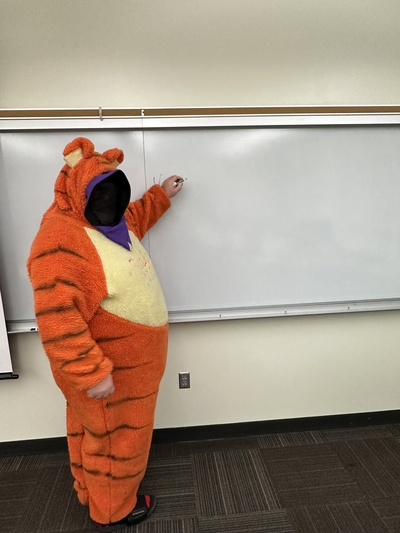
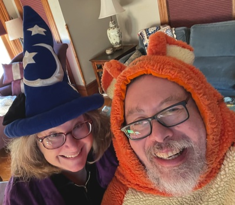

_Halloween was a few days ago. I started this musing then, but didn't finish it until today. I'd hoped to dig up an appropriate photo (no pun intended), but failed._

Halloween is one of my favorite holidays. It was also one of Miochelle's favorite holidays. Or perhaps it's the other way around.

I like Halloween because it gives me the opportunity to wear [the Tigger suit](tigger-suit). We've probably reached twenty-five years of Tigger teaching. It was a great investment.  The "faceless" mask ("anonymous Tigger"?) that I wore this year also seems to have been successful.

It's fun to wear the Tigger suit because it's somewhat absurd, because it makes students happy (or at least it seems to make students happy), and it can be anopportunity for creativity (e.g., What joke will I make this year? or How can I update the costume?). I also like giving candy to students [1].

What did Michelle like about Halloween? She clearly liked dressing up a bit. But she mostly seemed to like sitting on our porch, giving candy to kids and complimenting them on their costumes. I think part of it was the joy at seeing her patients out of her office. But there was also a broader joy at seeing children having fun. Maybe she also liked being able to sit on our porch, rather than having to be in the hospital on call. After all, it's the "Michelle on porch" halloweens that I most remember [2].

I'll admit that I like seeing and hearing the happy kids. The happy parents, too. Tonight there was one just learning to talk who happily attempted to imitate everything her dad said. Eldest son also insisted we hand out Pokemon cards, which elicited some "wows" and the occasional parental comment ("your dad is going to be sad that he couldn't get a pack"). The big siblings seem to like them, too.

Halloween also reminds me of how special my kids were when they were young. I love the men that they've become. And I'm so proud of them. But there's something special about the joy, enthusiasm, and perhaps even innocence of your kids when they are young. Everythingis new and special. And so seeing other kids makes me happy. I wonder if Michelle felt similarly? Probably.

In any case, it was nice to sit on the front porch the other night, to share candy and cards with kids, and to feel Michelle's virtual presence. Hey, it's Halloween. Perhaps her spirit sat her with me.

---

_**Postscript**_: Since I can't find the photo of Michelle on the porch, I'll go with a shared selfie from last year.

---

[1] My children like to tell the story about when I used to hand out Dum-Dum pops at Registration, back when we had in-person Registration. A student asked, "Shouldn't you be giving us Smarties?" I replied "And what do they say about taking candy from strangers?" After all, what could be stranger than me?

[2] Unfortunately, although I'd swear I just saw a "Michelle in witch's hat on porch photo", I can't find that photo. It's not in her iCloud. It's not in mine. I wonder if I saw it on Facebook. I'll cross my fingers that it pops up again.

