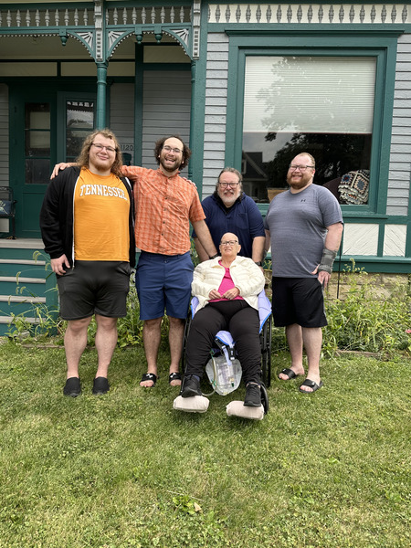

After attending Torah study and lunch this morning, I came home to do a bunch of work for my class. I also spent time fighting with my computers [1]. At some point, I looked at one of the computers, and this was on its screen, along with the label "On This Day, Sep 18, 2024".

That should be a happy memory. As I mentioned in [the story of Michelle's illnesses](what-happened-michelle), when Michelle had her final stay in the hospital, I arranged a "jail break" so she could come home. The family was together. We were clearly happy to be with her, and she with us. 

_So why do I find myself sobbing uncontrollably?_

I suppose the reasons are obvious. I miss her terribly [2]. At the time we took the picture, we didn't know how little time she had left. Less than a month! Perhaps half that of consciousness. It's not fair!

Nonetheless, I should be happy, smiling as much as we are in the picture. We did something nice for her that day. And she had a great time. Most importantly, we got to share love with each other.

I'm keeping my fingers crossed that the smile finds its way back to my face later tonight. For now, tears suffice.

---

**_Postscript_**: Am I tempting fate by posting this to Facebook? Will I see the picture there in a year, or two, or seven? If that happens, I hope it brings joyful memories.

---

[1] I'll report on that experience in another musing.

[2] That does not mean I am terrible at missing her.
