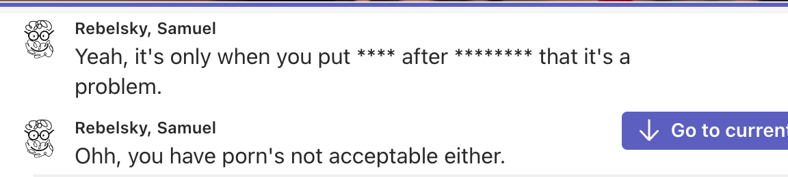

The other day, I was talking to a colleague on Microsoft Teams. When I use Teams for video chat, I often turn on auto-captioning. It helps with my hearing loss. It also helps with my distractability. Plus, it's fun to see what it thinks it hears [1].

At some point in our conversation, my colleague used the word "hardcore". I don't recall the exact context, but it was the usual meaning of "seriously over-committed." Surprisingly, the Teams transcription did not include the word "hardcore". Instead, it used eight asterisks, "\*\*\*\*\*\*\*\*".

I mentioned the change, and we started talking about it. I wanted to suggest that things are contextual, and it's only when you put "porn" after "hardcore" that the word might be a problem. Conveniently, the Teams Transcription used asterisks for "porn", too.

That lead me to note that in "porn's not acceptable either", Teams did not replace the "porn's" with "\*\*\*\*'s" [2].

Ah, the joy of inadequate over-screening [5].

In addition to being amused by Teams' behavior, I find myself a bit frustrated. Don't the hard-of-hearing deserve to see words like "hardcore" and "porn", too? I wonder if Microcensorship is configurable [6].

I also have a new game. What four-letter and eight-letter words can you put in that sentence?

> "It's only when you put _Word_ after _software_ that it's a problem."

> "It's only when you put _talk_ after _sleeping_ that it's a problem."

> "It's only when you put _celt_ after _Beantown_ that it's a problem."

> "It's only when you put _pool_ after _interior_ that it's a problem."

> "It's only when you put _four_ after _fourteen_ that it's a problem."

> "It's only when you put _cats_ after _cloister_ that it's a problem."

> "It's only when you put _muse_ after _Rebelsky_ that it's a problem."

Okay, good combinations are harder to come up with than I thought. I'll need to play a bit more with this sentence structure. Perhaps I'll write a program to do so. Perhaps I'll let it drop.

---

[1] Of course, text to read doesn't help with my distractability.

[2] Is there a verb for "replace with asterisks"? Perhaps "star out"? "Astericize" [3]? It's not really bowdlerizing the work, although it may be a form of bowdlerization [4]. "Astereplace?"

[3] [Urban dictionary](https://www.urbandictionary.com/define.php?term=astericize) claims that "astericize" means "To banish a sentence from the realm of correctness or grammaticality by putting an asterisk next to it in a linguistics paper."

[4] Should "bowdlerization" be capitalized?

[5] I find myself drawn to that phrase. It describes so many things that frustrate me. Someone does something a bit over-the-top, but it doesn't truly achieve its goals. For example, the kind of email encryption we're supposed to use is highly susceptible to adversary-in-the-middle [7] attacks.

[6] It appears that [the "profanity filtering" _is_ configurable](https://techcommunity.microsoft.com/t5/microsoft-365-insider/profanity-filtering-control-for-live-captions-in-teams-meetings/m-p/3792872#). I find that surprising given that Microsoft doesn't include basic features like [viewing Team members in alphabetical order](https://answers.microsoft.com/en-us/msteams/forum/all/how-do-i-sort-my-teams-member-names-alphabetically/92a2b17d-c519-4815-9aaf-76c9df430a6f). Oh well, at least the deaf and hard of hearing can read profanity (when appropriate).

[7] Historically, the term is "man-in-the-middle". However, women and those not on the gender binary may also choose to try to intercept an encrypted conversation. Machines might, too. AITM is a much better option.
