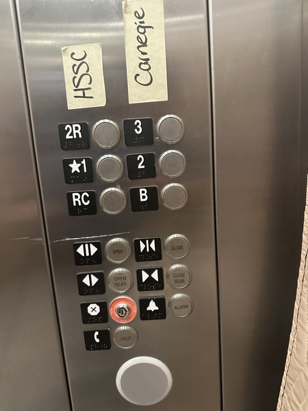

I spend way too much time thinking about user interface design.

Strike that.

I spend way too much time finding myself frustrated by UI design. Perhaps it's because I'm too often forced to use Microsoftware.

My complaints and concrns go beyond the products from Microsoft. They even go beyond software.

Here's one.

Consider the following set of elevator buttons.

As I expect most of my readers know, the addition of hand-written labels to an interface is one sign of a poorly designed interface. You may have identified otehrs. For example, why is there a 2R but not a 1R or a 3R? Why is the main floor (the starred 1) in the same column as a rear button? What does "RC" stand for?

One of the ways in which you often learn about the strengths and weaknesses of a UI is when you try to use the UI to achieve a task. Here's one. Suppose you have difficulty taking stairs and want to get to HSSC C2410. Which button would you push?

One possibility is "2R", since the room number starts "HSSC". However, if you press that button, you'll find that although all the nearby rooms have numbers that start with 2, they all start with "S" rather than "C". Perhaps that will lead you to realize that the "C" stands for "Carnegie".

Your next guess might be "2", since you've now determined that you are looking for a room in Carnegie that starts with 2.

You'd be wrong.

The "2" button brings you to a floor in which all of the rooms are numbered starting with "C1". At least it's the right starting letter.

At that point, you might realize that you need to press "3" to get to "HSSC C2410".

I don't understand.

Presumably, we got to choose the room numbers and the buttons on the elevators. Or at least our designers did. Why isn't the left column "RC", "1", and "2" and the right column "B", "1R", and "2R"? Alternately, if we think that the middle level of Carnegie is the 2nd floor, why not number those rooms starting with "2" and the rooms on the floor above them starting with "3"?

Also: Those taped labels are not accessible. A non-sighted person might have even more difficulty. Or perhaps they'd find it easier, since they wouldn't be misguided by the "HSSC" label. Who knows?

I wonder who I should complain to [1].

---

[1] "to whom I should complain" [2]

[2] Insert the ending of the Harvard joke [3].

[3] If you don't know the Harvard joke, don't worry, it's not very funny.
