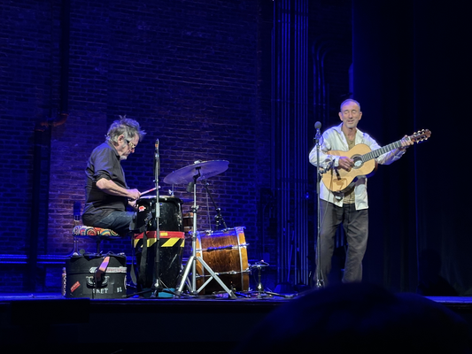

Last night, I had the privilege of attending a Jonathan Richman concert at the Englert Theatre in Iowa City. For those who aren't familiar with Richman, he's a musician who is hard to classify. He started out as the leader of The Modern Lovers ("We sing modern love songs"), an early punk band, one of the first bands clearly influenced by the Velvet Underground. The Modern Lovers had a host of great songs, including "Roadrunner", "Pablo Picasso", and "Government Center". Almost immediately, he switched to singing odd children's songs, such as "Abominable Snowman in the Market" and "Hey Three Little Insect". At some point, he moved to a mostly solo act or, as he's doing it these days, a duo with his drummer, Tommy Larkins. This latter period has a host of songs, from songs written in Italian, Spanish, and Sardinian (if I recall correctly) to a song inspired by the poems of Rumi ("He Gave Us the Wine To Taste") to tributes to seasons ("That Summer Feeling") and people ("Vincent Van Gogh", "Walter Johnson"). Michelle and I particularly loved "Not Yet Three", which we sang to the kids.

Jonathan shows are an experience. He sings and plays the guitar, as you'd expect. But he also dances (he's amazingly limber for someone who is about 75 years old), chats with the audience, ad-libs lyrics, and more. It also appears that he doesn't like photos taken at the concert. I learned that after taking this one. Whoops.

This is the fourth or fifth time I've had the privilege of seeing Jonathan live. The first time was at a free (I think) show at Mandel Hall at the University of Chicago. At the time, I knew Roadrunner, but that may be it. He immediately became a favorite, and I started seeking out his albums. Michelle, Jon Strymish, and I saw him together in Boston. I think it was at the Paradise. I don't remember what year it was. I saw him at a hole-in-the-wall place in a mall in Kansas City in 2015 [1]. Why Kansas City? I was there for the SIGCSE Technical Symposium, checked the paper for shows in town, and saw that he was playing. I brought a student with me who was also a fan [2]. I feel like Jonnie and I saw Jonathan another time together. But I'm old; I could be mixing up shows.

I appreciated the mix of people around us. I brought a friend who had never heard his music. The person behind us, who danced to one of his songs at her wedding, brought a friend who knew "Roadrunner" and that's about it. Perhaps the only person I know in Iowa City who is not affiliated with Grinnell College was also behind me; she also hadn't heard his music, but her partner brought her. She was hoping for a more comprehensible experience than last week's Stereolab show. There was a small child down the aisle from us. And someone in an X shirt was prowling the front of the venue [3].

What about the show? It was a Jonathan show. It was great. It was a bit odd. He was cranky at times, especially about photographers with red lights on their cameras (I don't think that was me) and his neighbors back home with giant lights that interfere with his ability to enjoy the nighttime sky [4]. He sang songs in lots of languages. He mixed some song into "That Summer Feeling", although he sang very few lyrics to "That Summer Feeling". I don't think I ever heard the key lyric, "That summer feeling's gonna haunt you the rest of your life."

Jonathan gave us an extended riff on "Pablo Picasso". I recall when he wouldn't play that song. And it's questionable whether he really played "Pablo Picasso", since he never sang "Pablo Picasso was never called an asshole" [5]. He certainly had a lot of fun with variants of that lyric. I wish I could recall what he sang instead. But I'm old; my memory fails me. I suppose [this relatively recent performance](https://www.youtube.com/watch?v=L9P9yK8hcLA) is similar. No, it's not. But it at least gives you the flavor.

Jonathan also sang an extended version of "David and Goliath", with a lot of singing along. I couldn't tell whether or not he appreciated it when the audience repeated the chorus of "rat-a-tat-a-tat, rat-a-tat-a-tat, rat-a-tat-a-tat-a-tat-a-tat". He also got us to sing along on the main part of the song. It was a lot of fun.

He also gave us a fantastic version of "Dancing in the Lesbian Bar". Of course, it's not clear whether it's possible for him to do anything but a fantasatic version of that song. In any case, he got us clapping and then danced, played various percussion instruments, sang, and more.

What other songs were there? "Ishkode! Ishkode!" with an extended introduction about setting bonfires and a question about why we laughed when he mentioned that. "He Gave Us The Wine To Taste". A short cover of "Volare". "Cold Pizza", along with some discussion; it was definitely better than the studio version.  "O Moon, Queen of Night on Earth". "The Dog Star", which is recent, and one I didn't know well. "Affection", which comes from the 1970's, and which I love. My memory fails me on the rest.

Before the show, one of the people behind me said "It's been a hard week. I'm glad I'm here. It's hard to leave a Jonathan Richman song unhappy." She was right. In any case, I'm glad I went. I hope I'll have another chance to see him live again. And I hope I'll have a chance to bring more people.

---

**_Postscript_**: As those who know me well might expect, I also experienced some emotional turmoil. I'll muse about that separately.

--- 

[1] I think it was the RecordBar, but I'm not certain.

[2] I'm not sure I'd do that now. The world is a more complicated place. Two students? Yes. One student? Probably not. One female-identifying student? Almost certainly not.

[3] I also saw X at Mandel Hall. Michelle was not a fan.

[4] Perhaps he should move to Iowa.

[5] In writing this piece, I put on [the original version, or something like it](https://www.youtube.com/watch?v=ejmE-F3EJyQ). I definitely reminds me of how much they sounded like the Velvets.
