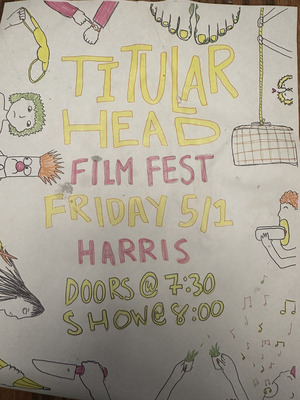

A few weeks ago, I served as one of the four judges for the 2026 Grinnell Titular Head competition. Titular Head (or "Tit Head", as students refer to it in short) is one of Grinnell's long-standing student traditions; I believe I heard that this was the 50th Tit Head. The current iteration of Tit Head is a student short film competition. I believe it originated as a short play competition. And, because it's Grinnell, the films can be about anything. In the past, I've seen an animated comedy short about using our endowment to destroy our competitors, acted in a film about Grinnell expelling a student [1], grooved to a music video by one of my Tutorial students, groaned upon seeing my Tigger costume used in a "Walk of Shame" compilation, and laughed at a compilation of campus personalities saying "Wassup!" [2]. And that's just from my first few years at Grinnell.

When one of my advisees asked me to serve as a judge at this year's Titular Head, I reflected on these videos and immediately said: "Yes" [3]. I forgot about the bad parts of Tit Head and my students' and offsprings' regular warnings to stay away from the event. Why would one stay away? Well, these are Grinnell students, so the films are not always "safe for work", as it were.

I was reminded of those reasons when I saw the list of award categories: Best Film, Most Grinnellian, Best Writing, Most Shocking, Best Nude Film, and Best Acting. Yeah, two of those are worrisome. For "Most Shocking", I recalled students telling me about someone who put a camera in a toilet, pointing upwards, and then made use of the facilities. For "Best Nude Film", I recalled a student telling me that their professor screamed at their class after judging Tit Head, saying something like "Why didn't any of you warn me that I'd see my advisees naked? How can I look at them in the face again?" [4]. Then there's the whole "bloody Christ" thing from one year, something that was controversial enough that President Kington needed to hold a public forum about it.

But I'd agreed, and I try to stick to my word.

I'm glad I did. I'll do my best to explain why.

First of all, I quickly discovered that I was the token male judge (the other three all present as female or non-binary) and the token science faculty member (the others were a staff member, a faculty member from Social Studies, and a faculty member from the Humanities [5]). It's nice to represent some of my intersectional identities. I suppose I'm also the only one of the four who visibly presents as somewhat disabled.

More importantly, I discovered that many of my advisees (and other CS students) were involved in the competition, with some making films and others taking leadership roles. As I've said before, one of my favorite things about Grinnell is that students explore areas beyond their major; it's nice to see our majors doing theatrical activities.

I also learned that there was a pre-film skit that involved the four judges. So I even got to act a bit, as well as make fun of one of my advisees. What could be better?

I also got access to the legendary Harris Center dressing rooms. Why are they legendary? Well, I consider them legendary because I recall something that Billy Bragg said while performing. Here's my approximate quotation:

> When I was in the dressing room, I saw that Wilco had signed the wall and written something like "We just won our Grammy". I signed underneath and wrote "Whose Grammy?"

For those who don't know, Billy Bragg and Wilco released _Mermaid Avenue_, an album of Woody Guthrie songs they'd set to music [6,7]. That album won a Grammy.

Anyway, it appears that musicians have a custom of signing the walls. I tried to find the Wilco and Bragg signatures, but couldn't. But I only had limited time, there was a mirror in front of one wall, and I think there's also a second dressing room. Still, I saw a Dar Williams signature; I'm not sure whether it was from her first visit to Grinnell or her second [8].

Have I gone off track? Probably. That's okay, it's part of my charm (at least if I have any charm).

On to the films.

There were somewhere between thirty and forty films. Most were well made. Many were funny. I've lost the list of titles, so I can only describe them a bit.

Let's get the complicated issues out of the way first. I won't tell you about the "Most Shocking" film, except to note that, from my perspective, it was even worse than I imagined the toilet film to be. It made me ill. Of course, as a parent of three children, I'm used to excrement. And the aspects of the film that made me ill may just be my cultural biases. In any case, I hope to never even think about that film again. Good job, filmmakers!

What about the nudity? It wasn't as bad as I'd expected. There was full male nudity in a few films, but it was generally from a distance, and I don't think it involved any students I know well. I also discovered that non-sexual male nudity doesn't affect me much. One short involved students getting naked and climbing the inside of the HSSC. Another involved someone tying their pants to a model rocket and shooting it in the air in the hopes of removing them. 

Grinnell students are strange.

I was more worried about the female nudity. It turned out that there was less such nudity than there was in past years [9]. If I recall correctly, there were only two films that involved such nudity, and both were simply a series of chest shots, with the latter one including decorated breasts. In the end, both ended up being more about matters of identity and individuality than anything sexual. Plus, you couldn't see any faces, so the breasts and chests were not associated with people you might know.

Other films may also have included some naked butts (of various genders); I don't recall. Again, not sexual, not worrisome.

Judging these things got me thinking about the use of nudity in these films. My naive reflection was "Given the current state of the Interweb, it makes sense that men are much more comfortable showing their full naked bodies non-anonymously, while women are reasonably reluctant to take that risk." A colleague noted that if screenshots of naked students were leaked, the men's would generally be interpreted as "Oh, that's normal college highjinks", while the women's would be sexualized, even if they weren't intended as such. So much for equality.

I also had a short pre-show discussion about the issue with a few folks. One noted that in most art schools, many of the faculty end up seeing their students naked, either in person (e.g., for figure drawing sessions) or in pictures (naked photography is a common gender). That got me wondering about why we worry so much about these things. Can we learn to treat the human body as something natural rather than something sexual? I suppose that's something nudists and gender theorists [10] have been asking for years. I'll need to think more about the issue.

I think that's enough on the two problematic issues.

Or at least the issues I thought would be problematic.

I didn't think about the other problematic issues. There was way too much celebration of alcohol consumption, including people pouring from open bottles directly into their own or other people's mouths. I realize that they may be mimicking things they see on social media or in music videos. However, given the associated problems with alcohol (over-)consumption, I worry about works that celebrate it. I may be getting old.

I also wasn't thrilled to see students I know in films that took the form of "Students get high and then attempt to do something." I recall two such films: One involved smoking something and then attempting golf. Another involved edibles and then cooking. I'm sure both were just acting; students wouldn't actually take drugs as part of the filming. I suppose this is less worrisome than the alcohol ones, and I know that college students use recreational drugs, but I'm not sure that I love seeing it promoted, especially since it remains illegal. I am getting old.

In any case, I'd rather see the "get high" films than the "get drunk" films.

There were also a variety of carefully crafted films, including a fake documentary about Grinnell, a history of Tit Head, a comedic take on the "This room will shut down in sixty seconds" announcement that we regularly hear in our classrooms, a strange film about the dangers of being a fake Grinnellian, and more. Films also included an exploration of student understanding of the term "queef", an etiquette guide to holding the door for other people (co-starring a CS major), a few warnings about drinking the beverage we call "Hawkeye", a fake wedding video [11], a celebration of back flips, a few short horror flicks, and too many films about people climbing campus buildings. Given that one of my college roommates regularly climbed campus buildings and explored the steam tunnels, I suppose I shouldn't complain about the dangers inherent in that last set. However, as I've said, I'm getting old [12].

There were many wonderful films. I wish that the judges had more time to discuss our selections and reach consensus. We picked good films, but I wonder whether more time would have led to different decisions. Upon reflection, here are my top choices. I don't recall the exact names.

* Best Film: A History of Titular Head
* Most Grinnellian: A tie between the "About Grinnell" film and the
  "Babies know true Grinnellians" film.
* Best Writing: The variant of "This room will shut down in 60 seconds".
* Most Shocking: The one I hope to forget, which is also the one that won.
* Best Nude Film: A tie between the naked climbing film and the second
  set of breasts.
* Best Acting: This was a hard one. Perhaps the students who were pretending
  to be stoned? The drunk detective? The subject of the cautionary tale about
  Hawkeye? The person for whom someone was holding the door?

Perhaps I'd have different opinions in a week. As I said, there were many wonderful films.

In addition to the films and the opening skit, the event also had a wonderful tribute to the myth of Self Governance as well as a lettuce-eating competition. Grinnellians are strange.

Grinnellians are also supportive. Harris Gym [14] was packed. People applauded, cheered, laughed, and more. It's nice to see community together. I would have appreciated less applause for the alcohol consumption. Oh well.

I also learned a new word: NARP, which I was told stands for "Non-Athlete, Regular Person". I don't love the term, since it's intended to describe people who are not on one of our athletic teams or clubs. You can certainly be an athlete without competing. In any case, NARP is intended as a contrast to SPORTO. I've yet to find someone who knows the details of the latter acronym. Perhaps "Sports Person On Regular Team Organization". Hmmm ... is "Team Organization" redundant? Perhaps "On Redundant Team Organization".

There was also a bunch of wrestling. Well, there were at least two films that included wrestling, including a documentary on Grinnellians celebrating 10/10 abroad and one that I recall just being a bunch of wrestling scenes. I know that wrestling is part of Iowa culture, but I hadn't realized it was part of Grinnell culture. Mayhaps it's just 10/10 culture. You learn something new every day. At least I do. 

As I wrap up, I should note that I'm thrilled to see how many CS majors were involved in this. As I noted, there were majors (including advisees) in the leadership team and in the opening skit. But they did more: They directed films, acted (I think one major was in about six films), scripted. I'm not sure if any composed a soundtrack. I'm proud of them!

Congratulations to the organizers and everyone involved for a spectacular show!

---

**_Postscript_**: A few friends have asked me whether I'd judge again if asked. I feel lucky that I got to judge what seems to have been a relatively tame Titular Head. So I'm not certain. However, I had a wonderful time. I think the answer is "It depends on whether I'm asked." I may even sneak into one.

---

[1] I need to find a copy of that video.

[2] People of a certain age may remember this from a Budweiser commercial.

[3] Or at least "Yes, provided it fits in my schedule."

[4] Insert obligatory joke that "It's better to look at their face than elsewhere."

[5] Also from an interdisciplinary major.

[6] They then released a few follow-up albums.

[7] In most cases, Guthrie had also set them to music, but the music had not been preserved.

[8] I saw Dar Williams the second time she visited Grinnell. When she played "Iowa", she told a story about leaving Grinnell after the first visit, planning to head to Iowa City, and driving in the wrong direction. Once she turned around, she got even more time with the rolling hills of Iowa, and that inspired the song. At least that's what I recall. At least one other person who was there also remembers a similar story.

[9] Or at least less than I was told there has been.

[10] Sorry for the odd conjunction there.

[11] More precisely, a video of a fake wedding. I believe the fake wedding was planned independently of the video; the video was just an add-on.

[12] Even though I'm getting old, I think I've done a wonderful job of recalling the films nearly three weeks later.

[14] Officially, it's "Harris Concert Hall". It still reminds me of a high-school gym.

