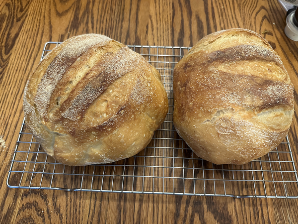
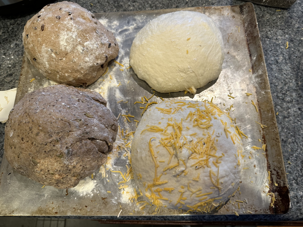
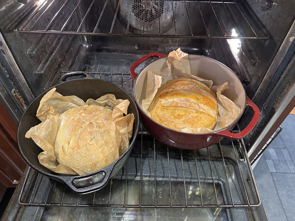
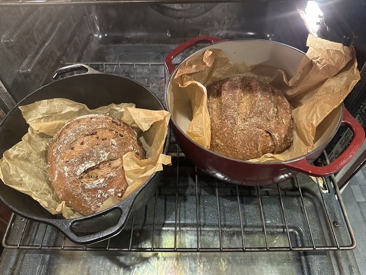
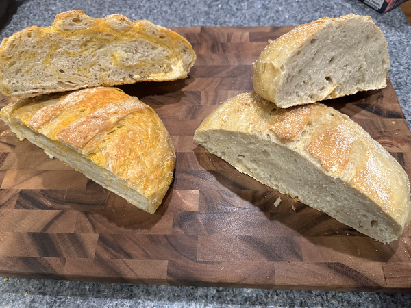
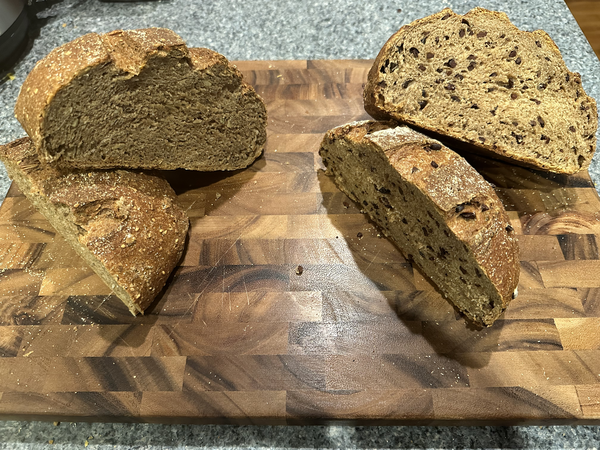

Late this summer, I started making bread again. Why? One reason is that I like bread. Of course, that's a bad reason to make bread because I tend to eat too much decent (or even half-decent) bread. The other reason is that one of my summer students was complaining about how much they missed decent bread. Strangely enough, the soft, squishy stuff that they sell at Hy-Vee doesn't count.

The last time I made bread with any regularity was, um, probably in the summer of 2012. I only recall the year because I associate making bread with a student who graduated in the class of 2014. In any case, that's the summer I discovered what I call "lazy bread" and which most people refer to as "no-knead" bread.

"Lazy bread" is not quick bread. Quick bread is raised with baking soda or baking powder (or perhaps even beer). Lazy bread is a yeasted bread. It's "lazy" in that (a) you don't need to spend time kneading, and (b) you do it nice and slowly. I don't pay enough attention to the science behind bread, but my basic understanding is that for a yeasted dough, you want to build long gluten strands and then align them. Kneading helps align the strands. Making a wetter dough and letting it sit longer also helps align the strands. When it sits longer, it also gains flavor (or so I'm told).

If you look around a bit, you'll find that there are a variety of recipes for no-knead bread [1]. The first one I attempted this summer came from _The New Artisan Bread in Five Minutes a Day_. I quickly realized that it wasn't the one I'd made in the past. This one had me make enough dough for four loaves and refrigerate the dough after a few hours of rising. Thinking back to 2012 or so, I recalled making a loaf at a time and letting it sit on the counter for nearly a day. In any case, the recipe didn't quite succeed. Or is that, "I didn't quite succeed at making the recipe"? In any case, the bread turned out a bit denser than I'd like. Still, it looked beautiful and tasted reasonably good [2]. I wasn't sure whether it was because I had not-very-live yeast; after all, the yeast in my fridge probably dates back to Thanksgiving, and I was using it in July.

For whatever reason, I decided to look for another recipe and eventually recalled that I had previously used one from _The New York Times_. It's been updated, but is still called [No-Knead Bread](https://cooking.nytimes.com/recipes/11376-no-knead-bread) [3]. 

Eldest says that I cannot bear to follow a recipe exactly. He's right. I'd liked some aspects of the _NAB5_ recipe, particularly cutting the top of the bread before baking; it certainly made for a beautiful loaf. I also don't completely trust our yeast. And, um, I wanted a whole-wheat loaf in addition to a regular loaf [4]. So I made two loaves. I used 1/2 teaspoon of yeast instead of a 1/4 teaspoon. I let it rise with the seam side up, rather than seam-side down. Why? So that when I flipped it, the seam would be down, giving me a clean top to cut.

In any case, they both turned out great. The whole-wheat loaf was a bit denser, but I suppose that's what you'd expect. I also added a bit of gluten to that one.

My next attempt included two whole-wheat beer breads. Conveniently, the recipe calls for 12 oz of liquid; after all, that's one bottle. I'd read online that whole-wheat no-knead breads need a bit more liquid, so I also added an extra 2 oz of water. I'm not sure that's enough; I recall reading "twice as much water", but that seems like a lot.

I've made more changes since. Here's my approximate approach [5]. I don't know where I got all of my advice along the way. Some was from Middle. Some was experimental. Some was from the Interweb. I do recall looking at [the narrative on _Salt and Serenity_](https://www.saltandserenity.com/2024/01/jim-laheys-no-knead-bread/).

---

**Make the dough and let it rise**

In a large plastic bowl, mix together

* 3 1/3 cups flour
* 1/2 Tablespoon salt
* 1/2 teaspoon dry yeast

Yes, I realize that I should work with weights rather than volume to ensure uniformity. However, I'm okay with my bread varying a bit. And I note that _The New York Times_ recipe changed from three cups to three-and-a-third cups over the years. Some variation should be fine.

For white bread, I use bread flour. Middle recommends King Arthur bread flour. I tend to use whatever is available at a reasonable price. If I'm buying locally, I use Fareway bread flour. If I happen to have stopped at a place like Costco, I've probably picked up a larger bag of King Arthur flour.

For wheat bread, I use whole-wheat flour [6]. I also add a heaping Tablespoon of gluten. I know that some people mix white and wheat flour and others mix rye and wheat. For now, I'm sticking with all wheat flour. Once again, Middle recommends King Arthur wheat flour, but I've been using Fareway brand. I did pick up some King Arthur for a future attempt.

Now it's time to add the liquid. For white bread, use one-and-a-half cups of lukewarm water. For wheat bread, use a twelve-ounce can of decent beer and another two ounces of lukewarm water. Don't worry about the alcohol; it just burns off. Does the kind of beer matter? It should. However, I'll admit that I had trouble tasting the difference between a loaf I made with stout and a loaf I made with wheat beer. Perhaps I lack sophisticated-enough taste buds. 

Mix it all together. At some point, I usually end up using my hand.

Cover and let sit for about twenty hours. I think I've let it sit as little as sixteen hours and as many as twenty-four.

---

**Shape the dough and let it proof**

Flour a surface. Dump the dough out on the surface, using something to scrape the little bits out of the bowl. Flour your hands. Fold the top (far?) third of the dough over the middle third. Fold the bottom (near?) third of the dough (or is it now half?) over the middle. Fold the left third of the dough over the middle third. Fold the right third (half?) over the middle. Lightly shape into a ball.

Wait fifteen minutes or so. (Hmmm ... I see that you're also supposed to cover it. I don't always remember to do so.)

Cut a long piece of parchment paper. (Read ahead to figure out how long.) Crumple it up and then uncrumple it. Lightly dust the parchment paper with cornmeal.

Re-form [7] the dough into a ball by dragging from the top to the bottom. The _NAB5_ recipe notes that this creates something I recall they call a "gluten cap". I may be wrong.

Gently place the dough, seam side down, on the parchment paper. The _NYT_ recipe says to put the seam side up and place the dough on a towel with lots of cornmeal. But they also have us dump the dough off the towel. We'll leave it on the parchment paper for future steps.

Lightly place the parchment paper and dough back in the bowl. Note how well the parchment paper serves as handles. Cover the bowl.

Wait about ninety minutes. Wait a bit longer for whole-wheat bread [8].

---

**Prepare the oven**

Put a covered Dutch oven in your oven. Set your oven to 450°F. 

Wait another half hour. Isn't waiting great?

---

**Start baking**

Lightly dust the top of the dough with cornmeal. Cut some slashes in the top with a very sharp knife, a razor blade, or a lame [9]. That permits the steam to escape. It also makes it look pretty. I generally use three parallel slashes. However, I see that [The Perfect Loaf recommends a square for the boules](https://www.youtube.com/watch?v=W-9gDmtmT4Y). Maybe I'll try that and some other approaches in the future.

Remove the Dutch oven from the oven. Remove the lid. Gently place the parchment paper and dough into the Dutch oven. (There's a reason we use parchment paper: The parchment paper serves as a transport device.) Re-cover [10] the Dutch oven. Put it back in the oven.

Wait thirty minutes.

---

**Bake some more**

Remove the lid. Cook another fifteen minutes or so until it looks right. (Aren't approximate directions great?)

---

**Finish up**

Remove from oven and cool on a rack.

Eat.

---

I'll admit that I rarely make only one loaf. After all, I like both white and wheat bread, and I have two Dutch ovens [11]. Plus, bread is fun to share. A few times, I've found myself making four loaves. Someday, I'll make four loaves, but put two of the loaves of uncooked dough in the fridge to let it ferment a bit.

My most recent batch of four was more experimental. I added seeds (pumpkin, sesame, and chia) to one of the wheat loaves. I added a bunch of cacao nibs to the other. I probably should have ground the cacao nibs to a finer powder; I didn't want them to be obvious. Did I measure how much of each I used? Nope. I'm a bad experimental scientist [12].

I left one of the white loaves alone and tried to make cheese bread with the other. That is, when folding the dough together, I kept throwing grated cheddar cheese in the middle. I could only fit in 8 oz of cheese. My quick exploration of pages on the Interweb suggests that that's about all I could expect to fit. Some pages also suggest that I should make a fattier dough. They're wrong. The cheese made it more than fatty enough.

Here are the four loaves (piles of dough?) after forming. You may not be able to tell, but the plain white pile of dough is a bit softer than the rest.

After baking, they looked like this as they prepared to leave the oven.

And here's what they look like after being cooled and cut open.

Yum!

---

**_Postscript_**: Yes, this approach still requires some work. I have a friend who uses a bread machine. Perhaps we should call that "Lazier Bread".

---

**_Postscript_**: Rating the four latest loaves. (They're all still good enough to eat.)

In first place: _Cheese bread_. I love cheese. I love bread. What could be better than the two cooked together? It's a bit richer than I'd like---or at least richer than I can eat in large quantitites. That's probably a good thing.

_Plain white bread_. Tastes as I'd expect. The crust was less crispy than normal, and the loaf was a bit shorter than normal. I'm not sure why. Perhaps I should measure more carefully.

_Seeded wheat bread_. Doesn't taste much different than the normal wheat bread. When I catch some seeds, they're good, but I didn't include enough. I'll have to measure next time. It's also a bit salty. I'm not sure why. It may just be that I'm more sensitive to salt these days because I don't use it in my regular cooking.

_Wheat bread with cacao nibs_. I had hoped to integrate the cacao nibs better. As you can see from the photo, they're relatively obvious. I haven't decided whether or not I like the taste. And, like the other wheat bread, it tastes salty to me. Why the wheat and not the white? I'm not sure. It might be good for peanut butter and banana sandwiches.

Next time? Perhaps I'll go back to plain bread. Experimenting with new ways to score the loaves will be fun!

---

[1] I haven't found many people (besides myself) who call it "lazy bread".

[2] One student said, "It needs salt". The student I made it for called it "the highlight of my food experience this summer". The latter comment worries me.

[3] I almost certainly need bread, so the name eludes me.

[4] My doctor says that I should prioritize whole-wheat bread over white bread.

[5] It's approximate because it changes a bit each time.

[6] Duh.

[7] You don't need to send it to Juvie.

[8] Since I usually cook the white bread first, I wait about an hour longer to put my whole-wheat bread in the oven.

[9] No, Grammarly, that's not an inappropriate word. It's a homograph of a potentially inappropriate word. A lame (pronounced "lahm", with a short/Canadian "a") is a device for breadmaking that consists of a handle and a razor blade.

[10] "Re-cover", not "recover".

[11] To be accurate, the house has at least three Dutch ovens. I'm pretty sure that one belongs to Eldest. One is also big enough that it won't fit in the oven with another Dutch oven. We may also have a Dutch oven designed for cooking outdoors somewhere in the garage.

[12] No, Grammarly, I'm not an evil experimental scientist. I'm just bad at doing experimental science. There's a difference.

