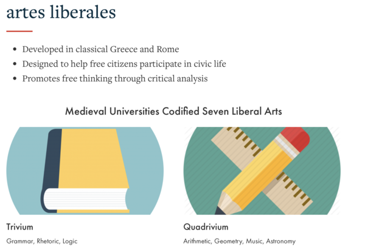

_tl;dr_

Liberal education liberates us, or at least our minds. At Grinnell, students should design their plan of study not by looking at a list of subjects to take, but by figuring out what subjects will help achieve the goals of liberal education. William Cronon writes better than I do about these topics. Nonetheless, I am better at connecting them to Grinnell. We need to revise how we present liberal education. I propose one approach that focuses on connecting goals and subjects.

---

For the past few months, I've been thinking a lot about liberal education and Grinnell's approach to liberal education. Why? In part, I was spurred by discussions of summer advising at Grinnell. In part, these are topics I often reflect on. I commented on our use of "quantitative reasoning" in [a somewhat recent musing](quantitative-reasoning-2025-12-19) as well as [in the distant past](quantitative-reasoning-tag). I started this musing [1] about a month ago. Now I see that we're about to have another faculty-wide discussion about liberal education and/or the liberal arts. My muse tells me that I should finish these reflections _before_ that discussion so that I can not only prepare for the discussion, but also record how I think before I encounter the wise influence of my colleagues.

I had planned three or four separate musings. First, I had hoped to reflect on the broad ideas of liberal education and liberal arts. Next, I planned to comment on Grinnell's [Six Elements of a Liberal Education](https://catalog.grinnell.edu/content.php?catoid=38&navoid=6365#Elements_of_a_Liberal_Education) [2] and [our Web page on the liberal arts](https://www.grinnell.edu/academics/experience/liberal-arts). Would that be one musing or two? I'm not sure. Finally, I considered proposing a new version---or at least a framework for a new version.

Now? I have less than a day. I'm going to combine everything into one document. I won't make as much progress toward my next musing milestone, but I suppose that's okay. After all, milestones are only a letter away from millstones.

---

Let's start with the three terms: liberal education, the liberal arts, and liberal arts education. They are related, but not necessarily the same.

In spite of what some pundits suggest, a liberal education is not an education intended to imbue progressive thoughts in students. Rather, it is an education that is intended to liberate the mind. From what must minds be liberated? Ignorance, certainly. But also more. We want to free students from restricted ways of thinking, from viewing the world through the lens of self, from unintended biases, from much more. More importantly, we want to free students _to_ do things: to approach problems in new and different ways, to understand those different than them, to determine their role in the world, to become their best selves.

What about the liberal arts? In days of old ("the classical world", in the words of the catalog), there were seven liberal arts, grouped into a set of four (arithmetic, geometry, music, and astronomy) [3] and a set of three (grammar, logic, and rhetoric). Notions of what belongs in the liberal arts have evolved over time, and, for better or for worse, they remain lists of areas to study.

The liberal arts are often distinguished from "the vocational arts", disciplines intended to prepare you for a vocation, like lawyer, doctor, engineer, plumber, or business executive. In that framing, some take a narrower view of the liberal arts, such as by excluding sciences, as science can be a vocation. We will consider neither the difference between the liberal and vocational arts nor the question of whether we should excise certain areas.

What's the relationship between liberal education and the liberal arts, or vice versa? The liberal arts provide a mechanism for achieving a liberal education. Are they the only mechanism? Certainly not. But they are a convenient one. It's easier to use a checklist than to reflect carefully on how to free oneself.

However ...

However ...

However, Grinnell prides itself on an _individually advised curriculum_ [4]. Students, faculty, and staff should be working together to help each student understand the purpose and goals of a liberal education and develop a plan of study that helps them achieve such an education. The list of topics may serve as a starting point for discussion, but should not be employed as little more than a checklist.

---

Suppose we've embraced the value of having a list of topics, if only as a starting point for discussion. What should that list look like? Here's what we currently have.

> 1\. Nothing enhances the expression of knowledge better than engaging, clear, and accurate language. Reading closely, thinking clearly, and writing effectively form a web of connected skills, whether practiced in the First-Year Tutorial, in the Writing, Reading, and Speaking Center in designated writing courses, or in courses ranging from the introductory to the advanced level in almost every discipline. Students planning their academic programs should strive for the ability to convey their ideas with power and grace, to analyze and formulate arguments, and to adapt each piece of writing to its context and audience.

> 2\. Study of a language other than one’s own opens the mind to new ways of thinking. Language placement tests are offered during New Student Orientation, and students are asked to determine their appropriate level at that time. Many Grinnell College faculty members urge their advisees to study a nonnative language and its literature, not only for the exposure to a rich alternative world of cultural meanings, but also to gain a valuable perspective (unavailable to the monolingual person) on the workings of language itself. For careful planning, students should note that many off-campus study opportunities, the Alternative Language Study Option, certain academic majors, and many types of postgraduate study require specific levels of demonstrated ability in foreign languages.

> 3\. An education in the natural sciences—biology, chemistry, physics, and psychology— introduces techniques of observation and experimentation, the relation of data to hypotheses, and the practice of scientific reasoning. This work trains the mind to relate concrete empirical information to abstract models, stimulating multidimensional and creative habits of thought. Sustained experience in the laboratory and a grasp of basic scientific principles lead to a better understanding of commonly observed phenomena. Non-specialists who are scientifically literate bring valuable understanding to public discourse and to an increasing number of professional settings.

> 4\. Quantitative reasoning, with emphasis on mathematical models and methods above the secondary-school level, aids in the expression of hypotheses, processes, and theoretical relations. A course in statistics can be helpful for all students, and particularly for those who might work in the social and behavioral sciences. Studies in computer science offer valuable exposure to principles of logic and problem-solving paradigms.

> 5\. The study of human behavior and society leads students to investigate their own identities and to gain insight into social categories and relations. Faculty advisers often urge students to take a sustained look at the history of a specific society, and also to examine a contemporary society (or a segment of it) that is unfamiliar. In light of these encounters, students learn to make and evaluate their own political and ethical choices. Whether a student explores anthropology, economics, education, history, philosophy, political science, religious studies, sociology, or interdisciplinary studies, this question will lie near the heart of the inquiry: in what ways have people lived together, and how should they live together?

> 6\. Students enlarge their understanding of the liberal arts through the study of creative expression. In the analysis of creative works, whether through historical survey of forms, aesthetic theory, or interpretive practice, the arts occupy the foreground, though knowledge of history and society may inform the analysis. In this way, courses in literature, music, theatre, dance, and the visual arts complement studies in anthropology, history, philosophy, religious studies, and other fields. Students also benefit from learning, through direct instruction in artistic or literary technique, the intense discipline of art and its interplay between conscious intent and unconscious design. [5]

Or, as we summarize it [elsewhere](https://www.grinnell.edu/academics/experience/liberal-arts), 

* Writing and Communication, 
* Language Study, 
* Natural Science, 
* Quantitative Reasoning, 
* Human Behavior and Society, and 
* Creative Expression.

While I generally support the ideas framed therein, I dislike much about these statements. I've already written about [my frustration of calling three different kinds of thinking "quantitative reasoning"](quantitative-reasoning-2025-12-19).  I'm still not sure that I have a better unifying term, other than "formal reasoning". Nonetheless, it's worth pointing out the flaw in the hopes that others can find solutions.

_On that note, I discussed with Paula Smith my desire to reflect publicly on [6] our expression of these elements. I respect Paula highly, and she's been a wonderful mentor through the years. Because Paula authored these statements, I wanted to be sure that it was okay to critique her work. Paula told me that she had never expected what she'd written to last so long. She also suggested that rather than critique, I should propose new language. However, as I've just noted, I may be better able to identify flaws than to propose ways to repair those flaws. In addition, by noting flaws, we can avoid similar flaws in the future. Hence, while I will propose new approaches, I will begin by identifying some flaws. Sorry Paula._

Writing and Communication. Aren't these goals of a liberal education ("a liberally educated person communicates well through writing, speaking, diagramming, and more") rather than topics one studies?

Language Study. "Study of a language other than one’s own opens the mind to new ways of thinking." That's a great rationale for studying language. I'd like to know a bit more. I also worry about the relationship to the Whorfian hypothesis. What new ways of thinking? Unfortunately, the next sentence doesn't tell us. "Language placement tests are offered during New Student Orientation, and students are asked to determine their appropriate level at that time." WTF? Isn't that just a procedural note? Do we really need that in the midst of an analysis of why to study language? Was this written by committee? Fortunately, we go on to the reasons for such study. And then we end with more procedural issues. Is "Language Study" the only paragraph with procedural issues? I think so. Can't those go elsewhere?

Natural Science. Sorry, but Psychology is not a Natural Science; Psychology is not a field that primarily studies the natural world. That is not to say that Psychology does not belong in the Science Division. Grinnell's Psychology Department is definitely an experimental department, suggesting that we should refer to this grouping as the _Experimental Sciences_ or _Laboratory Sciences_.

Quantitative Reasoning. I've already expressed my concerns about this topic. To summarize: "Quantiative reasoning" does not sufficiently label the four different ways of thinking represented by this "element": Mathematical reasoning, Numeric reasoning, Statistical reasoning, and Computational thinking.

Human Behavior and Society. I'm not sure that "interdisiplinary studies" fits into the same category as "anthropology, economics, education, history, philosophy, political science, religious studies, [and] sociology". 

Creative Expression. Aren't there two sides to creative expression? There's value in analyzing creative works, particularly works from other cultures. At the same time, as the paragraph suggests, "Students also benefit from learning, through direct instruction in artistic or literary technique, the intense discipline of art and its interplay between conscious intent and unconscious design." Also, is our goal really to "expand [...] understanding of the liberal arts"? Isn't it something deeper? Perhaps to understand our humanity.

And More. Where are GWSS (Gender, Women's, and Sexuality Studies), African Diaspora Studies, and American Studies in all this, let alone our concentrations?

--

Rather than starting with inputs, it might be more productive to start with outputs. What characteristics do we expect of a liberally educated student, particularly a Grinnell-educated student? We know a bit about those because the College has documented them as part of our assessment activities. These are our CWLOs (College-Wide Learning Outcomes) [7].

> Students develop creative and critical thinking skills that allow them to analyze the work of others, formulate relevant questions, and respond to those questions in a substantive way using quantitative and qualitative evidence. 

> Students develop a sense of social responsibility and fairness that guides them in their personal and professional lives. 

> Students develop the ability to communicate clearly and persuasively in various modes for various purposes and audiences. 

> Students develop the ability to continue learning independently and collaboratively. 

> Students develop the ability to approach a question from multiple perspectives, representing a diversity of ideas and experiences. 

> Students pursue a chosen field of study in depth and develop understanding of a core body of knowledge in that field as well as the ability to employ modes of inquiry appropriate to that field. [8]

This doesn't tell students what to study, but it does tell us what they should get out of their studying.

I may prefer William Cronon's framing of the attributes of liberally educated people in "Only Connect" [9].

> 1\. They listen and they hear.

> 2\. They read and they understand.

> 3\. The can talk with anyone.

> 4\. They can write clearly and persuasively and movingly.

> 5\. They can solve a wide variety of puzzles and problems.

> 6\. They respect rigor not so much for its own sake but as a way of seeking truth.

> 7\. They practice humility, tolerance, and self-criticism.

> 8\. They understand how to get things done in the world.

> 9\. They nurture and empower the people around them.

> 10\. They follow E.M. Forster's injunction from _Howard's End_: "Only connect ..."

Of course, it's much harder to assess some of these than it is to assess our CWLOs.

---

For advising purposes, we want to be able to connect outcomes to the courses students might take. Let's see what I can come up with. Note that is very rough. I'm also not sure that I have deep enough knowledge to cover all of the "ways of thinking" we want.

> _**1\. Communication**. A liberally educated person can communicate clearly and persuasively in various modes for various purposes and audiences._ 

> > _1.a. Writing._ Most courses at Grinnell will provide opportunities to develop writing skills.  To further develop writing skills at communicating in writing, students might also consider courses in which they carefully analyze others' writings, such as TBD. Students might also take advantage of the Writing, Reading, and Speaking Center or serve as a writing mentor to further develop writing skills. Studying another language can also help students develop a deeper understanding of language.

> >  _1.b. Oral communication._ Most courses at Grinnell will also provide the opportunity to develop select oral skills (e.g., discussion, presenting). Once again, the Writing, Reading, and Speaking Center can provide further support. Serving a a class mentor or a Science Community Leader helps further develop oral communication skills.

> > _1.c. Visual communication._ To develop skills in communicating numeric information, students might take courses in statistics, experimental sciences, or social sciences. To develop skills in presenting other kinds of ideas visually, students might take TBD.

> _**2\. Analytical Approaches**: A liberally educated person can employ multiple approaches as they seek to understand problems and issues._

> > _2.a. Theory-based analysis._ Many Humanistic disciplines (e.g., Philosophy, Religious Studies, English, GWSS) encourage study of subjects through the lens of one or more theoretical frameworks.

> > _2.b. Synthesizing literature._ In many disciplines, one analyzes issues, at least in part, by identifying and reading relevant literature and synthesizing ideas from that literature. Upper-level seminars are often a good opportunity to practice and develop this approach.

> > _2.c. Experimental science._ The experimental sciences (including Biology, Chemistry, Neuroscience, Physics, and Psychology) provide a very different mechanism wherein one observes, generates hypotheses, designs experiments, conducts those experiments, and analyses the results. The social sciences (including Anthropology, Economics, Political Science, and Sociology) provide appropriate background in such an approach.

> > _2.d. Observational science._ In many instances, particularly in cases in volving human subjects, it is not ethical to design experiments that involve "treating" participants. Hence, observational scientific techniques that also involve observation, hypotheses, data gathering, and analysis are also appropriate. 
The social sciences (including Anthropology, Economics, Political Sciences, and Sociology) also use observational methodologies, tempered by the ethical considerations of designing experiments on humans and societies. 

> > _2.e. Formal methodologies._ The mathematical sciences (such as Mathematics, Statistics, and Computer Science) provide more formal mechanisms and, unlike many others, permit certaininty in proof. 

> > As I said, I'm not competent to finish this section.

> _**3. Understanding the other.** A liberally educated person looks beyond the self to understand those different than they are._

> > _3.a. Studies of societies and peoples._ Courses in the social sciences and History provide one lens through which to understand others. Courses in African Diaspora Studies, American Studies, and GWSS provide further understanding.

> > _3.b. Foreign language._ Learning another language provides insight into other cultures.

> > _3.c. Cultural studies._ Explicit studies of other cultures, often offered through Grinnell's language departments, provide further insight.

> _**4. Creativity.** A liberally educated person can create new things._  Students generally develop creative skills through courses in Studio Art, Music, and TDPS (Theatre, Dance, & Performance Studies). Courses in creative writing provide another opportunity to develop creative skills as do Grinnell's opportunities to publish student works. Music ensembles, campus performances, and more provide further opportunities.

> _**5. Study of creative works.** Students enhance their understanding of humanity by carefully studying creative works._

> > _5.a. Literary studies._ Courses in English and many upper-level coures in our language departments provide the opportunity to delve deeply into literature and what we can learn from studying it.

> > _5.b. Other arts._ Courses in Art History allow students to consider a wide range of issues related to art, particularly visual arts. Selected courses in Music and TDPS provide the opportunity to understand performative arts.

> _**6. Introspection.** A liberally educated student has deeply considered their place in the world._ Courses in Philosophy and Religious Studies often ground such considerations.

> _**7. Interdisciplinarity.** A liberally educated person can connect ideas and approaches from multiple discplines._ Courses in interdisciplinary subjects, such as GWSS and African Diaspora Studies, provide one type of opportunity to build interdisciplinary skills. Grinnell's interdisciplinary concentrations provide another.

Yeah, that was rougher than I'd like. But you have to start somewhere, right? Maybe I'll come back and write a new version after a week or two.

---

What else? Oh, that's right. I promised to critique [our web page](https://www.grinnell.edu/academics/experience/liberal-arts). Here goes.

Do I need to comment on this? Perhaps it's just my distaste for presenting complex issues in bullet points. Nonetheless, if we're promoting the liberal arts, shouldn't we do so with careful writing, rather than a few points? And why should anyone care?

I'd like to see links to the full descriptions of these elements.

I'm not sure why someone in a VR lab represents Human Behavior and Society. What does the alt text for that image say? Ah, "VR on Campus". Very informative. I'm not sure why it's relevant.

Of course, given some of the stuff I produce, I shouldn't critique others. Oh well.

---

**_Postscript_**: I also [mused about this topic](liberal-arts-education) about eight years ago. You should find this new musing sufficiently different.

---

**_Postscript_**: I noted that a liberal education is not intended to make one liberal. However, for many people, freeing your thinking from its bounds and to consider more broadly often leads people to become more progressive. There's a reason that conservatives have worked so hard to discourage education (or at least liberal education). 

I must also admit that some faculty (perhaps many) find it their calling to skip a step; rather than freeing their students' minds with an expectation that this will lead to liberal thinking, they strive to direct them to liberal thinking. However, pushing students to think in particular ways does not liberate them.

---

[1] More precisely, all three parts of this musing.

[2] The link should lead you to a discussion of liberal education in the _2025--26 Grinnell College Catalog_. 

[3] The _Catalog_ calls the set of four "the quadrivium of quantitative reasoning". I suppose they are all topics in which we (could) reason about quantities. However, that doesn't seem to match current uses of the term "quantitative reasoning".

[4] "Individually advised curriculum" may someday become a registered trademark of the school formerly known as Iowa College.

[5] Grinnell College. 2025. Elements of a Liberal Education. In _2025--2026 Academic Catalog_. Available online at <https://catalog.grinnell.edu/content.php?catoid=38&navoid=6365#Elements_of_a_Liberal_Education>.

[6] muse about, critique, rant about, diss, etc.

[7] I pronounce the acronym CWLO as "quillow"

[8] Grinnell College. nd. College-Wide Learning Outcomes. Online document at <https://www.grinnell.edu/academics/centers-programs/ctla/assessment/college-wide>. Accessed 29 January 2026.

[9] Cronon, William. 1998. "Only Connect..." : The Goals of a Liberal Education. _The American Scholar_ (Autumn, 1998), pp. 73--80. Available online at <https://www.williamcronon.net/writing/cronon_only_connect.pdf>.
