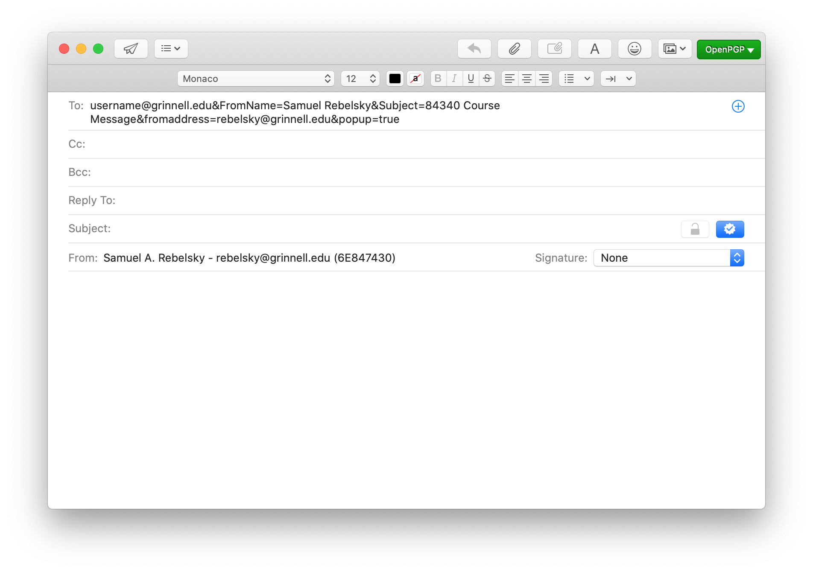

The other day, I clicked a link on the class roster page [Grinnell's
Blackboard System](https://pioneerweb.grinnell.edu), officially
known as "Pioneer Web" and colloquially referred to as P'Web.
Although my mail reader popped up, as I had expected, the "To:"
field was incorrect.  Here's what appeared in that field, appropriately
anonymized.

I observed the same behavior whether I used Firefox, Safari, Chrome,
or Opera [1]. Why didn't the message appear correctly?  Some folks
would say that it's because I'm using a Macintosh.  But I believe
the problem is a bit more complex than that.  I think it has to do
with how they formatted the `mailto` link.  Here's the link that appeared
in the original.

> <a href="mailto:username@grinnell.edu&FromName=Samuel Rebelsky&Subject=84607 Course Message&fromaddress=rebelsky@grinnell.edu&popup=true">mailto:username@grinnell.edu&FromName=Samuel Rebelsky&Subject=84607 Course Message&fromaddress=rebelsky@grinnell.edu&popup=true</a>

Let's try a series of experiments.  We'll start with just the basics.

> <a href="mailto:username@grinnell.edu">mailto:username@grinnell.edu</a>

Yup.  That works fine.

Now, let's add the subject.  I don't particularly like the subject that
Blackboard chooses, but I'm not going to be picky.

> <a href="mailto:username@grinnell.edu&Subject=84607 Course Message">mailto:username@grinnell.edu&subject=84607 Course Message</a>

Nope.  It all appears in the "To" field.

Okay.  Let's check [the documentation for mailto
URIs](https://tools.ietf.org/html/rfc6068).  Ah!  Start with a
question mark, not an ampersand.  I knew that.  Or at least I should
have known that.

> <a href="mailto:username@grinnell.edu?Subject=84607 Course Message">mailto:username@grinnell.edu?subject=84607 Course Message</a>

Yup.  That works.  That is, the `username@grinnell.edu` appears in
the "To:" field and the useless "84607 Course Message" appears in
the subject.  Now let's try the longer one.

> <a href="mailto:username@grinnell.edu?FromName=Samuel Rebelsky&Subject=84607 Course Message&fromaddress=rebelsky@grinnell.edu&popup=true">mailto:username@grinnell.edu?FromName=Samuel Rebelsky&Subject=84607 Course Message&fromaddress=rebelsky@grinnell.edu&popup=true</a>

That works just like the prior one.  I wonder whether I can futz with it?

> <a href="mailto:username@grinnell.edu?FromName=Raynard Kington&Subject=84607 Course Message&fromaddress=kington@grinnell.edu&popup=true">mailto:username@grinnell.edu?FromName=Raynard Kington&Subject=84607 Course Message&fromaddress=kington@grinnell.edu&popup=true</a>

Nope.  It makes no difference.  So why do they generate such a long URI?
I have no idea.  In any case, it's time to report the issue to ITS so
that clicking on the link works appropriately.
