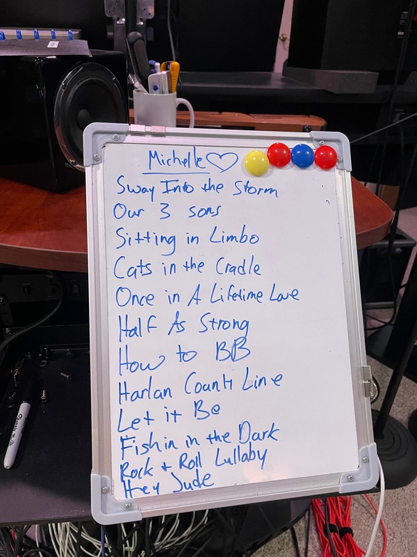

Recently, our friends [Danika Holmes and Jeb Hart](https://danikaandthejeb.com) suggested doing a show of "Songs Michelle Loves". They asked us to come up with a setlist of ten songs or so. Unfortunately, at the time I was putting the setlist together, Michelle wasn't up to suggesting songs or even approving/vetoing them. So I did my best.

How do we know Danika and Jeb? I started listening to them on [StageIt](https://stageit.com) during the pandemic. Then, while Michelle was working in Audubon, we had "remote date nights" in which we both listened to and chatted about the show. They've also performed two house concerts at our house, we've hung out with them on various occasions, and Michelle has been a good friend to Danika during some hard times. They've also been good friends to us, supporting us during our hard years. That's just a sampling; there are other connections, too. We're lucky to have them as friends.

In thinking about songs for Michelle, I had a whole lifetime of music to consider, including time before we were together. She performed in "Sing Out" in high school. She went to concerts in college [1]. We saw shows together, from shows she loved (Joe Ely, the Blasters, the Loomers, and more) to shows she hated (Phillip Glass stands out). There are CDs and mix tapes she and we listened to as we drove back and forth between Hanover, NH, and Waterville, ME [2]. There are also the tune she listened to when driving back and forth to Audubon while she worked there.

Fortunately, my choices were more constrained. In particular, I was limited to either songs Danika and Jeb had written or covers they regularly performed. So no Shel Silverstein songs performed by Dr. Hook and the Medicine Show [3], not many Lowen and Navarro songs, no Joe Ely or the Blasters, no Bad Examples [4], no Michelle Shocked [5], no Jon Svetkey, nothing from Gregson and Collister's _Love is a Strange Hotel_, and so on and so forth. None of the 90's country she listened to frequently [6]. As I said, I feel fortunate to be constrained; otherwise, there would have been too many choices.

Here's what I came up with, as Danika wrote it up on their setlist board, which is neither the order I listed them nor the order they performed them. It's not a perfect list, but it was a great show. And I know Michelle loved all of these songs [7].

**"Sway Into the Storm"** (originally performed by _Danika and the Jeb_)

Most of the times Michelle had the opportunity to request a song, she requested this one. I don't know all the reasons. She told me that she appreciated the imagery ("we're two brances from the same oak tree"). I also think that she liked the overall country vibe. I remain convinced this song could be a hit for one of those big-hat country singers. 

Personally, I love the way Danika has subconsciously incorporated various songs."You seek shelter, and I sway into the storm" evokes Dylan's "Shelter from the Storm". "You take the high road and I take the low" directly quotes "Loch Lomond". And "No redemption songs" references Bob Marley's "Redemption Song".

**"Our Three Sons"** (originally performed by _Danika and the Jeb_)

This is officially "our song". I commissioned it for our 35th wedding anniversary. Michelle wasn't thrilled: Money was tighter than normal, and Danika and the Jeb compositions don't come cheap. But once she heard the song, all was forgiven. It speaks well to our life together and, most importantly, to our pride in our three offspring. I also like how it "swings", for lack of a better word. I'm glad we were able to hold hands during this performance.

**"Sitting in Limbo"** (originally performed by _Jimmy Cliff_)

Back in April, Michelle chose this song for a Danika and the Jeb "choose covers for us to play" show. We didn't discuss all the reasons, but we talked about some. Michelle said she didn't think of it being about death. Rather, she felt like her life was currently in a state of limbo, not really moving forward. It's clear to me that she felt a passion for helping others and she felt frustrated that her illness meant that she couldn't do so as directly.

"Sitting in Limbo" is also an amazing song from one of the best Reggae albums (perhaps one of the best albums independent of genre). And it feels almost spiritual, particularly the way Danika and Jeb perform it.

**"Cat's in the Cradle"** (originally performed by _Harry Chapin_)

Michelle loves Harry Chapin. Michelle's brother loves Harry Chapin. My kids love Harry Chapin. Me, I find him a bit too maudlin. But the songs are good to sing along to. And he wrote a tribute to Phil Ochs, so he can't be all bad. This isn't Michelle's favorite Harry Chapin song, but it seems appropriately representative.

**"Legacy"** (originally performed by _Lowen and Navarro_)

Michelle chose this song for one of Danika and Jeb's first "Choose covers for us to play" shows. She picked it because she loves the song (and loves Lowen and Navarro more generally) and because Danika was on her way to being a new mother. The song definitely speaks to parenthood in a much more positive way than "Cat's in the Cradle".

You probably haven't heard of Lowen and Navarro. But you likely know at least one of their songs (at least if you're in our generation). They wrote Pat Benatar's "We Belong". Backstory: I picked up their "Walking on a Wire" in a $2 bin about thirty years ago (maybe more) and we both fell in love with the album. We moved on to most of their other albums. We've had the opportunity to see Dan Navarro twice (unfortunately, Eric Lowen passed away) and have found him a great entertainer and a gracious person. 

I forgot to include this song in my original setlist. Fortunately, Danika and the Jeb were able to fit it in.

**"Once in a Lifetime Love** (originally performed by _Danika and the Jeb_)

This beautiful song about Danika's aunt and uncle's love is a clear favorite. Michelle and I also had a wonderful afternoon chatting with them one day. Michelle and I haven't talked much about the song, but it's clear that she always loved it. And I like how it evokes our own love, even though our love story is very different.

Danika and Jeb have a lot of love songs that also don't match our love, including "Black Swan" and "Let's Cruise". G&J's most resonates with ours, even though we didn't reach their 40+ years.

**"Half As Strong As You** (originally performed by _Danika and the Jeb_)

I remember riding in the car with Michelle and her saying something like "I'd love to hear them perform this song live, but it must be so hard for Danika." The song is a tribute of sorts to Danika's father and speaks to the ways in which a daughter relies on her father's love and guidance. I'm pretty sure that it resonated with Michelle's feelings about her own father and about talking to him on his deathbed.

I was a bit worried about choosing the song, particularly given the stage of Michelle's life, such as "I don't know if you can hear me, but I hope you can feel me". I managed to keep my tears down to a reasonable level during the performance. And it was great to hold her hand while listening.

**"How to Be Beautiful"** (originally performed by _Danika and the Jeb_)

A beautiful song about inner beauty, which pairs well with "Half As Strong As You". I don't know what else to add.

**"Harlan County Line"** (originally performed by _Dave Alvin_)

Michelle seems to have listened to a lot of solo Dave Alvin, presumably as she was driving back and forth to Audubon. We also say Dave a few times, including with his brother, Phil. Did we see an incarnation of the Blasters together? I can't recall precisely, but I think so. Did it have Dave? I can't recall.

In any case, while I think there are other Dave Alvin songs she likes more (e.g., "Gary Indiana 1959"), when it came time to choose a cover for Danika and the Jeb to play, she chose this one because she wanted to hear how Jeb approached the guitar solos. And we've enjoyed it as a very different type of song for the two of them to play. I know Danika found it challenging to sing like someone who isn't a traditional singer.

**"Let It Be"** (originally performed by _The Beatles_)

I know, I know. This is a song almost everyone loves. But I also know that when Danika and (the) Jeb played their first show at our house, this song was at the top of Michelle's request list. Danika does a great job on this, and Jeb's sinuous guitar adds a lot.

**"Fishing in the Dark"** (originally performed by _The Nitty Gritty Dirt Band_)

I wasn't sure whether or not to include this ditty. But it's a genre that Michelle likes, and she sang along when they first performed it. I don't have any other backstory to add. I do think I told Danika it was optional.

**"Rock and Roll Lullaby"** (originally performed by _BJ Thomas_)

A song that Michelle and I listened to together many times, whether in the BJ Thomas version or the great a capella version by The Belmonts (with no Dion). She also picked this for one of their "choose cover songs for us to perform" shows. (There's a pattern here, isn't there?)

**"Hey Jude"** (originally performed by _The Beatles_)

Michelle would regularly sing along to Danika and the Jeb shows. But I struggled when I tried to remember what songs she sang along to. I chose this as a song that (almost) everyone likes to sing along to. I also remember us singing along to it while watching Ted Lasso.

---

Thirteen songs. Whoops. That's about ten, right? In any case, what is normally a forty-five- or fifty-minute show ended up being about seventy minutes. It was wonderful. I appreciate Danika and Jeb for doing this. From what I could tell, Michelle did, too.

There were certainly a lot of other songs I could have chosen that could have been as good or, perhaps, even better. She loved most of their originals; she even had "Concrete Dragons" and "Bluebird" jewelry. And their covers are great. Michelle said she liked "the creepy kid's song", which I interpret as "Goodnight Moon" (originally by Shivaree). The first time she heard their cover of "Gunpowder and Lead" (originally by Miranda Lambert), she insisted I track it down. And their cover of Beyonce's "Umbrella" is just stunning. We also used to sing Jonathan Richman's "Not Yet Three" to our kids (and thought they'd appreciate it) and she chose Chris de Burgh's "Don't Pay The Ferryman" for a recent show, too.

---

[1] We later learned that we were both at least one concert together in college, even though we didn't know each other yet.

[2] Not so far as the high-flying crow flies. Fairly far if you stay on main roads and avoid the mountains.

[3] Strangely enough, both of us listened to "Sloppy Seconds" a lot as children.

[4] It might be amusing to see Danika and the Jeb perform the Bad Example's "Long Drive Back from Madison".

[5] Perhaps I overstate her love of Michelle Shocked.

[6] Maybe I'll request Martina McBride's "Independent Day" (written by Gretchen Peters) for the next Danika and the Jeb cover show. It was definitely one of Michelle's favorite songs.

[7] Of course, she loved most songs that Danika and the Jeb did, including covers of songs she'd not heard before.

