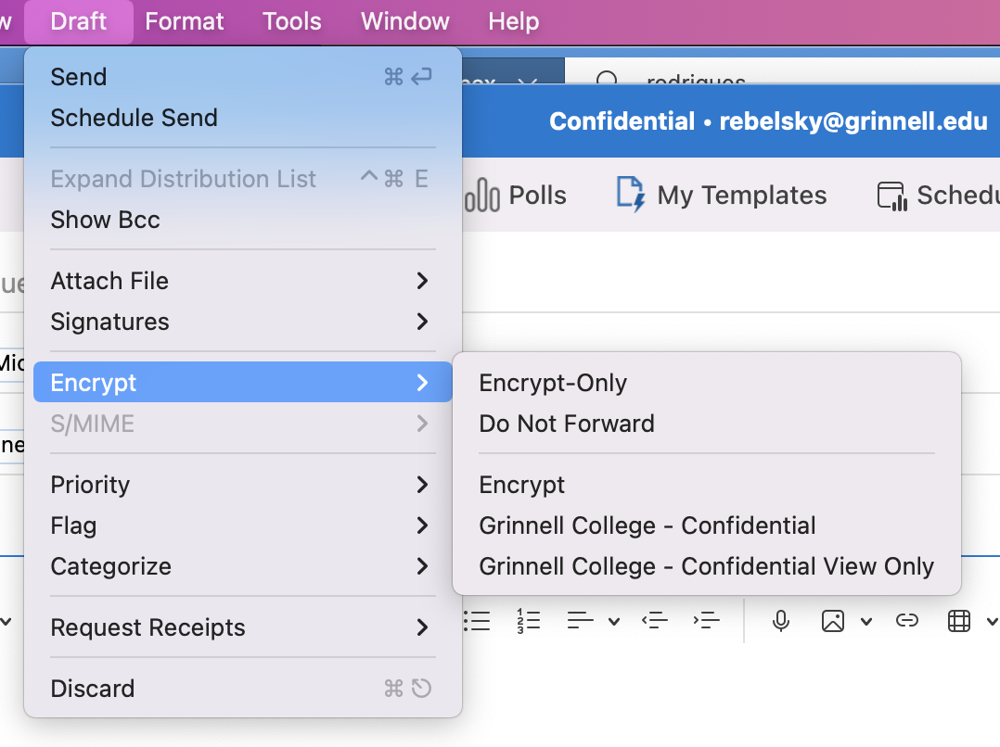
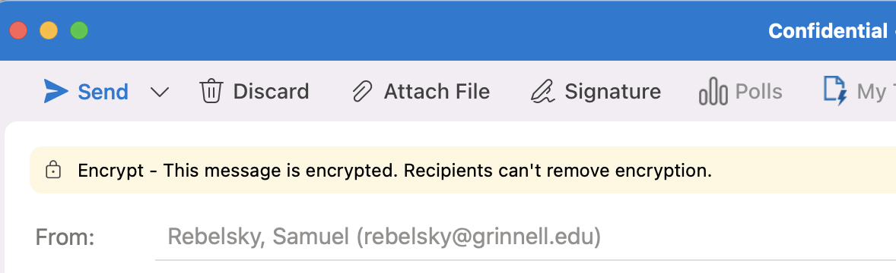
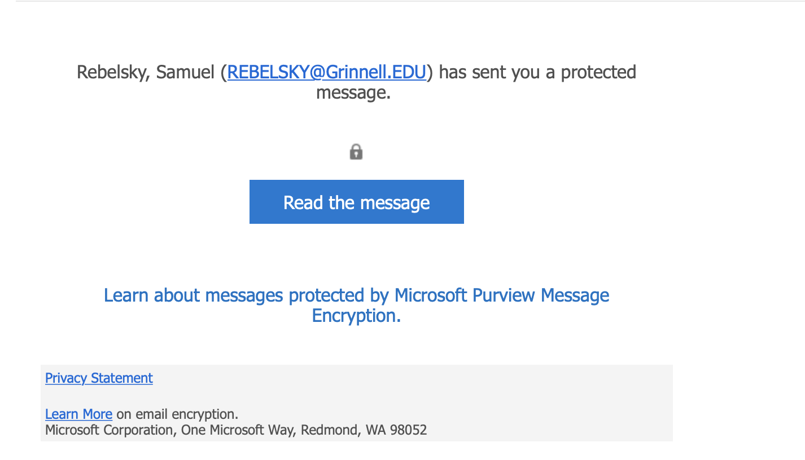
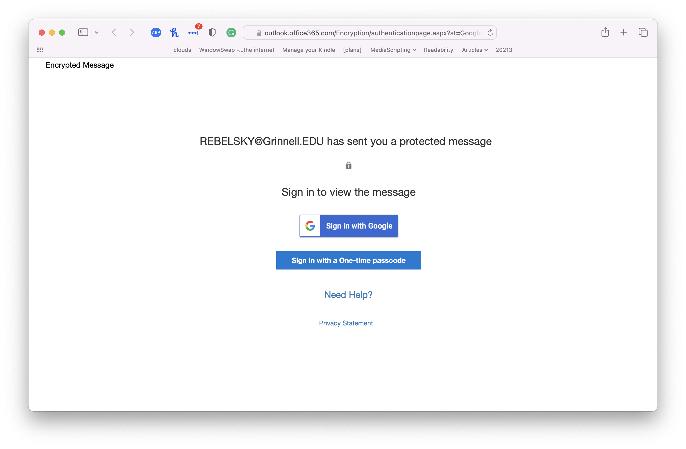
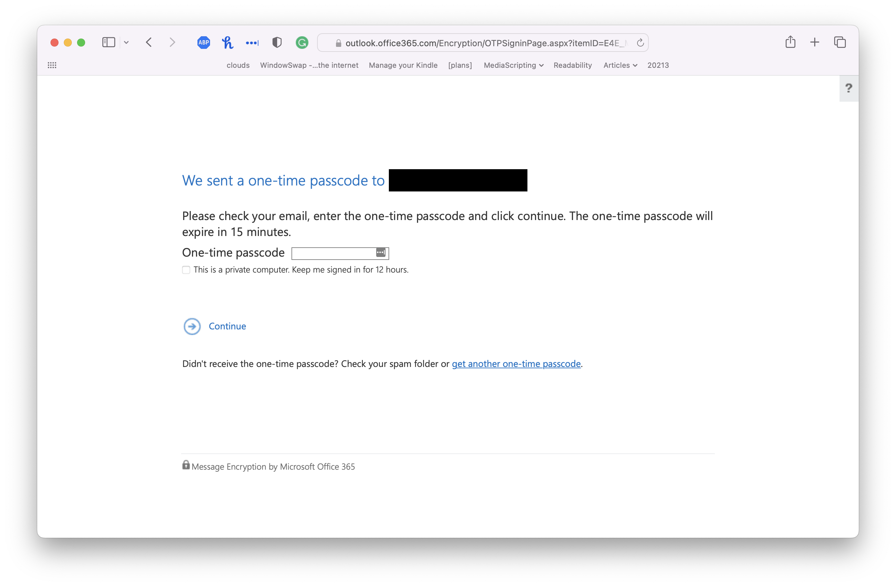
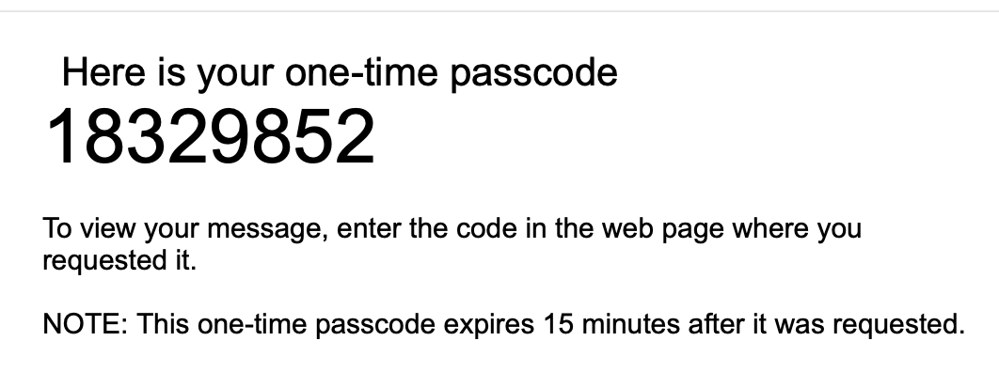

Grinnell's recent [data protection training](https://grinco.sharepoint.com/sites/EmployeeLearner/SitePages/DataProtectionatGrinnellCollege.aspx) [1,4] has gotten me thinking more about email encryption. The training suggests that we encrypt our email when we send confidential information [6]. My colleagues in CS and I have had a long-standing practice of encrypting email when we share thoughts and comments about, say, students or other colleagues.

The idea of encryption should be reasonably straightforward. Suppose Avery wants to send a message to Blake. But Avery wants to stop others from reading the message. Who might intercept the message? That's a reasonable question. Many agents have access to their email, including Avery and Blake's system administrators, their email providers, any services that process their email [7], and perhaps others who can view the data that flows through the Internet pipes between Avery and Blake. For convenience, we'll call that person Chandler. We'll assume that Chandler can read any of the emails Blake receives, but can't stop Blake from receiving those emails [8].

In the model of encryption that I learned and teach, Avery uses an algorithm (well, a program that embodies the algorithm) to turn the message into something that others will have trouble reading unless they know a magic "key" [9]. Perhaps Avery has given that key to Blake using a different mechanism; perhaps Blake has given Avery a way to encrypt things so that only Blake's key will decrypt it. In any case, instead of sending the original message, Avery now sends the encrypted message. Chandler can read the encrypted message. However, since Chandler doesn't know the key, Chandler cannot read the original contents. All is good.

For the past decade or so, I've used [PGP encryption](https://www.openpgp.org), an open standard for encryption [10], using the GPG [11] implementation of PGP. Because I'm lazy and want encryption embedded in my mail reader, I generally use the [GPG Suite for macOS](https://gpgtools.org) [12]. My colleagues generally use some flavor of PGP (and, presumably, GPG).

For complicated reasons, higher-ups at Grinnell have strongly encouraged us to switch from PGP/GPG to the encryption built into Microsoft Outlook. According to [the Microsoft support page](https://support.microsoft.com/en-us/office/encrypt-email-messages-373339cb-bf1a-4509-b296-802a39d801dc), Outlook supports two kinds of encryption: S/MIME encryption and Microsoft 365 Message Encryption (Information Rights Management). I had planned to use S/MIME encryption because it's an open standard. But I'm told that I should use IRM encryption.

Here's how that works.

First, you type your message in Outlook. That seems straightforward enough, doesn't it?

Next, you tell Outlook to encrypt it.  Once you've figured out where the menu item is, that's also straightforward.  Draft > Encrypt > Encrypt.

You'll see a little message at the top of your message window.  

And then you send it. 

Eventually, it makes its way to the recipient.  

What does the recipient see?  It depends on the email client you use.  In most clients, you'll see something like this.

Let's click the blue button and hope it doesn't lead to the blue screen of death.

Let's say that our recipient doesn't want to risk giving their Google identity to Microsoft, so they click on "Sign in with a One-time passcode".

Back to our email client!

Nope, I won't show you the contents of the message.  After all, it was encrypted for privacy.

That process seems appropriate, doesn't it?  Microsoft tells us that the message was encrypted.  Our recipient has to follow a cumbersome process to read it [14].  Our message is safe.

Or is it?

Remember: We're worried about people who can peek at our email messages.  I think we called the snooper "Chandler" [15].  As far as I can tell, Chandler can see the first message that goes out, the one with the link that reads "Read the message".  That means Chandler can also visit that page in their Web browser.  They can then click "Sign in with a one-time passcode".  Since they can intercept the message with the passcode, they can now read the message.

Whoops!  Chandler has read the message that we don't want them to read.  There's a little bit of a trail: Our recipient will see the strange message with the one-time passcode.  But it provides little information about the identity of the person who requested that one-time passcode.

As far as I can tell, Microsoft 365 Message Encryption may encrypt the message, but it doesn't secure it.  And that's pointless.  It's like putting your valuables in a safe but leaving the code to the safe in a nearby drawer.  Or it's like password-protecting your Excel files [16].

I may be missing something.  I don't think so.  If someone can explain why anyone should consider this encryption secure, I'd love to hear that encryption.

Here are some incorrect explanations.

_No one can spy on your email traffic._

> If that's the case, why bother with encryption at all?  In addition, neither you nor I know much about my recipients' email providers.  Plus, there are lots of people who can spy on my email at Grinnell: Microsoft, members of the ITS staff, Proofpoint, others.

_Microsoft 365 Message Encryption is an industry standard._

> If everyone else jumped off a cliff, would you?  Standard does not mean secure.  And most people who are serious about security either (a) avoid email in the first place, (b) use PGP, or (c) use S/MIME.

As I said, if you know of a reason I should trust this insecure encryption, I'd love to hear it.  Otherwise, I'm finding a way to switch to S/MIME.

---

**_Postscript_**: What does Microsoft mean that "Recipients can't remove encryption"?  As far as I can tell, recipients can copy from the Web page and then send the message along unencrypted.

---

[1] Only available to members of the Grinnell community. One of the GLADIS [2] training programs.

[2] Grinnell Learning and Development Instruction Site. One of the few six-letter acronyms I know of [3].

[3] GLIMMER (Grinnell Laboratory for Interactive Multi-Media Experimentation and Research) is a seven-letter acronym.  I should be more tolerant.

[4] I may eventually muse about taking that training. [5]

[5] Grammarly wanted me to rewrite that to "I may eventually regret taking that training."  Sometimes, I love Grammarly.  Sometimes, not.

[6] I think the official term is "restricted information".

[7] E.g., Proofpoint.

[8] We may consider more complicated issues later in the musing.

[9] Like "open sesame".

[10] Amusingly, PGP stands for "Pretty Good Privacy". 

[11] GNU Privacy Guard. Don't you love acronyms?

[12] Is it macOS or MacOS? I can never get it straight.

[14] It may be less cumbersome if you use Outlook as your mail reader.

[15] No relation to Bing.

[16] I don't know how things are now, but it used to be that password protection of Excel files only made a difference if you opened them in Excel.  The data was still stored in plaintext, so anyone with a smidgen of technical knowledge could read it.  I know of at least one major data leak (social security numbers, private records) that happened because someone stored important passwords in a password-protected Excel file [17].

[17] I wonder if that person still reads my musings.
