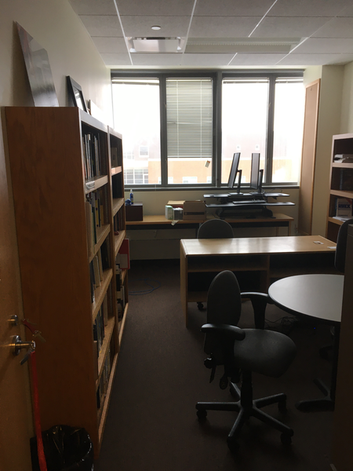
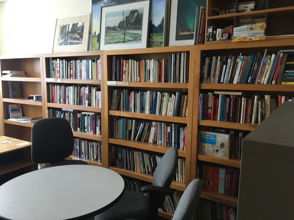

Since the Noyce Phase II construction that moved CS to Noyce 3rd,
my office has been in Noyce 3824.  Well, it's mostly been Noyce
3824.  For the past two years, I've been out of my office in Noyce
3824.  I expect to be moving back to Noyce sometime this summer,
but I probably won't be moving back into Noyce 3824.  Why not?
Because the tradition in our department is that we clear out the
old folk [1] to ensure that the new folk can be on the same floor
as most of the other faculty.  And when I say "we clear out the old
folk", I mean that "the more senior faculty volunteer to move".
It's not a very long tradition; Henry Walker moved downstairs.  John
Stone indicated he'd be willing to move downstairs.  I assume that
I'm next in line.

For those who've not seen my office, it's crowded.  I have six
bookcases [2] comprising way too many linear feet of books [3], two
lateral filing cabinets, lots and lots of tchotchkes, six or so
paintings [6], and more.  Oh, I also have a desk, a pair of
tables by the window, a round desk to work with students at, and
assorted chairs.  Also an oriental carpet [7].  Probably other
things I'm forgetting.  It's going to be challenging [8] to move.
There's also the question of space. I'm not sure how many bookcases
FM can put into another office.  I assume we'd move some from my
current office because, well, the younger generation doesn't seem
quite as enamored of books [9].  I'm hoping we can move the four
wooden shelves from the east wall.  But we might not move any.

Since Henry Walker is vacating his office, I've asked to be moved
into his office.  It's a sensible place.  It's the nearest second-floor
office to Noyce 3rd, which helps with departmental communication
and continuity.  It's also near Barbara Johnson's office, which is
likely to be helpful as we teach overlapping courses next year.
But I'm told that Henry's office space is in high demand.  It's
also near Chemistry and the Science Learning Center.  Plus, it
started out as a Biology office [11].  But it would be a good office
for me; there are two bookcases already and there's wall space for more 
bookshelves if I rearrange the room a bit.  And I'd certainly appreciate
the implicit connection to Henry.

There are other places the College might put me.  We've housed some
of our visitors [12] on what was originally designed as the SFS/Visitor
corridor on Noyce Second.  But, well, Grinnell Science grew more
than expected, and it's become a home for tenure-line faculty, too.
So there's a chance that I'll get moved to one of those.  I think
these offices are smaller than the standard tenure-line offices
[14], which makes moving my stuff there worrisome.

I know that I'm getting close to the point in my career in which I
need to get rid of books.  Lots of books.  Lots and lots of books.
I probably don't need them all.  I certainly don't need them all.
As one of my sons says, "Dad, why do you need six different editions
of _The Chicago Manual of Style_?" [15] But there's something
strangely comforting about having every edition I've purchased.  I
may never teach Tutorial again; perhaps I don't need three shelves
of books on writing.  I wonder if someone reading this would want
them.  Somehow, I find it easier to get rid of books if I know they
are going to a good home.  Two of the boys went to Grinnell, but I
don't think they'll want my shelf of books on Grinnell or on or by
Grinnellians [16].

Since two of my offspring are pursuing careers in computing, I
wonder if either of them will eventually want some of my CS books.
Not all of them; no sensible person wants all of them.  But perhaps
they'll want the collection of CS classics.  Maybe the books on
gender in computing.

Oh well, I still have some time until retirement [17,18].  I don't
need to get rid of the books now.  But I should start thinking about
it.  Maybe I'll make a list of the genres that live in my office
and lab.  Then I can post it and see if folks want groups of books.
Mayhaps my next leave will include more time devoted to cleaning
things out.  Come to think of it, I should use my next leave to
vacate my lab to provide room for a younger faculty member.  I'll
still need a lab, I'll just try to use a smaller one.

Speaking of labs and offices, I hope that the Dean's office is
making long-term plans for CS space.  If we ever reach the nine or
ten faculty members that sixty majors per class year demands, we'll
need more offices and more labs.  We've already started to see the
strain; I believe I was the first science faculty member in recent
years who had to vacate not only their office to make room for a
visitor [19,20].  Oh well, the Dean's office has known about these
issues for a while, back to when Kate Walker was treasurer [21].
It's not my responsibility to address them [22].

For now, I'd just like to know where I'm moving and when I'm supposed
to move.  It's going to take some planning to figure out *how* to
move everything.  What furniture will the new office need?  Will
FM provide it?  What will fit and where will it fit?  What do I
have to move elsewhere?  And I hope that the timing is right that
I'll still have a son or two here to help.  Oh well, it's not in my
control.  I'll find out when I find out.

---

**_Postscript_**: Here's what my 3824 office looks like when cleared
out for a visitor.  The tchotchkes and some of the books are gone,
as is the oriental carpet and, well, lots of other stuff.

---

[1] No, not "the dead wood".

[2] Six was my estimate without looking back into the office.  I found
a photo that seems to verify the claim.

[3] I had intended to measure but forgot.  Let's assume each bookshelf
is forty-five inches wide [4].  Five shelves per bookshelf, times six
bookshelves, divided by twelve inches per foot.  About 112 linear
feet.  But my books don't all fit; I stored some, moved some to my
other office, and purchased some more [5].

[4] Yes, I'm pretty sure that's an accurate estimate.

[5] Bad Sam!

[6] Do we count my children's childhood paintings?  Then it's more.
But they aren't up in my office right now.

[7] Currently in storage in my lab.

[8] And time-consuming.

[9] Arguably, few people are as enamored of books as I am [10].

[10] I do have fond memories of Ellen Mease's books flowing out of
her office into the bookshelves in the waiting area outside her
office.  But Ellen is a literary theorist; books should be part of
her life.

[11] Bruce Voyles', I believe.

[12] As well as one young faculty member who indicated a preference
for being near other scientists to permit collaboration.

[14] I know that they are smaller than the normal Math/CS/Stats
offices, but I don't know the norms for tenure-line offices.

[15] From the first copy I bought as a grad student to the latest
one.

[16] By "shelf", I mean "full bookshelf", as in five shelves on a
bookshelf, five overflowing shelves.

[17] Well, senior faculty status.

[18] Musing forthcoming.

[19] I believe some people did so voluntarily, but most of those
were either doing sabbatical out of Grinnell or got an office
elsewhere in Noyce.

[20] I'm not complaining.  I volunteered to leave my Noyce Office.
I love my office at 1127 Park Street.  It's just that if I hadn't
volunteered, our visitor would have been physically isolated from
the department.

[21] When Raynard was discussing expanding the student body, I asked
where we could fit more faculty.  I was told there was room.  I
don't know where.  But, as I said, it's not my responsibility to
figure that out.

[22] I'm also happy to see that colleagues are thinking about that
question.  One asked about it at today's faculty meeting.  Noyce is
full.
