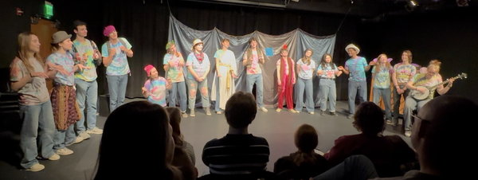
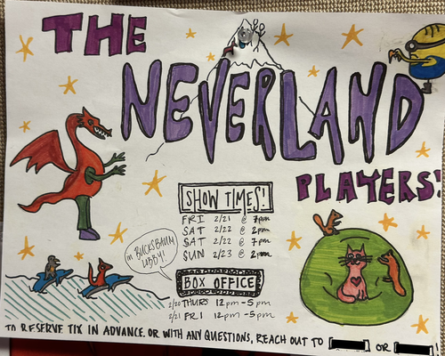

I awoke this morning with plans to write not one, but two rants. Unfortunately [1], life intervened. In particular, before starting to write those rants, I went to see this semester's _Neverland Players_ show. I left the show feeling more joyful than I've felt in a long time and, well, I'm not in the right mood to rant. A simportantly, my muse has compelled me to write about the show.

"What are The Neverland Players?", you may ask. The Neverland players are a long-standing student-led theatre tradition at Grinnell. Here's an approximation of how I describe them to first-semester, first-year students when I offer them extra credit [2] to attend.

> The Neverland Players take stories written by local elementary-school students [3], turn them into plays, and then perform those plays. It's a wonderful experience. First of all, there are few things as hallucinatory as the imaginations of elementary-school students. In addition, and this may be speaking as a parent, the kids and their families attend. Seeing the pride of the kids when their stories are performed is amazing.

In any case, it's one of my favorite Grinnell traditions. Alas, it is also something I haven't had the opportunity to attend for far too long. But I managed to snag a ticket for the Saturday afternoon performance, and off I went.

It was even better than I remembered [4].

It was, of course, filled with the surprising and unexpected. Mashed potato dragons, if I recall correctly, living chili peppers, bunny rabbits able to climb large mountains, unimaginably large food critics, paedomorphic salamanders, fairies and magicians, cats, a few more cats, and so much more. But it was also filled with important values: honesty, friendship, sharing, the possibility of finding royalty within ourselves, and the power of bodily processes.

Few, if any, of the performers are Theatre majors [5,6]. There was even a Physics/CS major on stage [7]. They did a stellar job acting and singing. I assume many of them contributed to the task of adapting stories to performances, too. As I've said, one of my favorite things about Grinnell is that students across majors have skills and interests that go far beyond their majors.

At the beginning, the house manager warned us that the show would last about an hour and forty-five minutes. Hence, I was a bit surprised that we hit the last piece after only seventy minutes or so. In addition, although all of the prior source stories were in the playbill [9], the last one wasn't.

In any case, I was wholly unprepared for the wonder that followed, a forty-five minute _musical_ performance about napkins, the addictive qualities of honey and spicy pickles, and the origin of the beehive. I heard melodies by Jim Steinman and either a banjo-playing frog or a composer of popular music who shares a last name with a former director of the Boston Pops [10,11]. I'm not sure whether the remaining songs were original or derivative, but it doesn't really matter. And, although I suppose I could describe the plot, I can't imagine any description living up to that performance. I could watch it again and again [12]. Fortunately, I managed to capture a few bits on my phone. And I hope that the directors and cast will find a way to share a recording more broadly [14]. 

To make the show even better, one of the writers was celebrating their birthday. Unfortunately, no one thought to bring cake and ice cream.

What else? Oh, it makes me happy that many of the authors are offspring of my neighbors, colleagues, and friends [15]. I'm also happy that I don't know others of the authors; I'm glad they cast a wide net.

One part about the whole event that makes me a bit sad. The show is in the Wall. No, it's not a Harry-Potter-esque magical thing where you somehow look crosseyed at a wall and walk into it; it's a theatre at Grinnell named after Joe Wall. Or at least I think it's named after Joe Wall [16,17]. And the Wall has an audience capacity of something like 51 people. Given that there are only four performances of the show, too few people will have the opportunity to attend. I hear that it sold out [18] in five or ten minutes.

In spite of that, I'm going to head back again tonight or tomorrow, put my name on the waitlist, and see if I can see it again. Fingers crossed! [19,20]

**Congratulations** and **thank you** to the authors, the adapters, the singers, the dancers, the actors, the musicians, the technical crew, the house managers, the directors, and everyone else involved in creating this spectacular show.

---

**_Postscript_**: If you're wondering how I managed to snag a ticket to a sold-out show, here's the story. The posters for the show say "To reserve tix in advance or with any questions, reach out to [the directors]." So I reached out. On Thursday morning. To try to get tickets for the Friday night performance. Unfortunately, one is supposed to reach out before that. However, they had one spare ticket that hadn't been claimed, and I was able to claim it. Next semester, I'm reaching out earlier or befriending one of the cast members. Perhaps I could threaten one of my advisees who will be associated with the show. Or ask the amazing Technical Director for the theatre. There are so many possibilities.

---

**_Postscript_**: The Neverland Players show is my second College theatrical/dance event this semester. Unfortunately, I'll be missing next week's shows. I left the first event in tears. I left this one with incredible joy. It's amazing what emotions performance can bring.

---

**_Postscript_**: Are you worried that you're missing out on not one, but two Sam Rants? Don't worry, my curmudgeonly self will resurface soon. You'll probably see them again in the next day or two.

---

[1] Or fortunately, depending on your views.

[2] "tokens", in the course lingo.

[3] I think it's elementary-school students.

[4] It's different every time, so my memory is of the general vibe rather than the particular performances.

[5] Or, more precisely, Theatre, Dance, and Performance Studies majors.

[6] I've lost my program, so I'm not really sure what most of their majors are. At least one is a first-year and probably doesn't have a major yet.

[7] They seem to be denying the CS part of their identity at present, so I apologize for outing them [8].

[8] No, not really.

[9] _Playbill_ is probably a trademark of some corporation. 

[10] Yes, I realize that my brain goes in strange directions.

[11] Those descriptions are of two different songs.

[12] And again.

[14] Copyright, schmopyright. Just do what's right.

[15] I'm pretty sure at least one of them is also one of my readers. At least one of them has told me that they based one of their reports to the College on something I'd posted.

[16] I tried a quick Web search. I did not find an answer. But I did learn that it is not the Wall Theatre. Rather, it's either the Wall Performance Space or the Wall Theatre Lab. Or maybe it _is_ the Wall Theatre, since I saw some Insta posts from the Theatre, Dance, and Performance Studies department that refer to it as such.

[17] I went back to check it out. It was given by Charles R. Wall 1967. And, surprisingly, one sign says "Wall Performance Lab" while the other says "Theatre Lab".

[18] "Sold out" is perhaps not an accurate term given that Grinnell doesn't sell tickets. Every event is free. But "ran out of tickets" doesn't sound quite the same.

[19] Is it greedy to see it twice when there are few seats available? Perhaps. But I'm going through the waitlist process rather than claiming two tickets. If I get in through the waitlist, I'm not taking a seat from someone else. 

[20] I went back on Saturday night. Although I was near the end of the waitlist, I managed to snag a front-row-center seat. I felt a little creepy sitting there taking photos and videos, particularly since some of the performers seemed to recognize me from the earlier performance. Still, I'm thrilled to have been able to see it a second time and to get a recording of the final piece.
