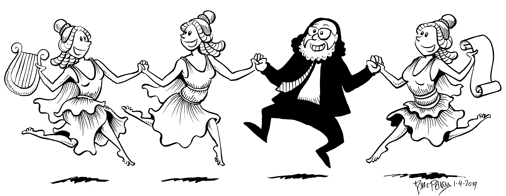

The other day, I was looking at books online [1] and saw a collection
of _Nina's Adventures_ comics.  My brain reminded me that I had enjoyed
those comics, both Paley's art, and the funny but serious and
sometimes depressing content.  As I often do, I asked myself, "What
is Nina Paley doing now?" [2].

Then I realized that the Nina Paley who drew Nina's Adventures is
the same Nina Paley who is one of my heroes.  Why?  Because a decade
or so ago, she released a feature-length animated film, [_Sita Sings
the Blues_](https://www.sitasingstheblues.com/) with a copyleft-style
license.  That is, not only did she make it possible for anyone to
use her work for free, including through derivative works, she also
required that the derivative works have the same license [3].  She
has since been an active proponent of the free use of artistic works.

Not only was _Sita Sings the Blues_ an important statement about
intellectual property, it's also a really good movie.  Paley tells
a good story, mixing creative animation and classic [4] music.  I
know that she had to pay for the music she used [5], but I'm not sure
what that means for derivative works [6].

I'll admit that I haven't looked at her work for at least five years.
I recall admiring her [_Mimi & Eunice_](https://mimiandeunice.com/)
comics, particularly the early ones on intellectual property or,
more precisely, intellectual pooperty [7].  But that's the last I
recall.  I'll also admit that I never associated the Nina Paley of
_Nina's Adventures_ with the Nina Paley of _Sita Sings the Blues_
and _Mimi & Eunice_.  I'm not sure why not.

I discovered a variety of things while poking around her site.  She
has a new movie out, [_Seder-Masochism_](https://sedermasochism.com/),
a fascinating take on the Passover story with additional religious
imagery and belief mixed in, including Jesus at the Last Supper and
some a spectacularly animated Mother G-ddess (or G-ddesses) [8].
Once again, the mixture of story, animation, and music is wonderful.
I'll admit that I particularly appreciated Pharaoh singing to a
clip of Gloria Gaynor [9].

She's also doing some fascinating embroidery with Theodore Gray,
one of the co-developers of _Mathematica_ [10] in [PaleGray
Labs](https://www.palegraylabs.com).  Some of their work, called
"Embroidermotion" appears in _Seder-Masochism_.  The first things
I saw were a wonderful quilt based on Muybridge's famous film
[11] of a horse in motion and Matzoh covers that I think were used
for animation in the film.

But it looks like Gray also has some interesting quilts, including
a Fibonacci spiral [12] and a spiral of the digits of Pi.  My favorite
may be their [Tree of Life
quilt](https://www.palegraylabs.com/projects/tree-of-life), which
I don't think is for sale.

One of the versions of CSC 105, focuses on crafting as computing,
or vice versa.  We do a lot with our programmable embroidery machines.
I wonder if we could use that as an excuse to bring them to campus
(or to take a trip out to see their work in action; Champaign Urbana
[14] isn't that far.  Of course, Paley would be worth considering
as a Convo speaker.  I'll need to remember that the next time the
call for nominations comes around.

In any case, I found myself impressed by the amazing range of Paley's
work.  I like to support artists, so I was looking around for
something that I'd like and would have a place for.  Admittedly,
there's a lot.  The part of my personality that likes to accumulate
and share multiples was drawn to [the box of 200 PAL
DVDs](http://www.palegraylabs.com/sita-merch/big-box-of-about-200-sita-sings-the-blues-pal-dvds),
in part because of the absurdity of it.  I thought about one of
the smaller horse quilts but had trouble deciding.

Then I discovered that [Paley does drawings for
$100](https://blog.ninapaley.com/hundred-dollar-drawing/).  You
send her two words and she draws something and sends it back to
you.  Because she believes in Free Culture, you are free to use the
drawing as you wish.  Of course, anyone else is, too.

I spent some time thinking about what to request.  Eventually, I settled
on "Musing Professor" [15].  Here's the image I received.

Here's what she wrote when she sent the image:

> Here ya go, Musing Professor.

> I was gonna draw all 9 muses, but that was crazy, so you only get the original 3: Aoide, Melete, and Mneme.

Now, here's the thing.  The male character in the image looks a lot
like me.  Same long black curls.  Similar glasses.  Similar beard.
The question is whether I'm Aoide, Melete, Mneme, or the Professor.
Aoide was the muse of song or voice, Melete was the muse of practice
or occasion, and Mneme was the muse of memory.  Or perhaps the one
I'm calling "the Professor" is instead one of the muses; he [16] looks
a bit like a stereotypical Rabbi, and Rabbis have to remember
a lot, so it could be Mneme, and the last one is the Professor,
with their current manuscript.  Or perhaps the person in black is
a Cantor, making them Aoide.

Of course, it may also be a coincidence that one of the four figures
looks like me.  I didn't send Paley a photo.  She says that she doesn't
do caricatures.  I don't think she knows me [17].  Perhaps she found
a picture of me while doing research for the drawing.  In any case,
I appreciate the drawing and would have appreciated it even if it
didn't have a figure that resembles me.  I considered using it as a
logo for my musings, but I think I'm happy without a logo.  I have
decided to use it as my cover photo on Facebook, though.

Now I'm considering whether it would be appropriate [18] to save
up and order a new drawing each month.  It would be fun to support
an artist, if only in this small way.  What words or phrases would
I choose?  I wonder what Paley would do with "Grinnellian"?  I could
pay tribute to a colleague with "Linguistic Stone" [19].  There's
my favorite play on my last name, "Sky Rebel".  Or the nickname of
one of my kids "Bell Ski".  Given what she wrote, I suppose "nine
muses" would be rude.  "Nina Muses" might be fun, though. I wonder
what I'd get if I used "Rabbi Mimi" or "Rabbi Eunice".  Or perhaps
I should reflect on things I love (other than my family).  Something
with "Pooka", perhaps [20].  Then there are some of the terms that came
up in this musing, such as "Wolfram Tungsten" or "Shampoo Banana".
In the end, I could always go with "Surprise me".  At worst, each
drawing would give me something new to muse about each month.  I'll
see what Michelle thinks about the whole endeavor.

---

Postscript: I appreciate that one colleague wrote to me and said,
"I just spotted you in Nina Paley's blog.  Nice!"  [21] I also like
that when I posted the drawing to Facebook, a distinguished film
scholar and humanist wrote, "I LOVE her videos!"

---

Postscript: I'm still trying to figure out what I'd do with 200 DVDs.
But that's okay, I'm better off ordering drawings, quilts, Matzoh
covers, or more intellectual pooperty minibooks.

---

Postscript: Would you believe that when I started writing this musing,
I thought it would be one of my short musings?

---

[1] Sorry Micki.

[2] Okay, I don't normally ask about Nina Paley.  But when I recall or
stumble upon something I once enjoyed, I do look to see what the creator
is now doing.

[3] It appears that she has compromised the latter aspect of copyleft.

[4] Not generally classical.

[5] Which may be one of the reasons she embraced copyleft.

[6] I assume that derivative works are subject to the same licensing
requirements for the music, but I Am Not A Lawyer.

[7] Some will be appearing in the mailroom, Burling, and elsewhere 
around campus once the semester starts.

[8] Here's Paley's synopsis.

> Loosely following a traditional Passover Seder, events from the Book of Exodus are retold by Moses, Aharon, the Angel of Death, Jesus, and the director’s own father. But there’s another side to this story: that of the Goddess, humankind’s original deity. Seder-Masochism resurrects the Great Mother in a tragic struggle against the forces of Patriarchy.

[9] You'll have to watch the film to see where. 

[10] Along with Stephen Wolfram, who my favorite office-mate used to refer
to as "Tungsten".

[11] Photographs?

[12] Have I written about the Fibonacci spiral, Damian Hirst,
intellectual property, and my final project in sculpture?  My quick
grep through my musings suggest that I have not.  I'll add that to
my list of potential musings.

[14] Or "Shampoo Banana" as that aforementioned office mate referred to
it.

[15] I offered "Professor Musing" as an alternative.

[16] It seems acceptable to gender the bearded character as male, even
though it may represent a muse.

[17] There's no reason that she'd know me directly.  But my mother had a
huge network, so there's a chance that she'd know me indirectly.

[18] Or reasonable.

[19] Unfortunately, "Philosopher Stone" has too popular a meaning.

[20] I'm thinking of Harvey.  But there's also one in _War for the Oaks_.

[21] Bonus to the first person who correctly guesses who that is.
