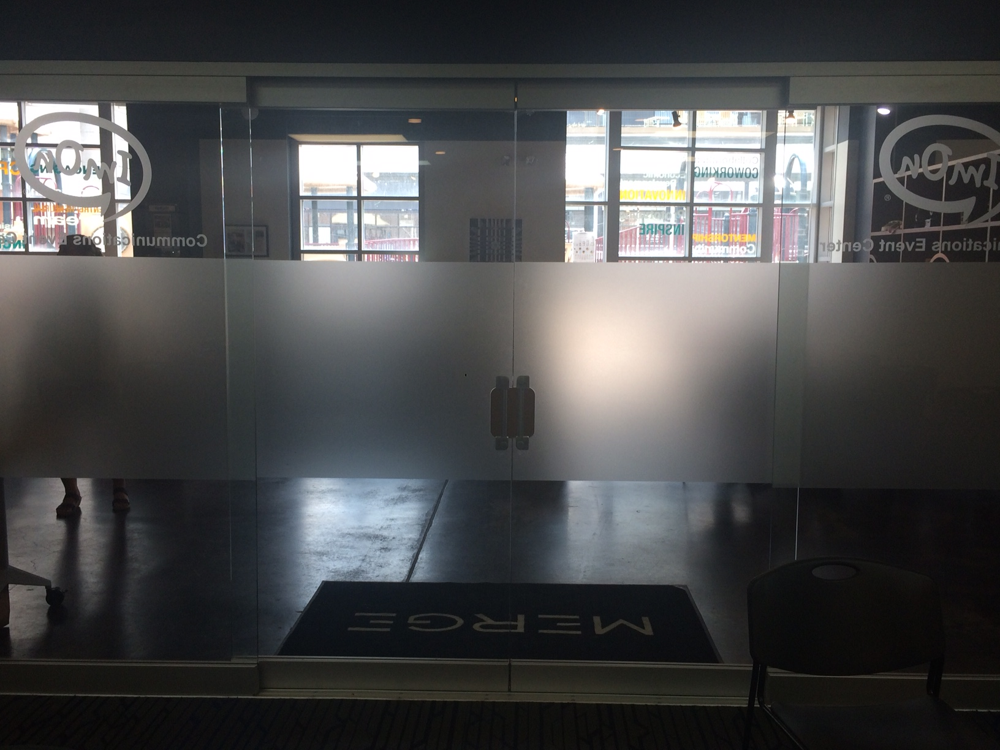
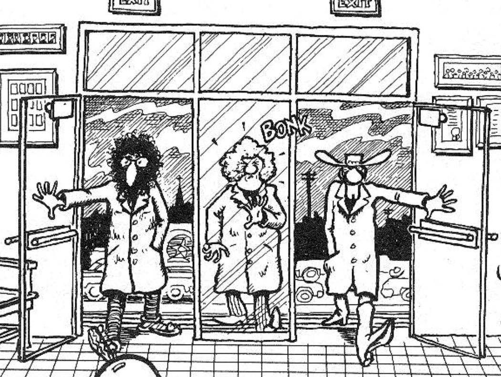

More Norman Doors
=================

*Topics/tags: [Rants](index-rants), design, short*

In his _The Psychology of Everyday Things_ [1], Donald Norman introduces the
concept of "Norman Doors"; doors whose design leads people to make mistakes
when they try to open them.  It may be that there's a full-door bar and the
hinges are invisible, leading someone to push on the wrong side [2].  It may be
that there's the same handle on both sides, making it unclear whether your
goal is to push or to pull.  I'm pretty sure that everyone has had a Norman
Door experience of some sort.

Yesterday I observed a new kind of Norman Door [4].  I was on a panel,
which meant that in addition to looking out on the participants, I was
also looking at the back of the room.  Because the
doors were glass, so I could see each person who tried to come into the
room late.  For the first five minutes, every person first tried to pull
the doors.  They failed.  Then they tried to push the doors.  They failed.
Eventually, someone in the room would come over and let them in.

What was wrong?  It turns out that they were *sliding doors*.
The trick was to use the handle to move the door to the right or left,
as appropriate.  The design of handles for those doors is tricky.
Our inclination is to push or pull doors.  I'm not sure how you clearly
indicate to someone that you need to slide rather than push or pull.  As
I look at them again, I do see why people pulled the doors; it's clear
that they were "in front of" the side panels.  But sliding?  I'm not sure.

Looking again, I do see that they make the tracks on the floor fairly
obvious.  But it's clear that it's not obvious enough.  An interesting
design problem, to be sure.

---

Postscript: Why do the images I take on my iPhone always end up right-side-up
on my computer and up-side-down on the Web?  Oh well.  That's why there's
ImageMagick.

---

[1] That book has a great acronym, POET.  Unfortunately, it didn't sell well
under that title.  It did much better when renamed to _The Design of
Everyday Things_.

[2] Someday I'll dig up the issue of The Fabulous Furry Freak Brothers in
which Fat Freddy crashes into a glass wall that is indistinguishable from
the doors around it.  [3]

[3] Found it!

It appears that the handles and hinges were clearly designated; a reasonably 
good design of glass doors.  But I'll still maintain my mental image of
Fat Freddy in the middle.

[4] Or, more precisely, a type of Norman Door that is new to me.

---

*Version 1.0 released 2018-08-10.

*Version 1.0.1 of 2018-08-23.
