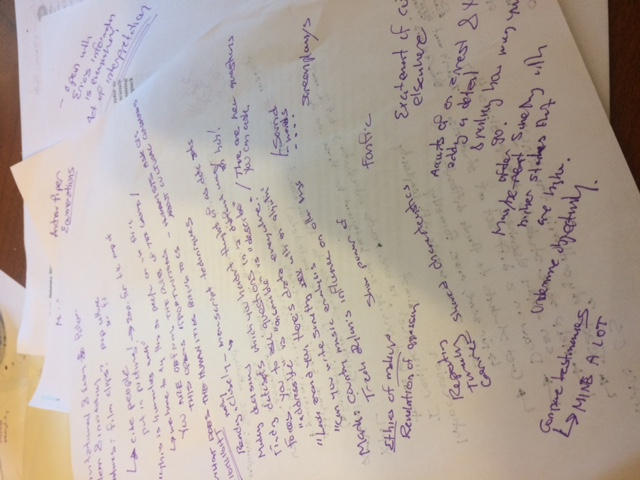

My second Obermann seminar
==========================

*Topics/tags: [Autobiographical](index-autobiographical), academia, [writing](index-on-writing), digital humanities, rambly*

This week, we had our second Obermann seminar.  I was presenting
this week, and, well, I was nervous.  I had brought the
[introduction](fundhum-intro-00) and half of a chapter on XML.  It's
scary to put your writing in front of a bunch of people who you know
are thoughtful and precise. I know that the meetings are supposed to be
supportive, and not critical, but, well, academics do like to critique.
It didn't help that the other presentation was about a project that has
incredible societal value.

But I took my turn.  I also took notes.

I guess I needn't have worried.  One person did say "I've made a list
of minor errors that you might want to correct", but that was intended
as a quick aside.  Beyond that, comments were surprisingly positive.
Many people said that they wanted to be able to take the class [1].  And I
heard that my description of the humanities was good.  What did I write?

> From my perspective, humanists study the works of humanity, including
language, philosophy, religion, and art. Scientists and social scientists
might also study these areas. However, humanists and scientists approach
their study differently. While scientists tend to employ the scientific
or experimental method, humanists often attend more to the particular
details or broader contexts of individual works, frequently guided by
an underlying theory or framework.

As I reread it, I'm not sure I agree that it was good.  It's on my list
of things to rewrite.  But I'll take a compliment when I receive one.

Of course, compliments are not the goal of the seminar; we meet to give
each other advice on  how to improve our work.  I'm still struggling to
piece together all of the helpful advice I got.  Let's see what I can
do with my notes.

One of the most helpful suggestions was to start each reading [2] with
an example that has both a visual and a narrative component.  I will admit
that I struggle a bit with both; I'm better with text than with pictures,
and I'm not a great storyteller.  Oh, yeah, coming up with good, motivational,
stories is hard.  I tend toward short, easy examples.  But those narratives
would undoubtedly strengthen each section.

I'm still trying to figure out how and where to use a broad frame that
one colleague suggested.  I didn't record their exact words, but it
went something like this.

> Look around you.  There are data everywhere.  By encoding the data for
the computer, you can ask new questions and even new kinds of questions.
Challenge yourself to find datasets which you had not thought of as
datasets.  You'll find that doing so will force you to ask questions in
a different way.

A related comment was that,

> By choosing how to encode information, you are defining the rules of the
game.  That opens opportunities.

Implied was that it also closes off opportunities.  Those choices are
worth highlighting.

It strikes me that I can use the first set of ideas in the introduction
to give more of a sense as to the possibilities.  The second may fit
more in the section on XML and markup.

A broader comment was that I was treating the class primarily as a way to
use computing to support the humanities and that I should also consider
opportunities to have the humanities inform computing, to ask the kinds
of questions humanists ask, but ask them about the work of algorithms.
Now, I do try to consider the social implications in much of my teaching.
Still, making that more explicitly a humanistic endeavor is likely to
be useful.  I see that I have a side note about the ethics of markup and
the ways that markup can reveal or conceal oppression.

There were also some suggestions about potential topics.  I particularly
liked a note that it would be useful to have folks mark up or interpret
a document and then add new information and see the effects.  For example,
what assumptions do you make about the gender or race of someone in a 
story, and how does it change when you add the information?

A practical suggestion was to have students analyze (word usage,
sentiment analysis, etc.) news items from a variety of sources about
the same topic [3].  That's a clever approach to combining the technical
and the humanistic; I'll find a way to work it in somewhere in the course.

Folks also suggested that I think about other kinds of data: Country
music songs, tracing Dylan's [4] influence and influences, screenplays,
and more.  Some of that's starting to get into machine learning territory,
and I'm not inclined to do ML [5] in the intro course.  But some of them
may prove to be fruitful areas of study.

Is it worth getting into music generation in the course?  I know I
have _Notes from the Metalevel_ sitting somewhere around my office.
Music is a humanistic endeavor.  Nonetheless, I think not. There's only
so much time in the semester, and there are already [too many core CS
topics to cover](fundhum-schedule-00).  Maybe sound and music can serve
as foci of a fourth version of CSC 151.

I see that I wrote "Act of _interpretation_" on the cover of my draft,
and underlined interpretation three times.  I'm not quite sure what I
meant by that, other than to reflect on the way we interpret text when
marking it up, the way we interpret the output of computers, or perhaps
how computers let us interpret other work.  I'll need to think more
about that.  It may be related to a note I put in an extended XML example
in which I note that I should make it explicit that the markup represents
*my* relationship with this text (and at this particular point).

In any case, it's a lot to think about.  These issues will be easier to
consider once I have written more.  And so it's time for me to get back
to work.

---

[1] While "smart and insightful faculty members" is not my target
audience, it is good to know that non-technical faculty found my work
engaging.

[2] I call them "readings".  You can think of them as chapters or
sections or something like that.

[3] The example was the Kavanaugh hearings.  But that's not something
I want to make the focus of a study; it is much too emotionally charged
and, at least at this point, only makes me furious.  It doesn't
help that [last night, President Trump decided to make jokes about
Ford](https://www.theatlantic.com/entertainment/archive/2018/10/trump-mocks-christine-blasey-ford/572005/).

[4] Bob Dylan's, not Dylan Thomas's.

[5] I realize that ML is now the standard abbreviation for Machine Learning.
I still think of the ML programming language, one of the major functional
languages.

---

*Version 1.0 of 2018-10-03.*
