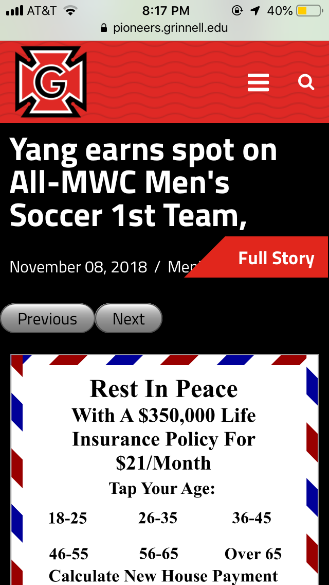
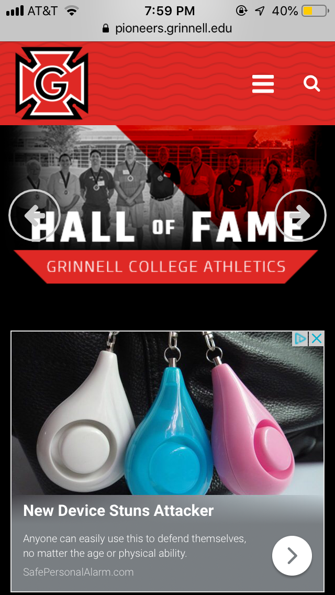
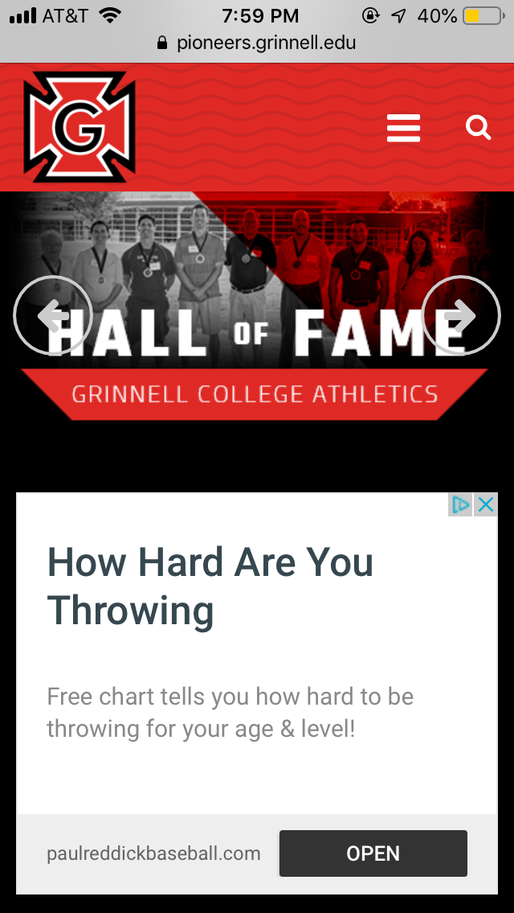

Cheapening the brand
====================

*Topics/tags: [Rants](index-rants), [Grinnell](index-grinnell), marketing*

There are many things I love about Grinnell.  One of those things is
the opportunity for our students to participate in varsity sports.
I appreciate that Grinnell has real student-athletes, students who are
students first, but also excellent and competitive athletes.  Of course,
I also appreciate that many of our teams are open to students who try
their best, but are not necessarily competitive.  If I recall correctly,
40% or so of Grinnell students participate in varsity athletics at
some point in their college career.  When possible, I try to attend
my students' athletic events [1].

My appreciation for Grinnell athletics is, unfortunately, tempered by
the horror of a Web site known as [pioneers.grinnell.edu](https://pioneers.grinnell.edu).  What don't I like about it?

First, whenever I connect to the site, I get the following warning.

From my perspective, there's no reason for a college Web site to need
the things that an ad blocker blocks.  Our site should not be tracking
me.  Our site should not be gathering information to sell to other
people.  Our site should not be putting advertisements on pages.

Second, all of the content appears to be generated via JavaScript, which,
from my perspective, makes it a non-accessible site.  Let's see what
happens when we try to load it via Lynx, a text-based browser popular
with some visually impaired people.

What do we see?  Not much of use.  There's no real content.  There are
way too many links, not grouped in any useful way and with no separators.
Would you want to try to navigate those?  I would not.  Can you get to
content?  Well, "Top Stories" is just text, not a link.  The same holds
for "More Headlines" and "Pioneer Events".  So, from my perspective, the
ability to access this material through Lynx is not equivalent to the
ability for a sighted person to access it through a standard Web browser [2].

Third, for a too-long period of time, we relied on [really crappy
auto-captioning software](complaints-about-captioning-01) for the videos
on the site.

All of those are long-standing issues [3].  Today, something else is
bugging me about pioneers dot grinnell dot edu.  When I visit the site
on my phone [4], some pages include advertisements.  Here's a sampling.

I'm sorry, but putting these kinds of crappy ads on official College Web
pages cheapens the brand [5].

If we're allowing ads, I should get in on the action.  What do you think
Coursera or the University of Phoenix would pay for ads on the musings? [6]

---

[1] Unfortunately, that's not very often.  Some years are better than others.

[2] Accessibility guidelines do not say that a site has to be accessible
via Lynx.  But a JavaScript-generated site is also not something one can
analyze with, say, an automated tool like [WAVE](http://wave.webaim.org/).
It would be nice to see someone do a real accessibility test for the site.

[3] Fortunately, the captioning is no longer a long-standing issue.  At 
least I hope that it's not.

[4] And, therefore, without an ad blocker.

[5] Perhaps more importantly, it cheapens the Honor-G.

[6] That was not a serious comment.

---

*Version 1.0 of 2018-11-14.*
