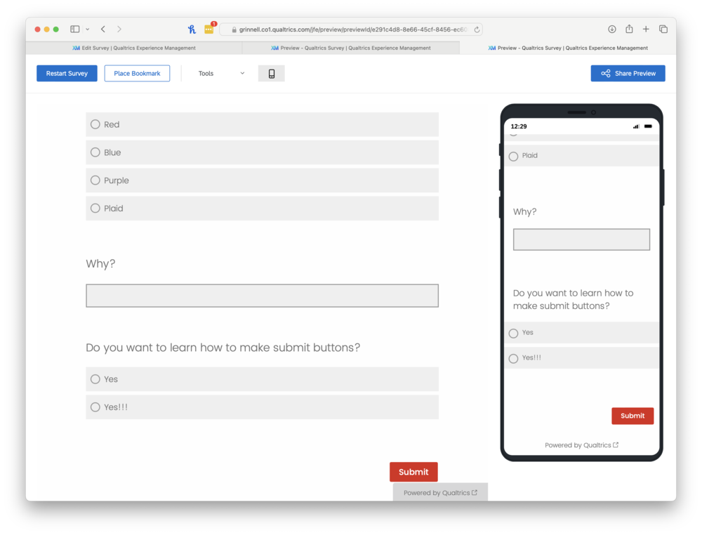

As many folks know, the user interface to a program affects how successful people are at using it. Hence, anyone who builds programs should either (a) work with user interface specialists or (b) learn a bit about UI design.

That seems straightforward enough, doesn't it?

Great.

Did you realize that a survey is a kind of program?

You didn't?

Well, they are.

If you build surveys, you should make sure that your users (the folks who fill out the survey) receive appropriate visual guidance.

Let's start with a simple question.

What does this button mean?

That's right. It means "**Go to the next page of the survey.**"

And that's all that it should mean!

If you use the right arrow for something else, you will confuse your user, perhaps leading them to enter incorrect information or to neglect to enter information. After all, if you're going to the next page, you assume that you'll have the chance to add more information and perhaps even go back to the previous page.

**_Don't use the right arrow to mean "Submit"._**

Unfortunately, too many people who build surveys in Qualtrics either (a) don't understand this basic concept or (b) can't figure out how to make the button say "Submit". I think it's more of the latter than the former. I've even seen some surveys that say "Click the right arrow to submit", which suggests that the authors know that right arrows aren't normally used to mean "submit".

Fortunately, once you untangle the Qualtrics user interface, it's relatively easy to make "Submit" buttons.

First, build your survey.

Click on the last block in your survey.  Then click on "Next/previous button text".

A dialog box will appear. Enter "Submit" for the next button text.

Preview your survey.

Wasn't that easy? (No, not if you haven't been told.)

It only takes a minute to make a Submit button. Spend the time to make your users' lives easier. You'll get better data, too.

Thanks!

---

_**Postscript**_: No, I don't know what symbol to use for "Submit". I agree a symbol might be better, since "Submit" is Anglocentric. Perhaps a checkmark?

---

_**Postscript**_: I'm not sure why the folks at Qualtrics did not make "Submit" the default for the last block. _something_ _something_ circle of hell reserved for _something something_ Qualtrics UI designers.
