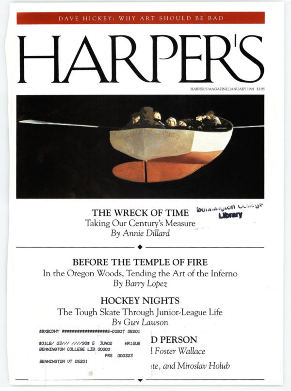

Tomorrow is the first day of Ralph Savarese's English 207, _Craft
of Creative Nonfiction_.  Ralph has generously allowed me to sit
in on the class, even though my schedule likely means that I will
miss some classes, provided I do the assignment and try to reign
myself in.  Or something like that.  He didn't say that I couldn't
muse about the class, and I know he reads my musings, so I'm likely
to write something from time to time.  Today, for example.

We have an assignment for the first day of class.  That's not surprising.
Many classes have an assignment for the first day.   Here's what
Ralph wrote.

> On that day, we will go over the syllabus and discuss a piece by Annie Dillard called "The Wreck of Time"; [the link](https://www.midwayisd.org/cms/lib/TX01000662/Centricity/Domain/115/The_Wreck_of_Time.pdf) appears below. Please be sure to read the essay closely. Skimming doesn't work in this sort of class [1].

I'll admit that I'm not quite sure what close reading entails for a
class in creative nonfiction.  Are we to consider content?  Language?
Style?  All of the above?  Things I don't know about?  I assume that
the real students know better than I, given that the Craft of Fiction
is a prerequisite for the course.  In any case, I thought it would be
fun to attempt to record my close reading in a musing [4].

But first, a typical SamR detour.  I see that Ralph provided a link
to a copy of Dillard's essay.  I'm not sure why, but I am inclined
to consider where and how things were published and to look for
original versions [5].  The copy he linked appears on [the Web site
for the [Midway Independent School District](https://www.midwayisd.org/)
in Texas.  Given what I've read recently about [what happens to
textbooks in
Texas](https://www.nytimes.com/interactive/2020/01/12/us/texas-vs-california-history-textbooks.html),
I definitely feel the need to look for another copy.  Fortunately, this
copy notes that the article

> First appeared in _Harper's Magazine_, January 1998. Later a part of a larger collection of reflections titled, as a book, as "For the Time Being," First Vintage Books Edition (Publisher), 2000

That's a strange way to phrase it.  And I'm pretty sure that _For the
Time Being_ was first published by Knopf in 1999, rather than Vintage
in 2000.  In any case, I went looking for
[the version from _Harper's
Magazine_](https://harpers.org/archive/1998/01/the-wreck-of-time/).  I
was surprised to find that _Harper's_ had what I'd considered a
mediocre scan, showing the ragged edges of ripped pages and all,
and, strangely enough, was taken from the library at Bennington
College [6].  Nonetheless, I was able to read it in something like the
original form.  It was the main article in the issue, or at least
the first one on the cover, the only one with an associated
illustration [7].  I'll need to think about the relation of the
words on the boat, "Llevame Contigo" or, as Google translates it,
"take me with you" to the content of the piece.

How else does the original version differ from the one on the Texas
ASD?  The original has a subtitle, "Taking Our Century's Measure",
which appears both on the cover and in the head of the article.  I
wonder if Dillard wrote that subtitle.  It certainly affects the
way one reads the piece, setting it as a reflection about the century, 
rather than simply about how we understand death [8].

The original tells us a bit about Dillard, at the bottom of the
first page.

> _Annie Dillard's writings include_ Pilgrim at Tinker Creek, An
  American Childhood, _and_ The Living, _a novel.  Her next book will
  appear in March 1999._

The original is better formatted, something I appreciate as a reader.
The original groups paragraphs differently.  I don't know about you,
but I find that the grouping of paragraphs affects how I read and 
understand a piece [9]. 

The original also has some illustrations.  There's a two-page
sequence of images: A lot full of cars [10], which reflect a question
in the third paragraph [11].  A tray full of teeth [12].  A bunch of
penguins [14].  What looks like one person on a street [15], at
least in this mediocre scan.  A huge crowd, possibly in an event I
should know about [16].  A whole bunch of shoes [17].

Later on, there's what looks like a collection of life masks, or
whatever they call those casts you take [18].  A lot of umbrellas,
from above [19].  Way too many skulls, in yet another poor scan
[20].

Do authors get to choose the images that accompany their articles?
Do they get to approve them?  I have no idea.  You'd think that
because photos have such an effect on how we "read" articles [21],
authors would have some input. But I also know that publishing
doesn't always work the way we expect.

The original also has a few excerpts that appear in large text on the
side.  Here they are.

* "A single death is a tragedy, a million deaths is a statistic," noted
  that connoisseur, Joseph Stalin.
* What were you doing on April 30, 1991, when a series of waves drowned
  138,000 people?
* Anyone's family and friends compose a group invisible, at whose loss
  the world will not blink.
* Who were the 30 million Mao starved or the 11 million children under
  five who die each year now?
* "The atom bomb is nothing to be afraid of," Mao told Nehru.  "China
  has many people..."

Once again, I wonder whether the selection of excerpts is an editorial
or authorial choice [23].

Okay, that's enough for the detour.  The experience of the original is
much different than the experience of the ASD version.  I wonder
what it's like in _For the Time Being_.  

Fortunately, Amazon has [a version that you can
search](https://www.amazon.com/Time-Being-Annie-Dillard/dp/0375403809).
The section that comes from this essay is not titled "The Wreck of
Time" and does not have the subtitle "Taking Our Century's Measure".
Instead, it begins with the word "Numbers".  It also adds a new
opening sentence.  Let me share the first three paragraphs with you.

> NUMBERS • I find the following three approaches to the mystery of
human numbers hilarious.  Ted Bundy, the serial killer, after his arrest,
could not comprehend the fuss.  What was the big deal?  David von Drehle
quotes an exasperated Bundy in _Among the Lowest of the Dead_: "I mean,
there are so many people."

> One R. Houwink, of Amsterdam, discovered this unnerving fact: The human
population of earth, arranged, perfectly tidily, would just fit into
Lake Windermere, in England's Lake District.

> Recently, in the Peruvian Amazon region, a man asked the writer
Alex Shoumatoff, "Isn't it true that the whole population of the
United States can be fitted into their cars?"

The _Harper's_ version lacks the first sentence, which changes
the tone of the piece.  It also italicizes the "so" in "I mean,
there are so many people."  I'd been wondering about that.  I wonder
what the original looks like.

Beyond that, the original essay is integrated throughout the book,
rather than appearing in a single place.  There's also a lot about
Judaism.  I think I want to read it in that context, too.

I suppose it's time to return from the detour.  But I've already written
a lot.  That happens from time to time [24].  So I'm *not* going to
share my close reading of the piece with you.  It's probably better
that way.

But I should go beyond the detour.  I must admit that part of me
feels like this piece bears some resemblance to what I think of as
the standard undergraduate desire to include every little thing
that they have found about the topic; you gotta use all of the
note cards, after all.  I know that's not the case, and that Dillard
has woven the anecdotes and quotations together.  I'm also interested
to see that she includes what I think of as colloquialisms: "slice
of life", "nickel and dime", "bless their hearts".  Perhaps I should
not be so concerned with my own use of such colloquialisms.  Or,
once again, I should reflect on how Dillard uses them intentionally.

I must also admit that the way I read articles reflects my experience
as an academic.  In particular, *I want citations!*    What's the
broader context of the Alex Shoumatoff episode?  What did Stalin say
in the original Russian, and who is responsible for this particular
translation [26]?  When did Mao meet with Nehru?  As my adventure
looking for the original suggests, I like context.  Oh well.

One more thing, I'm happy to report that Dillard uses "seriatim",
one of the words in [this year's Wayne State
list](wayne-state-word-list-2020)

> What were you doing on April 30, 1991, when a series of waves
drowned 138,000 people? Where were you when you first heard the
astounding, heart-breaking news? Who told you? What, seriatim, were
your sensations? Who did you tell? Did you weep? Did your anguish
last days or weeks?

Uplifting, isn't it?

In any case, I look forward to tomorrow's discussion and to hearing what
my fellow students say.  I'm glad that I'm supposed to stay comparatively
quiet.

---

[1] Savarese, Ralph. (2020).  Email message entitled "ENG 207: Craft of Creative Nonfiction".  Dated 2 January 2020. [2]

[2] I hadn't looked at the recipient list for Ralph's message
until today.  It appears that I know four of the ten students [3] enrolled
in the course and they are students who I appreciate knowing.  I look
forward to working with them.  I also look forward to working with the
other faculty member who is sitting in on the course.

[3] Hmmm.  The email went to ten students and two faculty members.  However,
[our schedule](https://webadv-prod.ec.grinnell.edu/WAPROD/WAPROD?type=P&pid=ST-X3WSEI) lists twelve students enrolled.  I didn't think students could add
after January 1.  I wonder what happened.

[4] Fun for me, that is.  I'm not sure how it will be for you.

[5] One reason is my experience with the population genetics paper
by G.H. Hardy.  I'll explain the details in a future musing.

[6] It even has "Bennington College Library" stamped on the front
and a mailing label to Bennington that manages to obscure the title
of an article by David Foster Wallace.

[7] _Untitled_ By Julio Larraz.

[8] Or whatever the article is about.

[9] I don't think nearly enough about how I group my paragraphs.  At
times, I use horizontal rules to do a form of grouping.  Dillard's
formatting is a bit more sensible.

[10] Photograph by Superstock.

[11] You'll have the opportunity to read that paragraph later in
this musing.

[12] Photograph by Rosamond Purcell.

[14] Photograph by Joseph Van Os/The Image Bank.

[15] Photograph by Michael Ackerman.

[16] Photograph by Superstock, again.

[17] Photograph by Jason Fulford.

[18] Another photograph by Rosamond Purcell.  I wonder who she was.
There's [a Web page](http://www.anartthatnaturemakes.com/rosamondpurcell)
that I should probably look at when I have time.

[19] Photograph by Bruno Barbey/Magnum Photos.

[20] Photography by Paul Almasy/AKG London.

[21] I like the word "read" for "understand the context of", even
though it can also mean to process the words sequentially [22].

[22] Or perhaps seriatim.

[23] I suppose that it could also be a design choice.

[24] Okay, it happens surprisingly often [25].

[25] Or perhaps not so surprisingly.

[26] Whoops, [Wikipedia](https://en.wikiquote.org/wiki/Joseph_Stalin)
tells me that this quotation may be misattributed [27] to Stalin [28].

[27] I am surprised to see that my spell checker does not like
"misattributed" and that it presents "masturbated" as an option.

[28] And, of course, Wikipedia is authoritative [29].

[29] Does sarcasm come through in my writing?
