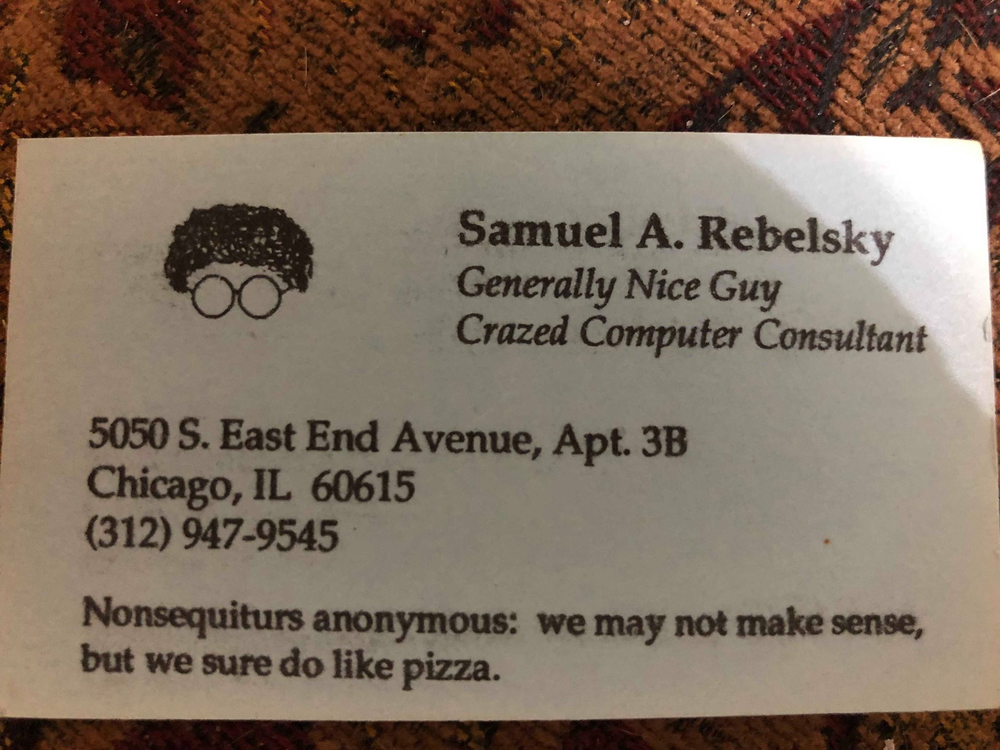
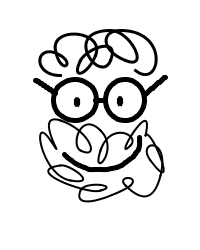

Today, during late-spring-cleaning, an friend from graduate school
found something I'd given him in the late 1980's and sent me a
picture.  That picture led me to reflect a bit on who I was and who
I am.  Don't worry; my reflections aren't all that deep, and they
certainly won't be painful.  The deep, tortuous baring of my soul
will have to wait until a day when my muse feels differently.

People who know me today know that I am inclined to puns and other
bad jokes.  Or dad jokes.  Whatever you call them.  Those things
that I think are funny but seem to be alone in that assessment.
Sometimes it's that my jokes are too obscure, such as when I bring
up "Ray and Dave" when I suggest we need to get the kinks out of
something, or when I ask whether Ollie North will be the guest
caller for the Contra Dance club.  Sometimes they are just trite,
such as when I move my gaze toward the ceiling when someone asks
me "What's Up?" [1].  I've been that way for as long as I can recall
[2].

Since college [3], I've worked with computers in one way or another.
At UofC [4], I worked at the central users' site, or Usite [5].
Working for computing services in those days meant that I got access
to extra resources and cool things like laser printers and extra
computing funds.

I also like to play and experiment.  While that brings me joy, it's
also helped advance me professionally.  I played with HyperCard; I
got a job doing HyperCard programming.  I played with Adobe products,
I got a job teaching folks how to use PageMaker.  I played with
LaTeX, I got an assistant sysadmin job.  Of course, there's some
evidence that if I had played less, I would have finished graduate
school much earlier [6].

Whoops!  I just got caught in the endnotes.  But I'm back.

Where is all of this leading?  To the photograph I received.  Here it
is.

What's going on here?  Presumably, I had gotten access to some business
card stock and decided to make myself a business card.  I'm not sure
where the "Generally Nice Guy" and "Crazed Computer Consultant" came
from, but I'm pretty sure that they were ways I wanted to describe
myself.  That statement at the bottom?  It seems that I was in one
of my "funny" moods.  I can't recall whether there was more to
Nonsequiturs Anonymous than this business card.  It seems like
something that could have been a one-off or a running joke.

Then there's the computer sketch.  I'd completely forgotten about that.
About a decade ago, I started adding a doodle after my name when I 
signed informal things.  A few years ago, when I was teaching
Processing, I wrote a Processing program to draw that same doodle.  I
had intended to make an animated GIF [9] but never got around to it.
But I branded myself with the final drawing.

I gained eyes! [10]  And a beard! [11]  And a smile! [12]

What can I conclude from all of this?  Um ... I'm forgetful.  I
forgot that the business card had more than the "Nonsequiturs
Anonymous".  I only remembered that I'd made a business card in the
first place because the same friend reminded me of the saying a
year or two ago.  I certainly forgot that I had a logo on the
business card.  My understanding of English grammar needed some
improvement.  I'm pretty sure that I should have capitalized the
sentence that followed the colon.  And it should be "Nonsequiturs
Anonymous".  I'm still a generally nice guy.  I'm still crazed, but
I don't do much consulting on computers.  I haven't made my own
business cards in a while [14], but I do make my own letterhead.

Perhaps I've also learned that my subconscious regularly tries to remind
me that I'm sketchy.

And, just in case I forget: You can't take three from two---two is less than
three---so you look at the four in the tens place.  Now that's really four
tens, so you make it three tens, change the ten to ten ones, regroup,
add the two to the ten then you take away three that's nine.  Damn.
How does one punctuate that?

Or, as I learned from my seventh-grade math teacher: No soap, radio.

---

**_Postscript_**: Email address?  I had an email address.  But why
would one include an email address on a business card?

---

**_Postscript_**: It's taken me about thirty years, but I've now learned
that there's a space in "nonsequitur".  No, it doesn't come between the
cue and the you.  But I don't care.  I spell things some things as
I wish.  And I like tuna fish [16].

---

**_Postscript_**: This musing, like most, shows why I will never be a
professional writer.  And, if you didn't already have sympathy for my
family, I'm sure you gained some [17].

---

[1] When I'm on campus, the most common answer is "Ceiling tile".

[2] I'm getting old.  I can barely recall yesterday.

[3] "The College", as I think of it.

[4] No, Chris, I'm not calling it UChicago.

[5] Amazingly, I did my best to invite the "Lucite" joke.

[6] Sorry, Micki [7].

[7] Has anyone kept track of how many times I've written "Sorry, Micki" in
my musings?  It happens way too often.  What was it that my father said,
or that my mother said that my father said?

> The things that most annoy us about someone we love are often the 
inextricably tied to the things we love most about them.

Did he really say that?  Would he have used the word "inextricably"?  
That seems more like a mom word or maybe a Bones word [8].
I have no idea.  s I said, I'm getting old
and he died more than forty years ago.  Mom died about a decade ago.
Bleh.  In any case, I remember her telling me that, and so I'm sticking
with it.

Whoops!  Didn't I say that this wouldn't be morose or something like that?
Too bad, so sad.  The saying is still useful.

[8] Bones was one of Dad's best friends and was in advertising.  I recall
that he ended up writing a recommendation letter to help dad get his last
job, and it was filled with the kinds of words that only someone
in advertising would use.  Ah!  I found it.

> His probity and rectitude are beyond question.

Yeah, that's a nice compliment.

[9] I pronounce it "phig".

[10] I had eyes.  So perhaps I should say "My sketch gained eyes."

[11] I did not have a beard.  I do now, although some would suggest
that the growth of hair on my face does not deserve that denomination.

[12] Crooked though it is.

[14] Given that the atrocity we call a business card at Grinnell, perhaps
I should [15].

[15] I shouldn't complain; it's gotten better.

[16] You might be able to tune a cornetto, but you can't tuna fish.

[17] Sorry, Micki.
