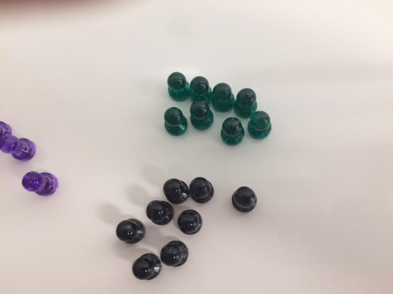

Red, Green, Black
=================

*Topics/tags: [Autobiographical](index-autobiographical)*

The other day, I was putting up push pin-shaped magnets on my whiteboard [1].
I thought I had eight of each color, so I was surprised when it seemed that
I had more than ten black ones.  Then I took a closer look; some of the
ones I'd called black were green.  Eventually, I found that I had eight
black and eight green.

Yes, I know that there are purple magnets in the photo, too.  And I'd
swear it was harder to tell the difference in person than it is in the
photo.  In any case, when I was first sorting, they seemed the same to me.

Why did I have trouble telling the difference between the black magnets
and the dark green magnets?  I'm pretty sure that it's because, like
a moderate amount of the male population, I have a form of red-green
color blindness.  My quick check on a [National Eye Institute page on
color blindness](https://nei.nih.gov/health/color_blindness/facts_about)
suggests that there are four different kinds of red-green color blindness.
I'm not sure which I have [2].  I tend to say that I'm "red-green
color deficient".

Here's what I know. I can see red.  I can see green.  I can usually
distinguish the two.  But there are some shades [3] of red and green
that I find it nearly impossible to tell from each other.  I recall
one of my kids' soccer games with one team in dark maroon and another
in forest green in which I couldn't tell which team each player was on.
And, strangely enough, I can't often tell the difference between really
dark green and black.  The push pins are on example.  Another I recall
is the textbook I used when I taught bioinformatics.  It took me a few
weeks to realize that they were highlighting text in green; I hadn't
seen any text that looked different, so I didn't know that anything
was highlighted.  You'd think bioinformaticists would know better.

Perhaps my color blindness is one of the reasons I'm aggressive about,
say, trying to make sure that people at Grinnell caption their videos
and add alt text to their images.  I also try to make it a point to
identify times that people use red and green to distinguish types of
data [4] and, more generally, suggest that people should use something
in addition to color to identify data in their graphs and plots.

Hmmm ... I wonder if that's also why I so often look at the numbers
instead of the graphs.

My children have way too much fun with my color blindness [5], regularly
trying to tell me that red things are green and green things are red.
But they can't fool me; I know that Mountain Dew is red [6].

---

Postscript: Even though I can't distinguish dark red from dark green,
nor dark green from black, I've never had trouble distinguishing dark
red from back [7].

---

[1] My new office doesn't have a tack board, so I bought magnets to allow
myself to use the whiteboard as a tack board.

[2] I've made an appointment with my optometrist to find out.

[3] A colleague in art says that I shouldn't use the word "shade", but
I don't know of a better one.

[4] As I said, there are times that I can tell red and green apart.

[5] They are fortunate enough to have good color vision.

[6] Well, Mountain Dew Code Red is red.  Normal Mountain Dew piers to
be some form of fluorescent green.

[7] Or maybe I have and haven't realized it.

---

*Version 1.0 of 2019-07-21.*
