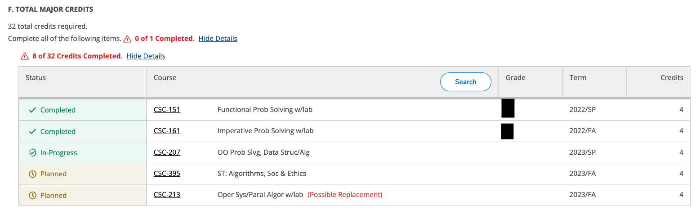

_n.b. These are not random in the sense that they are selected unpredictably according to some probability distribution and, in the limit, would follow that distribution.  Rather, they reflect what I found myself thinking about during the past few weeks of registration and what came to mind when I sat down to write.  Or perhaps they are selected from a probability distribution; it's just one that we don't understand [1]._

As the note above suggests, I've been thinking a lot about registration of late.  That is, perhaps, not all that surprising.  After all, I regularly muse about Grinnell's registration system during our registration period.  We're also working with a revised set of policies [2] that are still settling down.  Given the state of things, I found my muse compelling me to sit down and write about what I've observed [4].  As in the case of much of my musing, I'm mostly recording things as they come to mind.

**Advising for registration is harder than it used to be, perhaps much harder**.  Under the old system, I worked with my advisees to select their preferred schedules, chatted about a few potential fallbacks, registered, crossed our fingers that they'd get into the sections they wanted (or that the Registrar's office could rearrange the schedule to get them into the classes they wanted but not necessarily the sections they wanted), spent a few days reviewing the fallout, and then registered for the rest.  Under the new system, I'm expected to help them consider many more fallbacks and, even with those fallbacks, we still have to look at the fallout after rounds 1 and 2, and we now must do so in a much shorter time frame.

**Fallback planning is a fraught process**.  I'm not sure who thinks it's easy to pick a set of fallback courses and then fall back to them; that's certainly not been my experience.  In part, it's that not all students are willing to think beyond what they want in the coming semester.  In part, it's that some students, particularly double majors, don't have a lot of flexibility [5].  In part, it's that you can't plan for everything.  In part, it's that each choice limits the others.

For example, I have an advisee who was trying to get into ENV-125, _Introduction to Earth System Science w/lab_, for the third time.  They also needed to make forward progress in the CS major and had identified CSC-301, _Algorithm Analysis_, as an appropriate course.  We chose the afternoon section of CSC-301 and the Tuesday ENV-125 lab because they worked best with the other classes.  In round one, they could get into CSC-301 but not into the Tuesday ENV-125 lab, which meant that they couldn't register for ENV-125.  Switching to the Monday ENV-125 lab wasn't an immediate solution, since the morning CSC-301 section was full.  In the old days, the Registrar's Office would have been able to work that out as part of the larger process.  Now, they don't switch student section selections [6,7].  With some back-and-forth communication with various folks, we were able to get them switched to the morning CSC-301 and the Monday afternoon ENV-125 lab.  However, Monday afternoon labs cut out a lot of other opportunities since there are a lot of MWF 50-minute classes.  So we had to go back to the drawing board.

I had another advisee with mostly multi-section courses: CSC-213, MAT-215, and something in Economics.  We chose one pattern that worked best.  Amazingly, they were able to get both CSC-213 and CSC-324 in the first round.  Unfortunately, that left them with only one non-conflicting section of MAT-215, and that's the only section that filled.  We thought about switching CSC-324 for CSC-395, which seemed to have some room.  However, it filled by 7:01 a.m. on the day they were supposed to register. So now we're stuck trying to figure out how they advance in the math requirements for CS.  We still don't have a solution.  It may be that they'll need to double-up on CS courses for another semester.

**Round three requires additional advising**.  I have eleven rising third-year students who just declared their CS majors.  Since I did not expect to be available on their round-three registration day, I reviewed their plans on the previous evening [8].  Eight of the eleven needed more fallback classes than they'd already planned.  So I looked through their four-year plans [9] and, in essence, added all the courses that they were considering for other semesters.  Then I sent them email with recommendations.  It was not ideal.  And, in spite of that, I had at least two students who needed to talk to me that day because other unexpected things happened [10].

**Our revised registration system can't meet all of its requirements**.  The engineers among my readers likely find this unsurprising; most projects have so many requirements, particularly requirements that intersect, that it's impossible to meet them all.  One of the skills you learn as an engineer is how to balance and prioritize goals and requirements.  Unfortunately, our revised registration system does not include a transparent set of priorities.

For example, one of the priorities we have as a department is that declared majors make appropriate forward progress in the major.  We express that through a variety of policies.  For example, we prioritize all declared majors getting one CS course over some students getting two.  We also prioritize rising third-years getting into MAT/CSC-208, _Discrete Structures_, which serves as a prerequisite for two other required major courses, CSC-301, _Algorithm Analysis_, and CSC-341, _Automata, Formal Languages, and Computational Complexity_ [11].  And we con't count 208 toward that earlier priority.  That is, rising third-year CS majors who need 208 should be able to get into 208 and another CS course if they register for them in round one.

The system has other priorities.  For example, it's important that everyone get at least one course in round one.

Believe it or not, but the global priority and the 208 priority conflicted.  Since "everyone gets at least one course in round one" was tagged as more important, we had five rising third-years who did not get into 208.  They'll still be able to graduate.  They still got some CS courses in round one.  But their paths are less good.  I'm particularly concerned about those of the five who are studying abroad in the spring of 2024; they'll need to take 208 in the fall of their senior year and both 301 and 341 in the spring of their senior year [12].  Since we generally discourage students from taking 301 and 341 in the same semester, this is far from ideal.

There are also departmental and institutional priorities that we cannot express as policies.  For example, broadening participation in computing is a central part of the department's mission.  But it would be inappropriate---and probably illegal---for us to prioritize students based on their identities.

Unfortunately, that can have negative consequences.  The other day, I talked to one of my former CSC-151 [15] students and was saddened to learn that they were no longer pursuing a CS major because they could not get into CSC-207 [16] this semester.  Now I'm worried because there are four students who were dropped from my section of CSC-207 and could not get into the other section; three of them are from groups historically underrepresented in CS.

I was already considering taking all of the students off my wait list who had been cut from my section and couldn't get into the other section.  This confluence of events gives me more incentive to do so.  Of course, it does mean that we'll have slightly lower enrollment in CSC-207 in the spring and, more importantly, there will be even more pressure on our 300-level courses in the spring.  Nonetheless, "kick the can down the road" is a long-standing institutional and departmental tradition.

**Our current manual cut process requires too much manual labor**.  Particularly for the reasons mentioned above, cutting is hard.  I'm not sure how the Registrar's office did it when they had to do it with even more conflicts.deal  I certainly understand why there was a desire to move away from that old process.  I also noted that this year's process was hard enough that it took until Tuesday night to complete.  I feel sorry for our Registrar and her staff.

**Our current registration process remains neither equal nor equitable**.  Too many factors affect a student's ability to be successful in the process: the popularity of their major, their particular major, their advisor's reaction to the process, "insider" knowledge, and more.  We've already considered the issue of major popularity: If you have a popular major, you can only choose major courses in the first round; if you have a less popular major (or a major that pre-enrolls you in major courses), you have much more freedom.  And, as expected, students have already found ways to game the system.  I think I mentioned one already: If there's a course you really want in round one, you can significantly increase your odds of getting that course by making Comparative Herbalism your other course [17].  At worst, you end up in Comparative Herbalism, which is a great course.  I also saw my students who are less organized losing out in the process, even though I tried to intervene.

**There are enough moving parts in the process that things get lost**.  For example, I see that my CSC-151 section is over-enrolled by seven students.  That sounds like a lot.  But it's mostly that those students are taking slots that we had reserved for first-year students, perhaps slots that we had *intended* to reserve for first-year students.  I bear some of the blame.  I didn't check the policy data we sent the Registrar closely and, even though I was reading the schedule regularly, I didn't catch that the capacity of 18 was intended to indicate slots held for first-years.  There's also the hidden issue: Changing the course capacity because the system can't handle holding slots for certain class years is a technological problem.  Unfortunately, it's a technological problem that has no resolution; we're not going to get Ellucian to add that feature.

**You learn a lot reading through enrollments**.  For example, I discovered that one department, with three tenured faculty and one tenure-line faculty member, appears to have none of the tenured faculty teaching next year.  When I asked others about it, few were aware of the situation.  I hope everyone and everything in that department is okay [18].

**Ellucian Self-Service makes some things harder**.  After round three, I wanted to review all twenty advisees to ensure they were making adequate progress and to learn what pain points we might hit down the road.  Fortunately, Self-Service provides unique and straightforward URLs for each advisee [20], which means that I can bookmark them.  Unfortunately, Self-Service provides inadequate information in the Progress report.  Consider the following screenshot from the overview, which is supposed to help me understand how many courses the student has in the major.

Can you tell whether the student is registered for CSC-213, registered for CSC-395, registered for both, or registered for neither?  I can't.  In fact, the report looks nearly identical for the four situations.  If the student had selected 301 and 213---rather than 395 and 213---the four situations would appear identically [21].  How am I, as an advisor, supposed to plan with that?  I realize that I can switch over to the current semester view, which will show which courses are registered and which are not.  But I can't keep all that info in my head when I'm going through a sequence of students.  And I shouldn't have to.  The report should show me when students are registered for classes [22].

---

I'm unsure whether I have any good takeaways from all of this.  Our new registration process needs to be fixed.  But our old one had its own flaws.  I'm not sure I have a significantly better one; I'm not even sure there is a significantly better one.  I can think of a few changes I'd consider.  I'd count pre-enrolled classes, such as Econ seminars and courses with a travel component, against round-one enrollments.  I might go for four rounds of priority registration to eliminate the manual workload.  If we maintained the manual components, I might permit a way for a student to indicate, "it's okay to switch me to another section".

I also feel sorry for the folks in the Registrar's office.  They not only have to deal with the process, they must also deal with the fallout and complaints about the process.

I suppose that I should have learned two important things.  First, because advising is now harder and more time consuming, I should take fewer advisees.  Second, because the institution provides no incentives (and perhaps anti-incentives) to me to over-enroll my classes, I shouldn't over-enroll my classes.  Will I follow those lessons?  Probably not.

---

[1] Just like we don't understand most models that machine-learning algorithms generate.

[2] "rules and regulations", for the sake of titular alliteration [3].

[3] I like "titular alliteration" as a phrase.  I'll need to figure out 

[4] I suppose I could stand up and write about what I've observed.  I do, after all, own a few standing desks.  However, none of them are conveniently located at the moment.

[5] Double majors who are studying abroad have even less flexibility.

[6] Or mostly don't switch sections.  I'm not sure I completely understand everything that happened in round one, but it looks like some students did switch sections.

[7] In many cases, it's probably best that they rarely switch student sections since different sections of some courses have different approaches or topics.

[8] What's the term for this?  Perhaps "helicopter advisor".

[9] I've learned that I now need to request those in electronic form since the Registrar no longer sends us the filled-out physical forms.

[10] Some Econ and CS classes that looked like they had enough slots available filled incredibly quickly.  That shouldn't be unexpected, but I didn't expect it.

[11] "Theory" or "Theoretical Computer Science", for those of you who prefer shorter course titles.

[12] That's not quite true.  The generous 208 instructor is planning to allow the course to over-enroll for a bit [14].

[14] Yet another way that the College places the pains of registration on faculty. 

[15] _Functional Problem Solving w/lab_.

[16] _Object-Oriented Problem Solving, Data Structures, and Algorithms w/lab_.

[17] That strategy didn't work this year since it's not being offered in the fall.  But it's likely to work in the future.  

[18] I think it's just the normal confluence of situations: one is moving to SFS, one is on sabbatical, one has an external opportunity, etc.  I just worry because the College has not treated that department well of late [19].

[19] Snarky followup comment ellided.

[20] https://colss-prod.ec.grinnell.edu/Student/Planning/Advisors/Advise/########, where you replace the octothorpes by the student id.

[21] Nope, I'm not explaining the difference.

[22] I checked with ITS.  They said (approximately): "They fixed this problem in an earlier release.  But it appears they broke it again."  Someone at Ellucian needs to learn about test suites.
