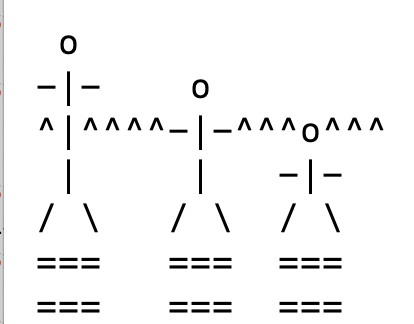

Here at Grinnell, we have gone through yet another new system of registration. I am not going to comment on the successes or failures of the system [1]. Rather, my muse has called me to reflect on the conflicting priorities that seem to be at play in the design of Grinnell's ever-evolving registration system. I know that one of our Registrar's goals, as she departs Grinnell, is to get us talking more about these priorities, and I also agree that we can not achieve a successful registration system unless we make these priorities clear (and, perhaps, even agree upon them).

As I've talked to people and watched our system evolve, I've noted that we have different priorities for our registration system. No, strike that. We have different values at play in the design of the registration system. Additionally, as my colleague, Paula Smith, noted in her study of nodes [2], we often assign very different meanings to the same term.

The first value/term at play is **fairness**. As researchers in the fairness and accountability in computing community know, there are many different conflicting notions of fairness. And they conflict not only in that they are different but also in that achieving one often undermines the other. The simplest conflict in our registration system is one between "individual fairness" and "communal fairness". 

In registration, that conflict most obviously comes into play when we consider whether it's more important that a student get into their preferred section of a course or that every student get into some section. Our old balancing process clearly prioritized the latter. The rhetoric around the resistance to balancing suggests that our system is designed to prioritize the former.

The conflict also comes into play when we think about other kinds of balancing, too. Consider a situation in which one section of a class has six students and the other has twenty four. Historically, we balanced those sections because, as faculty, we know that two classes of fifteen students each will provide a better experience for everyone. The students who were in the six-person section will have access to more voices in discussions. The students who were in the twenty-four-person section will get somewhat more individualized attention. The faculty member who would have run the six-person section will have a somewhat higher grading load, but won't have the experience of trying to run a class of too-few students on days that some students are unable to attend. The faculty member who would have run the twenty-four-person section will have more time for each student, as well as fewer things to grade. Everyone wins. Again, our old system balanced classes in such situations. Our new system does not. It's more important that students get their preferred section than that we try to make the courses more equal.

A related value/term pair is **equity**. One notion of equity is that you provide everyone with access to the same information, resources, and opportunities. For registration, everyone with the same class year might have the same opportunity to get into a class. However, others believe that to achieve true equity, you need to go beyond this notion and take individual circumstances into account. We'll use a narrative exposition of a famous cartoon to explain the difference.

> Suppose three people are trying to peer over a fence. One is tall (perhaps an adult), one is shorter (perhaps a middle-school student), and one is even shorter (perhaps an elementary-school student).

> We could provide all of them with a stack of two small boxes to stand upon.

> The adult can now easily see over the fence. The middle-school student can barely see over the fence. And the elementary school student still can't see over the fence.

> If, instead, we gave the adult one box, the middle-school student two boxes, and the elementary-school student three boxes (and helped them get up on top of them), then all three could peer over the fence.

Here's my representation of the situation in mediocre ASCII art. 

Here are the three people, standing in front of the fence. The carets (pointy things) represent the top of the fence. The tallest person is not quite tall enough to look over the fence. The other two are much worse off.

Here's what it looks like when we give each of them two boxes to stand on. You'll note that the first two can now see over the fence, but the third cannot.

Here's what it looks like when we distribute the three boxes differently. Now everyone can see!

In this model, giving everyone the same opportunity (two boxes) is "equality"; giving everyone what is appropriate for their needs (one box, two boxes, or three boxes, depending on their height) is "equity" [3]. I suppose it might be even more equitable to tear down the fence. However, we should assume that there's a reason the fence is there. Perhaps it protects us from something on the other side.

In any case, the new registration model clearly values equality over equity, perhaps because equity is messy.

What would an equitable model look like? It would consider additional factors in assigning classes. For example, suppose two double majors each want the afternoon section of CSC-341. One of them, a CS/Studio Art double major, has a required Studio Art class at the same time as the morning section of CSC-341. In contrast, the other, a CS/Econ double major, just wants the ability to sleep in.  An equity-focused model would prioritize the CS/Studio Art double major for the afternoon section since they cannot take the morning section. An equality-focused model would give them an equal chance to get into the afternoon section.

As I noted, these two models of equity (which we are now calling equity and equality) are closely associated with the two models of fairness. Equity connects naturally to communal fairness while equality is better supported by an individual fairness approach.

The question of **faculty roles** in registration also affects equity, although this relationship is more complex. On the one hand, we can only achieve equity if (a) someone is aware of each student's needs, (b) that information is conveyed to the person or system making registration decisions, and (c) the person or system making registration decisions incorporates their understanding of the student's needs in making those decisions.

Historically, we addressed these complexities by allowing faculty to choose who to keep in an over-enrolled course. Ideally, those decisions were made with the goals of equity and group fairness in mind. However significant inequity can also creep into such a system. Even if the faculty member selecting students can make perfectly equitable decisions, information is not conveyed uniformly. Some students have the social capital [4] to let the faculty members know about their special circumstances. Some students have "helicopter advisors" who make sure to convey the information. Others may not even be aware that it's important to convey such information or may be too intimidated to do so.

I am told that there are also concerns that faculty don't make equitable decisions, even when they have necessary information. There are concerns that we "play favorites", as it were. I'll admit that I can envision subconsciously doing so. For example, if I have to choose between two students who had previously taken a class from me, one of whom was always in class early and who participated actively, and one of whom regularly showed up late and often seemed to be disengaged from class, I would be more inclined to choose the first. But that's not equitable. After all, there may be significant factors in the second student's life that make it harder for them to be "an ideal student" and they should not be penalized for that.

In addition, some questions of equity, particularly as related to enrollments, are relatively complex. For example, I remember that there used to be two different rumors, both false, about how Gender, Women's, and Sexuality studies handled over-enrolled courses. In one rumor, they prioritized male-identifying students over female-identifying students because female-identifying students usually far outnumbered male-identifying students in the course, and they thought they would get better discussions with more male-identifying students. Or perhaps they thought it was more important that male-identifying students learned about GWSS topics. In another rumor, they prioritized female-identifying students, presumably so that class could be a safer space to discuss complex topics. Both sound like reasonable pedagogical goals. Both are also probably illegal. But there could be reasons to balance a class's enrollments that are also legal.

What part do values play in considering the faculty roles? We could value faculty input and assume that faculty will generally do the right thing. That's what we used to do. And it seems that faculty advisors _should_ have a significant role in what we promote as an "individually advised curriculum".

These days, the system treats faculty as untrustworthy. Not only are we not permitted to make decisions about our enrollments, we are discouraged from advocating for our students with special circumstances and we are not permitted to access useful information, such as who is on our wait list.

Would a middle ground be possible? I think so. Certainly, the attempt to clarify priorities for each course is a step in the right direction. If we valued equity, we could also give students an explicit opportunity to provide additional information. "There are two sections of this course; why should we prioritize you for this section over the other one?" We could then permit faculty members to make decisions that take into account the needs of individual students. And if we're that worried about faculty members playing favorites, we could have an Associate Dean review decisions. Or, I suppose, we could just let the Associate Deans put together the courses. Are they trustworthy? I assume so.

Believe it or not, I'm not done exploring values yet. There are also other values at play. One is the question of **manual work vs. automation**. The old registration system required a lot of manual work. Faculty had to look at over-enrolled courses and information from students to decide who to keep and drop. When they asked the Registrar's office to cut students randomly or to balance sections, the Registrar's staff had to do so manually. 

Automated systems are more equal. They treat each student as a piece of data and they "know" nothing about the data. However, unless we can get all the appropriate data into the system and write priority rules that draw upon those data to treat students equitably, it is nearly impossible to automate equitable decisions. Given what I've seen about our priority rules, we can't even specify the kinds of priorities we'd like. Certainly, the priority rules we've tried to set in CS have not been followed [5]. Were they impossible to code in our current system? I don't know, but I expect so.

As a computer scientist, I know that automated systems can never have complete information. And I know that it's very complicated to implement prioritization systems, particularly when you have to work under the constraints of, say, Ellucian systems. We couldn't even get Ellucian to temporarily hide a button we didn't want students to press. What does that say about implementing a rule like "it's more important to ensure that every CS major gets one CS course than that students get the section they want"?

Finally, we hit the value of **transparency**. I'm pretty sure that everyone values transparency. At least I think they do. And we've made great strides in making the system somewhat more transparent, particularly in that we indicate who we'd prefer to have priority for each course. Of course, as I just noted, not all the priorities we want can be represented in our current system. And, well, the process of creating these priorities was not particularly transparent [6]. 

And, well, other steps are not transparent. How does the system assign students to classes once the priorities are decided upon and students have indicated their preferences? Do we process one class at a time and then do some cleanup after everyone has been processed? Do we process one student at a time? Do we randomly select a class, take the highest priority student from that class (or a randomly selected student if they have equal priority), enroll them, and then move on? What do we do after all the steps are completed to ensure that students are making appropriate progress? None of that is stated. And when things are left unclear, people worry about both inequity and inequality.

There are probably more values to consider. But let's leave it at five: 

* Do we prioritize individual fairness or communal fairness?
* Do we prioritize equality or equity?
* Do we rely on faculty in the process or do we distrust faculty?
* Do we rely on automated processes or do we prioritize manual processes?
* How transparent are we?

As far as I can tell, someone decided to flip each of the first four values in designing new registration systems. That is, the new processes have moved us from a focus on communal fairness to individual, emphasize equality rather than equity, demonstrate a distrust of faculty, and attempt to automate what used to be manual processes. 

As Grinnell's Registrar has suggested, we can't build a successful registration system unless make explicit some basic principles. I'd say these four (five?) sets of values are one place we need to start. And, while we may not completely agree, knowing what values are at play will be an important step.

---

**_Postscript_**: It appears that I could have used [the original equality vs equity](https://interactioninstitute.org/illustrating-equality-vs-equity/) cartoon rather than making ASCII art, provided I added something like the following.

> This image is free to use with attribution: "Interaction Institute for Social Change | Artist: Angus Maguire." For online use please provide links: <interactioninstitute.org> and <madewithangus.com>.

That's okay. I had fun making the ASCII art, even if I changed the story a bit.

---

[1] Other than to say that my blood pressure can't handle another year like this one.

[2] At least that's what I recall her calling them.

[3] "To each according to their need." Hmmm. Sounds vaguely socialist.

[4] Or just the chutzpah.

[5] I said I wouldn't rant. That is not a rant. It's a statement of fact.

[6] I've elided my rant about the topic.
