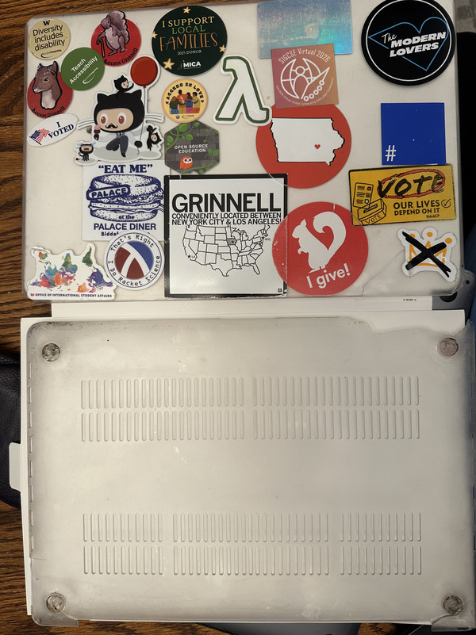

Whenever I get a MacBook, I put a protective cover on it. Why? Two reasons. First of all, I like to put stickers on my laptops, and the protective cover allows me to start fresh every once in a while. Also, they protect my laptop. After some time---usually six months or less---the cheap plastic covers admit defeat and it's time to start again.

Between the office, the lab, and my house, I probably have a dozen or so old laptop covers saved. I should probably take pictures of them and throw them away. I haven't done so yet; my muse keeps telling me that I'll want to write about them. But I'll have to take pictures before I write, so maybe I'll take pictures and throw them away when I next find them. Michelle would appreciate that.

In any case, I reached the point that I had to replace the cover on one of my laptops. To be honest, I reached the point that I should have replaced it more than a month ago. Why? Well, the top kept falling off and the bottom was cracked in a bunch of places. Here's a picture.

Isn't that lovely? It clearly did its job. I don't recall when that junk fell off of the bottom. I think it was cracked and then got caught on the zipper on the backpack when I pulled it out. Why did it crack? I don't think it was a fall. Perhaps I dropped the backpack on the floor one day. Who remembers?

Like most of my MacBook covers---more precisely, my stickered-up MacBook covers---this one says something about me and my history. Most importantly, I give a <strike>rat's</strike> squirrel's ass [1]. There are a few stickers from places I've visited, including the Palace Diner in Biddeford Maine and a Jonathan Richman concert. Those vary depending on where I visited when I was stickering my laptop.  

You can tell I'm a computer geek because I have a bunch of computing stickers, including at least one Octocat. I love the "I Do Racket Science" sticker that some of our students designed. I'm sad that we've run out and I can no longer put them on my computers. Perhaps we'll have a new Scamper sticker.

A few speak to my politics. I'll let you interpret them. I like the octothorpe blue square, which is the symbol of the Blue Square Alliance Against Hate, but also represents the wonderfully ambiguous "stand up to Jewish hate" [2]. I also appreciate the sticker that an alum made.

Even before I experienced disability, I supported the computing for disability community. I have multiple stickers (five?) referencing that support, including a few that represent my own disbilities.

I usually have two or three stickers that the Grinnell Office of International Student Affairs (OISA) gives out. I'll leave it to you to figure out which those are. One even comes from Raygun My friends in OISA tell me that they have a few new ones, too, although not any more from Raygun.

That leaves one sticker, the shiny one in the middle-upper-right (or something like that). I think I made that one on my photo printer. I no longer recall what it says. Perhaps "See you at SIGCSE Virtual 2026!". I don't recall.

Oh well, that's it for this case and for the description of this case. Perhaps you've learned something new about me. Perhaps not. Will my next laptop photo provide more insight? Perhaps.

---

**_Postscript_**: I remembered why I'm saving all of the broken laptop cases with stickers. Wall art! Of course, that assumes I can find available wall space. My wall space is mostly full with bookshelves and, well, art.

---

[1] I think it's funny.

[2] No, I won't explain why it's ambiguous. You should be able to tell. And I support both meanings.
