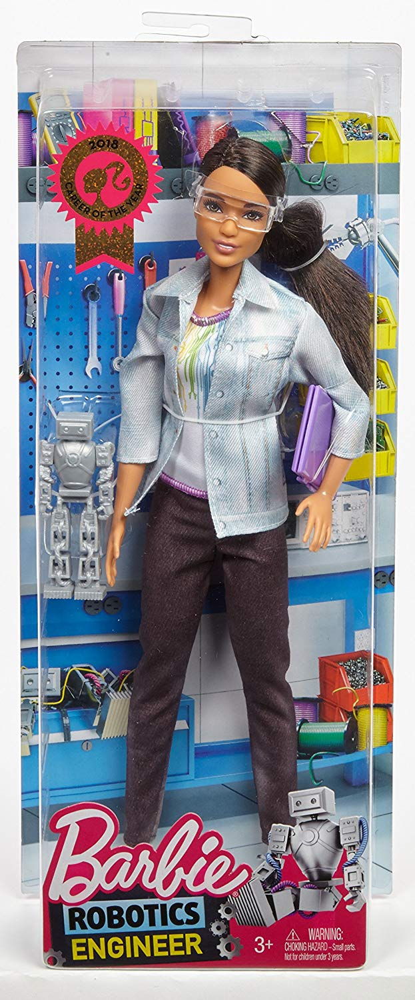
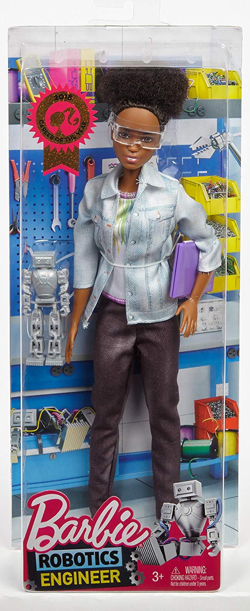
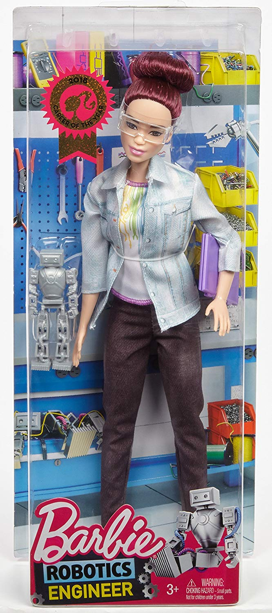
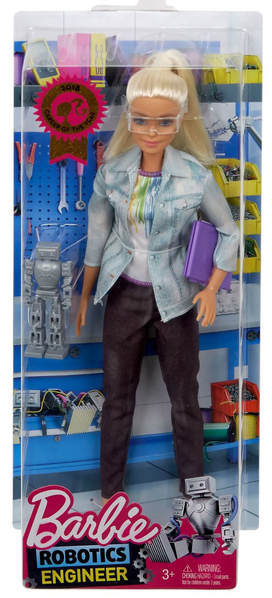

Robotics engineer Barbie
========================

*Topics/tags: [Miscellaneous](index-misc), gender and race in computing, rambly*

A few years ago, Mattel came out with a "Computer Engineer Barbie"
as part of the broader "Barbie Careers" line.  I recall that
many folks in the CS Ed community praised the idea as a way of
encouraging young women to think about computing.  It was certainly
a step up from the old talking Barbie who said things like "Math
class is tough" [1].  Then they came out with a corresponding book,
which was atrocious.  Fortunately, sensible people [remixed that
book](https://caseyfiesler.com/2014/11/18/barbie-remixed-i-really-can-be-a-computer-engineer/).

I heard about the doll long before I heard about the book.  And I bought
one because I appreciate the sentiment expressed by the doll itself.
Plus, Barbie keeps a Linux Penguin on her shelf!

I didn't know it at the time, but Mattel also released an African-American
Computer Engineer Barbie.  By the time I learned about those, they had
become collectors' items.  Once in a while, I look to see whether there's
one available at a reasonable rate.  There never is.  Somewhere along
the line, I picked up GameDev Barbie.  But she's also the traditional
Barbie skin tone [2].

When I looked today, I still couldn't find the AACEB at a reasonable
price, but I did discover that Mattel has now released a "Robotics engineer
Barbie".  And there are four versions with different skin tones and
hair styles!  Interestingly, Amazon refers to them only in terms of
their hair color.  The four dolls have similar descriptions.  Here's
how they describe the Robotics Engineer Barbie with the traditional Barbie
appearance.

> Dream big with Barbie Robotics Engineer doll -this Barbie Career of the Year doll introduces a partnership with Tynker, a game-based platform that teaches kids how to code and inspires them to explore STEM opportunities!

> Barbie doll comes with a silvery robot and a purple laptop -that shows a screenshot of her robotics project

> A career-themed look includes a white t-shirt with rainbow tech-inspired graphic, a denim jacket, black pants, white sneakers and protective goggles

> She wears her blonde hair in a trendy style with high ponytail

> Collect all the Barbie careers dolls to explore all your dreams because you can be anything with Barbie (each sold separately, subject to availability) 

What do they say about the hair styles of the other dolls?

> She wears her rich pink hair in a trendy updo with topknot inspiration 

> She wears her dark hair in a trendy side ponytail 

> She wears her dark brown hair in a trendy afro style

Here's what they look like [3].

 
 

It's hard to tell from the photos, but I'm pretty sure that the little
robot by Barbie's right arm is also a play toy and everything else
is just printed on the cardstock background.  I am a bit amused by
what's on the background.  Many aspects look more like a traditional
workshop---pegboard, bins of screws, power strip, etc.---than a place
you'd engineer robots.  I realize that there's some electronic device
behind Barbie and that there's something vaguely electronic on the
floor, but it still screams workshop to me.  And that clamp in the
upper-right-hand corner looks vaguely menacing.

What about this [Tynker](https://www.tynker.com) that Barbie has
partnered with?  They're a comparatively expensive ($20/month, $120/year)
online block-based platform.  Come on Barbie!  You support open source,
so partner with Scratch or Snap! or something similar! [4]

Where was I going with this musing?  I have no idea.  I'm glad
to see more playthings that support tech.  I'm glad to see what
seems to be more inclusive diversity than sometimes shows up in
[GoldieBlox](mixed-messages-2018-04-11).  I wonder if they'll release
an accompanying children's book and, if so, whether it will be
inspirational or atrocious.  If they do publish such a book, I hope that, 
at some point, the Barbies go out to get a coffee and get served by
[Barista Ken](images/barista-ken) [5,6].

---

[1] A few more words, and it would have been great: "The boys say
that math class is tough, but they're wrong."  Or even a growth mindset
phrase like, "Math class is tough, but I know I can do it."

[2] If I recall correctly, Game Developer Barbie has a purple streak
in her hair, making her much more hip than most Barbies with the
possible exception of the uncredited [Barbie tribute to Edie Sedgwick](images/andy-warhol-barbie).

[3] For some reason I don't understand, Amazon provides "in box" photos
for all but the traditional blonde Barbie.  I found that one elsewhere
on the Interweb.

[4] That was not a serious comment.  I realize that Mattel is a giant
corporation whose primary goal is to make money, not to empower people.
So it makes sense that they'd partner with an organization that seems
intended to get more money from parents.

[5] Dig that man bun!

[6] I'm still confused as to how the apron is part of the t-shirt pattern.

---

*Version 1.0 of 2018-12-05.*
