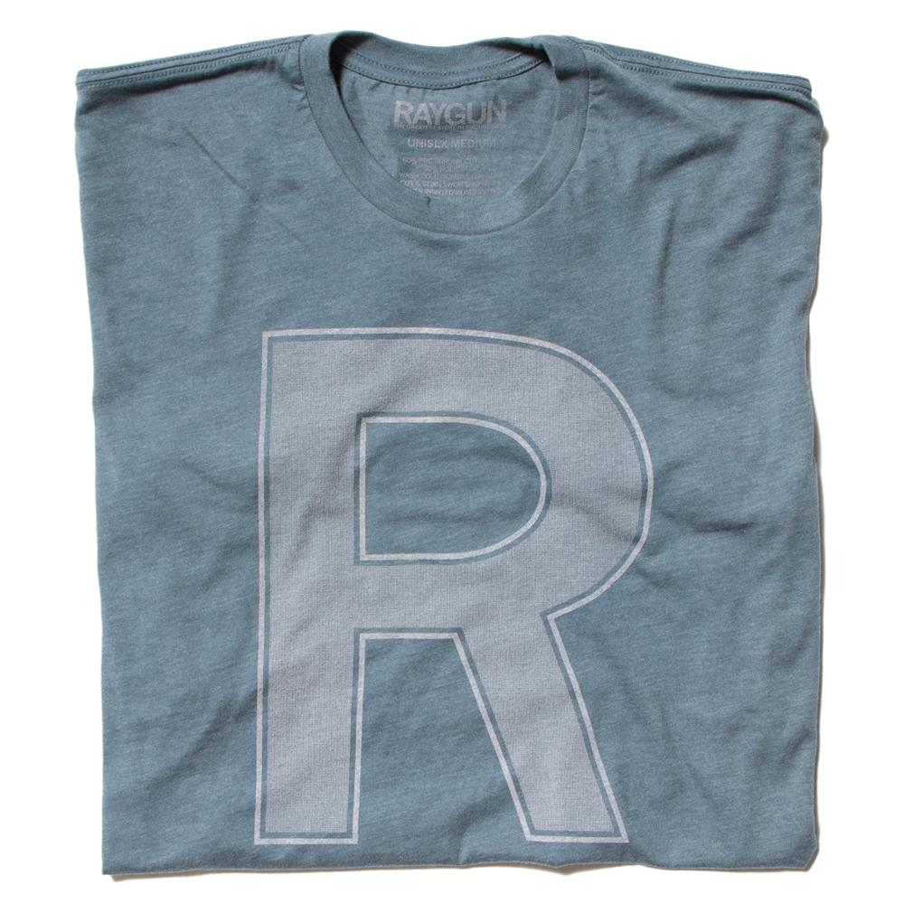

I dropped Eldest off at the airport this morning.  Each time I drop
a child off at the airport, I'm a bit sad.  Middle left on January
2 for Winter Training.  Eldest and I dropped Youngest off at the
airport on January 4.  So I got to experience a lot of sadness
recently.  And now we're empty nesters, at least for another week
or so, until Middle returns.

I love having my kids home.  It's great to have any one of them
here; having all three home at the same time is a privilege.  I
enjoy seeing how they interact with each other, I take pleasure in
playing games with them [1], and I revel in the opportunity to chat,
talk, argue, and discuss with them.  And, as I hope they know, I'm
proud of each of them; Michelle and I seem to have succeeded in
raising good young men [2].  It's particularly nice to have them home
when I don't have grading and other work to do.

But now they're gone.  And they've reached the times of their lives
in which it's likely to get harder and harder to get everyone
together at once.  I expect we will get pairs of sons together
relatively frequently, at least for the next few years, but having
all three may be a once-per-year occasion, if that.

On the other hand, even having one son around to play games with and
interact is a privilege.  

That will also happen less often, particularly as Middle moves on
to the next stage [4] of his life, which should happen this Summer.

Such mixed emotions!  Perhaps I should reflect on the things that
are better when they're gone.  Let me see.  

.

.

.

Um. 

.

.

Oh, I know!  The window shades stay up when my sons are not home
[7].  I'll take joy in the little things.

---

Postscript: Santa brought everyone a grey t-shirt with an R on the
front.  I regret forgetting to get a family photo with everyone in
those shirts, or the annual holiday pajamas.

---

[1] More on the Rebelsky Games will appear in a separate musing.

[2] I won't say more details or raise any minor criticisms [3] since 
they value their privacy.

[3] We're a critical family.

[4] I'd written "next *state* of his life", but "stage" is probably
appropriate, especially since he'll be in a different state [5].

[5] Why *do* we say "stage" rather than "state".  He will no longer
be a college student, so he'll also be in a different state of being.
Perhaps it's just that, as a computer scientist, I think of stateful
systems [6].

[6] Obligatory incomprehensible CS-related dad joke: If people are
stateful systems, does that mean that they are not functional?  Or
perhaps they are just impure.

[7] I prefer bright lights.  My children generally prefer dimmer rooms.
