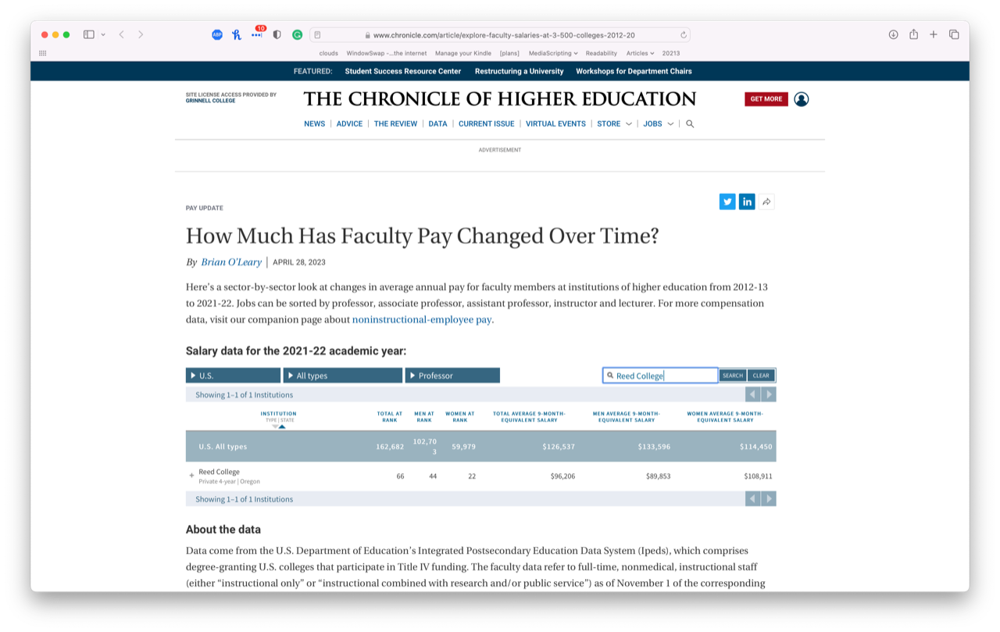
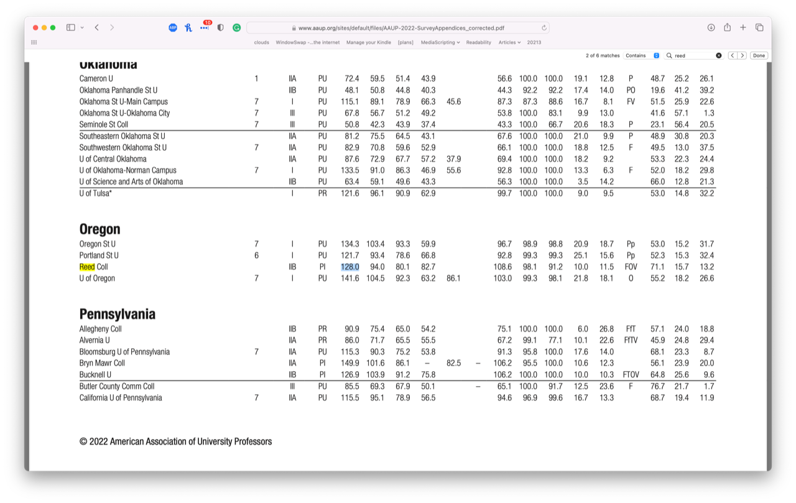

The other day, _Chronicle_ [1] released the latest version of their [faculty salary data tool](https://www.chronicle.com/article/explore-faculty-salaries-at-3-500-colleges-2012-20) covering up through the 2021--22 academic year.  And, as too often happens, I decided that I wanted to explore the data.

I'm not entirely sure why I feel compelled to explore salary data.  I receive a great salary from Grinnell, certainly adequate compensation for my work.  It may be less than what many of my former students make in industry, but it's also much more than many people earn.  So why should I care about, say, how Grinnell's salaries are compared to our peers'?

Here's the easy answer: Besides having a muse who inspires me to write, I have another one who encourages me to explore data.  Or, as a colleague suggested recently, I seem to enjoy looking at numbers.  Perhaps I enjoy complaining about numbers.  Something like that.

There are also more complex answers [2].  I find myself compelled to look at salaries because salaries are one of the ways that the institution shows respect for faculty.  If the administration is going to impose policies that undermine my role as a computing professional and add to my stress by under-resourcing my department, I may need to turn to compensation as a way of finding respect [3].  Grinnell shows appreciation with money; I want to feel appreciated.  I also wish the institution would show broader appreciation for the faculty.

It doesn't help that, after my first year, I received a lower-than-average raise because it was determined that new faculty were less valuable to the College.  It doesn't help that our past three years of raises have been below the cost-of-living increase.  It doesn't help that two years ago, with one of the highest faculty numbers one can have [4], I still had a below-average raise.

But it's more than that.  As in other cases when I play with numbers, I've found that the College is sometimes wrong when it presents salary data to the faculty.  Two particular instances come to mind.  About a decade ago, I got my hands on the Excel spreadsheet used to compute how Grinnell is doing compared to its peers.  And, lo and behold, the spreadsheet had an error in a few of the formulas [5].  It didn't look like an intentional error; it was more what looked to be one of those "I didn't realize I'd made an extra click" errors.  In particular, the calculation of average salaries at peer institutions included data from the wrong category.  If I recall correctly, the average full-professor salary computation also included some associate professor salaries at peer institutions.  The reverse may also have held.

That's one of the two.  The other was also about a decade ago.  Perhaps more.  It was in one of those salary presentations we get once a year.  I noted something troubling, at least troubling to me.  At the full professor level, Grinnell had gone from the top of our peer institutions to near the bottom.  I raised the issue in a faculty meeting.  It's one of the few times I've seen President Kington lose his temper; I don't think he liked being challenged on numbers.  He insisted that I didn't understand the numbers because, among other things, salaries don't represent our total compensation.  We get great retirement benefits, a robust health insurance plan, and good tuition programs for our offspring [6].  But I suggested that the earlier and current data were only about salaries, and we had dropped in that category.  That may have been when he lost his temper.  In any case, he sent me a nice apology a little bit later when he realized that I was right.  And he hated losing his temper (or anyone losing their temper).

After reading those reflections, you probably understand a bit more about my psyche.  And you'll realize that I felt compelled to look at salaries at Grinnell and our peer institutions.

First, I grabbed our [list of peer institutions](https://www.grinnell.edu/about/leadership/offices-services/institutional-research/peer-schools).  For those who don't want to follow the link, they are Amherst, Bowdoin, Carleton, Colorado, Davidson, Kenyon, Macalester, Oberlin, Pomona, Reed, Smith, St. Olaf, Swarthmore, Vassar, Washington & Lee, and Williams.  Some midwest.  Some east coast.  Even a few on the west coast.  Some rural.  Some less so.  Some more highly ranked.  Some less highly ranked.  It's a good peer set.  Those of you who consider institutional peer lists an exciting topic might enjoy [_Chronicle's visualization tool_](https://www.chronicle.com/article/who-does-your-college-think-its-peers-are).  The tool helped me realize that it's strange that we don't include Hamilton in our peer group, given that they are one of the few institutions with an open curriculum.  I also see that nine of the sixteen schools we list as peers reciprocate the listing.

Next, I went to find last year's report on how Grinnell is doing relative to its peers.  That was harder to find than I expected.  It wasn't in [the minutes](https://grinco.sharepoint.com/:w:/r/sites/dean/_layouts/15/Doc.aspx?sourcedoc=%7B545007F6-637F-4037-B34A-3DCC78D70C5B%7D&file=FacMtgMin_05-16-22-Amended%20Aug29.docx&action=default&mobileredirect=true) [7], even though it's supposed to be [8].  There was a summary in [the report of the chair of the faculty](https://grinco.sharepoint.com/sites/dean/Annual_Reports/Chair_of_the_Faculty_Report_FINAL_2021-22.pdf) [10].  However, for the reasons I've discussed above, I want to see the data and not just a summary. So I looked on the Dean's website.  Failing to find the data on the Dean's web site, I asked some folks.

Eventually, I gave up and decided to grab the data myself.  All that searching did remind me that we use [AAUP Data](https://www.aaup.org/our-work/research/FCS) rather than the IPEDS [11] data that _Chronicle_ relies on.  Does it make a difference?  A little.  In some cases, the IPEDS and AAUP data match.  In others, they differ significantly.  Full professors at Reed College are one example of a significant difference.

The _Chronicle_/IPEDS report suggests that Reed's average full-professor salary in 2020--21 was $96,206.

From those data, Reed is at the bottom of our peer institutions and is one of the few institutions where women full professors make significantly more than male full professors.

But when we turn to the AAUP, we see something very different.  There, the reported average full professor salary at Reed is $128,000.

Before writing this musing, I hadn't looked at Reed's numbers at the Associate level.  I'm intrigued to see that _Chronicle_ lists the average associate salary at $100,394, which is higher than the average full professor salary.  I think _Chronicle_ screwed up somewhere.  And that's one of the things I hate about these kinds of endeavors; you can't even trust data sources you think you should be able to trust.

Since Grinnell uses AAUP data for its calculations, I decided to stick with those data.  

At the associate and assistant levels, Grinnell is doing appropriately well.  That is, our average salary at each rank is about the median average salary at our peer institutions [12,14].  Oberlin has yet to report for 2022-23.  For the other fifteen, Grinnell is ninth at the associate level and eighth at the assistant level.  Oberlin generally pays less than Grinnell, so those numbers will likely stick.

Unfortunately, our long-term trend of doing worse at the full-professor level continues.  Currently, we're eleventh at that level. Even if I assume that Oberlin's average salaries remained the same, we're still eleventh. Since we were tenth last year, and we've approximately doubled how far off the median we are in terms of salary, we're going in the wrong direction.

There was also another question in the back of my head.  Last year, Faculty Chair Praitis negotiated a one-time 3% bonus for faculty and staff to compensate for the lack of raises in the first year of the pandemic [15].  I wondered whether they'd include that bonus in reporting our salaries. Doing so would make us look much better in our peer comparison group, but it would be a misleading comparison.  It's not that I suspected anyone of intentionally misleading us; it's that people sometimes forget about these things.  Fortunately, whoever reported our salaries appears to have used our contractual salaries, not the amount the College expected to pay us this year.  Yay!  I don't have to ask about it at the next faculty meeting.

That's all I have to report right now.  We should see the complete set of numbers at the next Faculty Meeting [16].

In all honesty, the faculty receive excellent salaries at Grinnell.  And, as I've said before, it's also important to see the College addressing the too-low staff salaries [17].  There's a lot to do.  Grinnell should also ensure that both faculty and staff get at least cost-of-living increases and that the staff pool is about the same as the faculty raise pool, at least in terms of percentages [18].  Let's make those salary goals, too.  And let's work hard to meet those new goals, as well as the old faculty median salary goals.

---

**_Postscript_**: Among the salary issues missing from the main body of the musing is the question of salary inversions.  A salary inversion is when a new hire makes more than existing faculty.  I had thought our policy was to raise the existing faculty member's salary to match the new salary; that's what I experienced when we hired new faculty in my fifth-or-so and eighth-or-so years at Grinnell [20].  But I think I heard the Dean say last year that addressing salary inversions is no longer automatic.  It should be.

---

**_Postscript_**: Back when I was on the Facult Salary Committee, we made salary decisions during winter break.  Given that the budget isn't approved until spring, I'm not quite sure how that worked out.  Now that we're trying to achieve particular goals, I wonder if we leave the calculations until the time we get the data from our peers or the AAUP.  We should.

---

[1] _The Chronicle of Higher Education_, for those who like full titles.

[2] I suppose you figured that out when I referred to an "easy answer".

[3] Isn't that a stupid quest?

[4] Yes, that's right, we indicate the value of every faculty member with a single number on a 1--5 scale.  Mine was 4.5.  It's dropped to 4.

[5] Formulae?

[6] The best programs cover up to the tuition at the home institution, no matter where your children go.  Grinnell has partnerships with a bunch of institutions that cover about 90% of tuition.  If your offspring attend another institution, Grinnell contributes up to $10K towards tuition annually.  Even though it's not at the level of the best programs, it's still quite generous.

[7] Only available to those with Grinnell accounts.

[8] "The data is public information and will be included in the faculty meeting minutes[.]" [9]

[9] What does it say about me that I want it to read "The data *are* public information ..."?

[10] Also requires a Grinnell login.

[11] IPEDS is The Integrated Postsecondary Education Data System.  It provides awesomely cool information about every U.S. College and University.  Someday, I'll figure out how to use it well.

[12] The faculty appreciate Kathy Kamp's efforts to get the trustees to agree to that as a target.  Kathy also got us salary bumps upon promotion.

[14] "median average salary of peers", not "average median salary of peers".  Order matters.

[15] Only for those employed at Grinnell at the start of the pandemic and still employed at Grinnell in spring 2023.

[16] I'm sure that Clark appreciates that.

[17] That's a hint to the trustees who read my musings.  We have wonderful staff at Grinnell.  Let's compensate them better.  Why should we rely primarily on regional salaries as the comparison metrics for these amazing people?

[18] For example, if we set the faculty raise pool at 4.5% of the faculty salary budget line [19], we should set the staff raise pool at about 4.5% of the staff salary budget line.

[19] I'm an optimist.

[20] Does it bother me that a new assistant professor was hired at more than I was making as an associate professor?  Yes, a bit.
