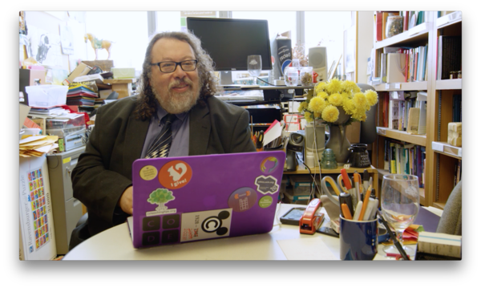

Promoting Grinnell
==================

*Topics/tags: [Autobiographical](index-autobiographical), [Grinnell](index-grinnell), marketing*

In late spring, Communications asked whether I'd be willing to be the
subject of a promotional video.  At the time, I was concerned
that they were confused.  Don't I critique most of our
promotional materials?  And, well, would you want to look at
me onscreen?  I know that I wouldn't.  But the agency we hired
went ahead and interviewed me for a video.  They've now released [a
draft](http://motionrefinery.com/clients/GrinnellCollege/Profiles/profs/)
[1].  I should warn you that it is not yet captioned [2].  However,
to ensure some form of accessibility, I'm putting the text below.
I've also included a few descriptions of what's onscreen, but not nearly
all of them.

---

[Text [3]: Sam Rebelsky]

[Additional Text: Professor of Computer Science]

[Shot: Sam in his very messy office.  You can see mom's Tang horse in
the far background, her yellow plastic flowers on my desk, my "Where
God drinks coffee" mug from the UofC Div School Coffee Shop, two Prairie
Meadows wine goblets that I got from Kathy, and much, much more.]

_It's pretty clear that computers are changing the world.  So it's important
to think about who devises or builds the technology that changes the world.
If we're building technology that affects everyone, we really need to
make sure that everyone is building that technology._

[Shot: An arch that says "Grinnell College".  Where is that arch?]

_I think from day one at Grinnell, one of my strongest goals has been to
diversify the discipline: to get more women in computing, to get more
domestic students of color into computing, to get people from across
the socio-economic spectrum to pursue computing [4,5]._

[Shot: Sam in 3813 with Charlie's summer research students.]

_I started to teach because I wanted to make a difference.  I love Grinnell
students.  There are so many kinds of them.  I love their diversity.  I
love the way they engage._

[Shots: Students around campus]

_I love that they still find ways to challenge me._

[Shot: Students studying on green grass that is now consumed by the HSSC.]

[Shot: Sam in the wood shop.]

_During my last sabbatical, I took studio art classes.  And I did that in
part because I like art and I had never tried to make art formally.  I thought
it would be interesting to do more formal attempts to create artistic pieces._

[Shot: Sam and student at a programmable embroidery machine.]

_At first glance, CS and Art seem like very different disciplines, but
we have a surprising number of students who are both art and CS majors.
Both, in the end, are about creation._

[Shots: Sam in office, Sam in 3813 with Charlie's students, etc.]

_Sometimes, particularly in art, you make a mistake and then realize "This is 
a better way to do something".  But it also happens in computing.  You do
something that doesn't work in the way you want, but then you realize
"Oh, this is a new approach."_

[Shots: Random students]

_I think the strength of a place like Grinnell is that students have to
learn many different things.  They need to learn how to interpret a text
closely.  They need to learn to think like a scientist.  You have to
be able to think broadly about societies.  And I like that our students
try all of these things and do them differently._

[More shots of Sam with Charlie's students]

_I know I make a difference in the lives of young people and I make a
difference in the lives of *awesome* young people.  And that's such a
great feeling.  I don't know why I wouldn't want to keep doing it._

---

Okay, transcribing that was horrible.  I don't like how I look.  I
don't need to see my facial expressions or my large belly again and again
and again.  Watching it once was okay.  Watching it slowly and pausing?
Dreadful.

At least there are shots of my laptop cover and my office.  I appreciate
seeing some of those things in the frame.  And I like the tie I'm wearing;
it's one of my favorites [6].  Here's a picture.

What about the content?  Well, it sounds like me, both literally and
figuratively.  It includes many things I often say about diversity in
CS and about loving Grinnell.  Still, I'm not sure that it would convince
me (or anyone) to come to Grinnell. However, I'm not the target audience.
I also don't like the ending line; couldn't I have said "I can't imagine
being anywhere else" or something better?

Oh well, perhaps it will encourage others to participate in videos.

---

Postscript: In case you couldn't tell from the photo, "I give!" [7]

---

Postscript: I had originally titled this "Serving as a pitchman for
Grinnell."  But "pitchman" is a gendered term.  I'm male, so I guess
it's okay to use it, but I'd prefer to find something else.  "Pitcher"
doesn't seem to work.  In the end, I tried "Pitching Grinnell" and ended
up with the current title.

---

[1] Click on the link that includes the word "SAM".

[2] I assume it will be captioned before it is released.

[3] In Futura, of course.

[4] I did not mention other underrepresented groups, including those
outside the gender binary and non-domestic students of color.  I do
consider it my responsibility to support students from those groups, too.

[5] Yes, I also support white males.

[6] I still remember buying it with my in-laws.  It's supposed to go with
an even more awesome double-breasted suit that does not currently fit me.

[7] A squirrel's behind [8].

[8] I've always claimed that the "I give!" stickers make me think of
the saying, "I don't give a rat's ass."

---

*Version 1.0 of 2018-10-03.*
