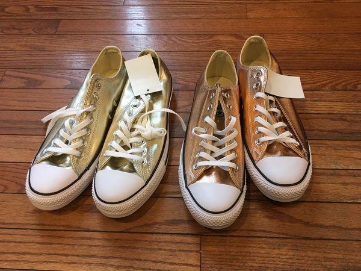

The other day, my family was visiting the new outlet mall in Altoona.
I saw that there was a Converse store.  That brought back memories.
When I was a young man, I wore Converse Jack Purcells because they
had good arch support.  Of course, Chuck Taylors were the cooler
sneakers, and perhaps the iconic American sneaker [1], but I liked
Jack Purcells.  And, as you likely know, Chuck Taylors and other
Converse sneakers are considered fashionable.  In any case, I have
a fond memory for Converse sneakers, so I wandered over to the
store.

With the sneaker boom of the past decade or two, Converse expanded
its lines to use different materials and different patterns.
Instead of canvas in white, blue, or black [2], now you can get
them in leather, suede, and different thicknesses of canvas in a
huge host of colors and patterns.

I don't wear sneakers much any more.  I also have wide feet and
Converse sneakers don't fit me very well.  But I thought it would
be fun to check out the different versions and to see if one might
fit me.  In particular, I know that they make black leather Jack
Purcells, and I was hopeful that a pair would fit.  Leather sneakers
are dressy, right?

I didn't find the black leather Jack Purcells.  But I did find some
coruscating [3] gold Chuck Taylors [4] in my size, or at least my
length.  They were a bit tight, but they were only $6.00 a pair [5].
There were also two shades of gold.  I bought both.

---

Postscript: While many people refer to sneakers as "Tennis shoes", I'm
pretty sure that Jack Purcells are the only Converse sneakers that
have the appropriate sole for tennis.  I was surprised to discover
that they were designed as badminton shoes.

---

Postscript: This musing would be incomplete if I did not insert the
following comment.  Like most Grinnellians, I remain hopeful that
Converse will soon produce a hybrid of Jack Purcells and Chuck
Taylors that they call the "[Jack
Taylor](https://en.wikipedia.org/wiki/Jack_Taylor_(basketball))"
'15.

---

[1] One might argue that Keds also had a role as iconic American
sneaker.

[2] Maybe you could also get red.  I don't recall.

[3] From [the 2020 Wayne State Word List](wayne-state-word-list-2020).

[4] Or maybe just All Stars.  These days, I can't get all of the
kinds of Converse sneakers straight.

[5] Eldest says, "There's a reason for that."  But what does he know?
