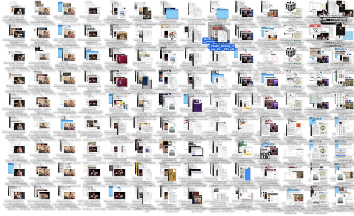

I have a technology problem. I think it's a technology problem of my own doing. I've ended up in a situation in which I'm alternating---or may be alternating---between three laptops. Why three? Well, there's my College-provided laptop, which spent around two months in service. There's the older laptop I purchased to serve as a temporary replacement [1]. And there's the "laptop" (really a desktop, since the screen is broken) that I'd been using for the first few weeks my College-provided laptop was unavailable and which sometimes serves as my convenient desktop.

In any case, I have three Macs that I use. I'd like to be sure that the information on each is more or less the same. Reproducing software is relatively easy [2]. It's my huge collection of files that has grown over the years, and that I'm too lazy to prune. I realize that there's an easy solution: I could store everything in the cloud [3]. However, I'm not necessarily comfortable doing that. I still like the security of having local files. I should probably clean up my file system; I accumulate files remarkably quickly. For example, there are nearly 1000 files on my desktop, most of which were added between April and August [4].  

I don't need it all. I certainly don't need it all on my Desktop. It's not even clear that I should have it on my work computer, but that's an issue for another day. In summarizing the kinds of files on the desktop (see footnote 4), I was able to move or remove about 1/4 of them.

And therein lies the problem. If I've made those changes on one Mac, how do I reproduce them on the other two?

As I said, there are simple solutions. I could store the files in the cloud. I suppose I could carry most of my "home directory" on an external drive. However, at least for the purposes of this musing, I'd like to have things on each of the computers. And I'd generally like changes on one computer to be reflected on the other computers. However, I am okay using an external drive to hold the "master".

When I started this musing, I assumed that I'd write a program to do that. I was almost looking forward to it. At least if we ignore some of the edge cases, the program should be pretty easy: Make some tables that map between digest hashes and file paths. When the same hash maps to different file paths, the file has moved (or been duplicated). When one table has a hash, and the other doesn't, the file has been added or deleted. If the same file path has two different hashes, then the file has changed. A human may have to decide what to do in some of these cases: Does "It's on A but not B" mean that we want to add it to B or delete it from A? Is it intentional that there are multiple copies of a file? And what if we not only have two files with the same path but different contents, but the contents of one appear in a different file? Yeah, now we're getting into edge cases, but edge cases that are likely to appear regularly, especially when I'm making changes on multiple computers.

I'd even planned other aspects of the program, such as separating the identification of changes from making the changes. That approach would include a file format to indicate a change to make (add, remove, move, replace, etc.). I had even planned this musing to consider those issues in more depth.

However, one of the benefits of musing is that it challenges me to think differently. In this case, I decided that it would make sense to see if there's already software available that does what I want. Wouldn't that be nice? So I searched for "mac sync directories across computers". And, lo and behold, there's [Syncthing](https://syncthing.net) and [Unison](https://github.com/bcpierce00/unison). Syncthing has a GUI of sorts, while Unison is more of a command-line tool (apparently fairly close to what I was envisioning).

I like that Unison is a command-line tool and supports syncing across multiple directories on the same computer. I don't love that it doesn't seem to track file moves, treating those as a "delete" and "add". Of course, file transfers are much faster than they used to be, so perhaps that's ok. I see that it keeps a bunch of information in a hidden directory. I wonder how much space that takes? 

Syncthing, in contrast, doesn't seem to let me sync across multiple directories on the same computer, although I bet I could figure out a way to hack that [8]. It runs continuously (or, more precisely, it updates every _n_ minutes), rather than only running when I issue a command. Is that good? I'm not sure.

In any case, I managed to get Syncthing installed on multiple laptops, and it seems to be doing a good job for the time being. And it looks like I can set it to ignore some files, making it possible to sync [9] most of my important files without setting up separate folders to synchronize.  Syncing takes more time than I'd like. However, there are always other things for me to do while waiting, whether on my computer or elsewhere.

In any case, I'm glad I found a solution. Now I can get back to using my newer laptop.

---

[1] I use MacBooks. All ITS could offer was a Windows laptop. The $400 for a 2019 MacBook with 32 GB of RAM was well worth the peace of mind to be able to use an OS I could configure.

[2] Although not that easy; see my [rant about Adobe](adobe-idiocies-2026-04-05).

[3] Probably iCloud.

[4] How do I accumulate 1000 files on the desktop? First of all, I use the desktop as the default location for files; it's easiest to get to them from there. I also take a lot of screenshots, which end up there (350 or so). I have screenshots to show problems with software [5]. I have screenshots from online music shows. I have screenshots of amusing things. I have screenshots of software that I take to explain to others how to use it. Beyond screenshots, I have assorted files I downloaded "temporarily", some calendar invites that didn't automatically delete, receipts from summer activities, handouts I received in workshops that haven't been filed, papers I intend to read [6], papers I'm reviewing that I accidentally put on the desktop, a few `.dmg` and `.pkg` files for software I installed. I have forms from students that I had to sign electronically and neglected to delete afterwards. I had a file called "Sam Hates Word", whose name, although true, is not all that helpful [7].

[5] It can be fun to review them. I'd forgotten many of the issues, such as GLADIS failing to work on Safari, a system that reported that I acknowledged receipt of a letter on an impossible date, and one that I just titled "Grinnell Wireless Fails".

[6] Here's a fun one: "Submerged Stone Structures in the Far West of Europe
During the Mesolithic/Neolithic Transition (Sein Island, Brittany, France)". Here's another: "Handwriting but not typewriting leads to widespread brain connectivity: a high-density EEG study with implications for the classroom". And another: "Modules to Introduce Assertions and Loop Invariants Informally Within CSI: Experiences and Observations"

[7] Ah! Word Online was repeatedly deleting an hour or so's worth of work, even though it assured me that it was saving it. That was a document in which I was regularly copying and pasting the current state of my online document.

[8] Let's see. Suppose I want to synchronize directories A and B on computer P. Share from directory A on computer P to directory A on computer Q. Soft link directory B on computer Q to directory A on computer Q. Share directory B on computer Q back to computer A. I suppose I'll give that a try.

[9] Is the shorthand for synchronize sync or synch? I think both are used. If I'd ever written the program, I would have called it "sink".
