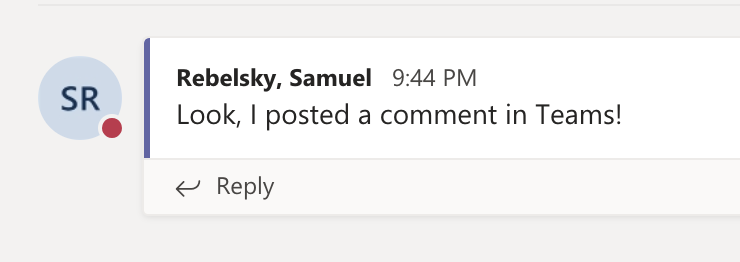

Because of Grinnell's new and restrictive software policies, I've
been trying to adapt to using Microsoft products.  As I've noted
before, Microsoft products are often similar to many of the popular
alternatives except a bit less intuitive [1].  I've also been
amused to find that not all products are covered by our normal
license.  For example, we may be having students use Visual Studio
Code [2] and it turns out that it wasn't on the list of approved
products [3].

But my current issue has to deal with more mainstream Microproducts,
like Teams [4], Planner [5], and Word for Web [6,7].  What's wrong?
It's how they interact with Active Directory, or whatever the service
is that keeps track of our names and other account details. 

At Grinnell, names are stored in last-name-first order.  So I'm
"Rebelsky, Samuel A.".  That makes sense, I suppose.  I'd prefer
that it use "Samuel A. Rebelsky", but I'll survive.  Here's the thing:
Lots of Microprods use two-letter initials.  But they aren't consistent.

For example, here's what I see in Teams.

Looks good, doesn't it?  "SR" stands for "Sam Rebelsky".

What happens in Word?  The same thing, right?  Nope.

Who's RS?  That's me, right?  "Rebelsky, Samuel".  Do you want to
figure that out?  What happens when Ralph Savarese and I are both
editing the same document?  Since people are used to initials being
first-last, the odds are that I get credited for carefully crafted
writng and Ralph gets blamed for wanton destruction.

**Dear Microsoft: Is it really that hard to make your damn products
consistent?**

Dear ITS: Can we perhaps select products that work correctly?

---

[1] They are not intuitive to me, but they may be intuitive to
people who have drunk the Microsoft Kool Aid.  Of course, I asked
one person who uses Microproducts regularly how I could sync a
folder on Sharepointless to my local drive, and they were unable
to figure it out.  I may have written about that experience.

[2] Also "VSCode" or just "Code".

[3] It is now, provided we have students turn off telemetry reporting
and crash reporting.  I'm glad that we're more concerned about the
information that Microsoft is taking from VS Code than we are about
the info it gathers from, say, our email server.

[4] Being advertised on a TV channel near you, or at least on the 
CW streaming service this evening.

[5] Is Planner mainstream?

[6] I'm pretty sure that the Web version of Word is a mainstream
product.

[7] Is it called "Word for Web"?  I'm not sure.
